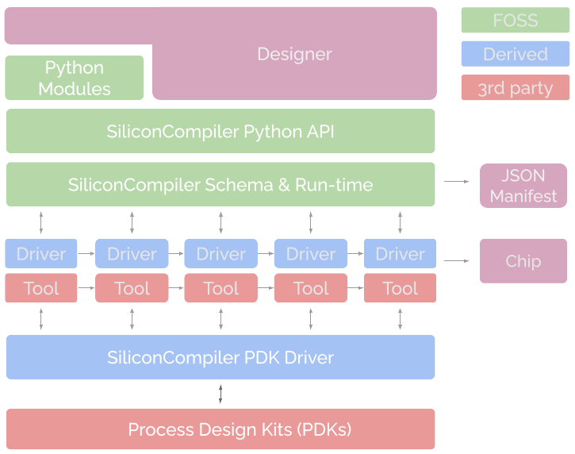

[](https://github.com/siliconcompiler/siliconcompiler/actions/workflows/on_push_tests.yml)
[](https://github.com/siliconcompiler/siliconcompiler/actions/workflows/daily_tests.yml)
[](https://github.com/siliconcompiler/siliconcompiler/actions/workflows/wheels.yml)
[](https://docs.siliconcompiler.com/en/latest/?badge=latest)
[](https://pepy.tech/project/siliconcompiler)

# What is SiliconCompiler?


A modular build system for hardware ("make for silicon"). The project philosophy is to "make the complex possible while keeping the simple simple".



The project foundation is a standardized dynamic JSON schema for configuring and tracking of compile time parameter related to design setup, libraries, tools, Process Design Kits (PDKs), flows, constraints, compiler time options, and run time metrics, Advanced projects (like ASICs) are far too complex be handled manually through markup languages like JSON/YAML, so the project also includes a simple (but powerful) object oriented Python API for compilation setup, run time scheduling, and results analysis. For more information about the project motivation and design philosophy, you can refer to the following paper.

A. Olofsson, W. Ransohoff, N. Moroze, "[Invited: A Distributed Approach to Silicon Compilation](docs/papers/sc_dac2022.pdf)", 59th Design Automation Conference (DAC), 10-14 July 2022, San Francisco, CA, USA. Published, 7/2022.

# Why SiliconCompiler?

* **Ease-of-use**: Programmable with a simple [Python API](https://docs.siliconcompiler.com/en/latest/user_guide/programming_model.html)
* **Portability:** Powerful dynamic JSON [schema](https://docs.siliconcompiler.com/en/latest/reference_manual/schema.html) supports ASIC and FPGA design and simulation
* **Speed:** Flowgraph [compilation model](https://docs.siliconcompiler.com/en/latest/user_guide/execution_model.html) enables cloud scale execution.
* **Friction-less:** [Remote execution model](https://docs.siliconcompiler.com/en/latest/user_guide/remote_processing.html) enables "zero install" compilation
* **Modularity:** [Tool abstraction layer](architecture) makes it easy to add/port new tools to the project.
* **Provenance:** [Comilation manifests](https://docs.siliconcompiler.com/en/latest/user_guide/data_model.html) created automatically during execution.
* **Documentated:** An extensive set of auto-generated high quality [reference documents](https://docs.siliconcompiler.com/en/latest/).
* **In-use:** Actively used by Zero ASIC for commercial tapeouts at advanced process node.

# Supported Technologies

| Type | Supported|
|------|----------|
|**Languages**| C, SV, VHDL, Chisel, Migen/Amaranth, Bluespec
|**Simulation**| Verilator, Icarus, GHDL
|**Synthesis**| Yosys, Vivado, Synopsys, Cadence
|**ASIC APR**| OpenRoad, Synopsys, Cadence
|**FPGA APR**| VPR, nextpnr, Vivado
|**Layout Viewer**| Klayout, Cadence, Synopsys
|**DRC/LVS**| Magic, Mentor, Synopsys
|**PDKs**| sky130, asap7, freepdk45

# Getting Started

SiliconCompiler is available as wheel packages on PyPI for macOS, Windows and
Linux platforms. For working Python 3.6-3.10 environment, just use pip.

```sh
python -m pip upgrade siliconcompiler
```


Converting RTL into DRC clean GDS takes less than 10 lines of simple Python code.

```python
import siliconcompiler                      # import python package
chip = siliconcompiler.Chip('heartbeat')    # create chip object
chip.load_target('freepdk45_demo')          # load a pre-defined target
chip.set('input', 'verilog', 'heartbeat.v') # set input sources
chip.set('input', 'sdc', 'heartbeat.sdc')   # set constraints
#chip.set('option','remote', True)          # enable remote execution
chip.run()                                  # run compilation
chip.summary()                              # print summary
chip.show()                                 # show layout
```

To reduce the pain of tool installation, the project supports free remote compilation at [siliconcompiler.com](siliconcompiler.com).

1. Sign up for a [free beta account](https://www.siliconcompiler.com/beta),
2. Create a [credentials file](https://docs.siliconcompiler.com/en/latest/user_guide/installation.html#cloud-access)
3. Set the remote option to True (see example above)
4. Run

Simple designs can be compiled using the built in command line 'sc' app:

```sh
sc -remote -input "verilog heartbeat.v" -design heartbeat -target "freepdk45_demo"
```

# Documentation

The full reference manual and tutorials can be found [HERE](https://docs.siliconcompiler.com/en/latest/).

# Installation


Complete installation instructions are available in the [Installation Guide](https://docs.siliconcompiler.com/en/latest/user_guide/installation.html).

To install the project from source (recommended for developers only).

```bash
git clone https://github.com/siliconcompiler/siliconcompiler
cd siliconcompiler
git submodule update --init --recursive third_party/tools/openroad
pip install -r requirements.txt
python -m pip install -e .
```

# Tool Installation

Installation instructions for all external tools can be found in the
[Tools](https://docs.siliconcompiler.com/en/latest/reference_manual/tools.html) section
of the reference manual. We have included shell setup scripts (Ubuntu) for most of the supported tools. See the [./setup](./setup) directory for a complete set of scripts.

# Contributing

SiliconCompiler is an open-source project and welcomes contributions. To find out
how to contribute to the project, see our
[Contributing Guidelines.](./CONTRIBUTING.md)

# Issues / Bugs

We use [GitHub Issues](https://github.com/siliconcompiler/siliconcompiler/issues)
for tracking requests and bugs.

# License

[Apache License 2.0](LICENSE)

# More information

| Resources | Link|
|-----------|-----|
| **Website**|  https://www.siliconcompiler.com
| **Documentation**|  https://docs.siliconcompiler.com
| **Sources**|  https://github.com/siliconcompiler/siliconcompiler
| **Issues**|  https://github.com/siliconcompiler/siliconcompiler/issues
| **RFCs**|  https://github.com/siliconcompiler/rfcs
| **Discussion**| https://github.com/siliconcompiler/siliconcompiler/discussions
