===================================
SC dashboard Complete Documentation
===================================

To start, run the command: 

.. code-block:: bash

    sc-dashboard -cfg <path to manifest>

You can specify the port by adding a port flag. If you don't provide one, the port will default to 8501:

.. code-block:: bash

    sc-dashboard -cfg <path to manifest> -port <port number>

And/or you can include extra chips by adding one or multiple graph_cfg flags.
The name of the manifest is optional. If you don't provide one, the name will default to the path to manifest:

.. code-block:: bash

    sc-dashboard -cfg <path to manifest> -graph_cfg <manifest name> <path to manifest> -graph_cfg <manifest name> <path to manifest>

======
Header
======

In the header, you can select any of the chips that are part of the history of the chip loaded in and any of the other chips loaded in through the graph_cfg flag.

.. image::  ../../_images/dashboard_images/dashboard_header.png

===========
Metrics Tab
===========

You will load into the metrics tab upon running ``sc-dashboard``.

.. image::  ../../_images/dashboard_images/dashboard_metrics.png

Metrics Section
---------------

The metrics section displays an overview of each value for each metric tracked for each node.
Click "Transpose" to switch the axes.

.. image::  ../../_images/dashboard_images/dashboard_metrics_metric_table.png

Use the "Select Parameter" expander to specify certain metrics and/or nodes. 
Click "Apply" to make those changes. If you don't specify any metrics and/or nodes,
all of the metrics and/or nodes will be shown.

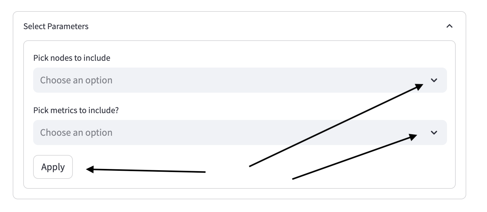

Flowgraph Section
-----------------

The flowgraph section displays the data dependencies for each node. Nodes are color-coded based on
their task status. Green means task status is a success, red means task status is a failure,
and yellow means task status is pending. Currently, task status should never be yellow because you
cannot view the dashboard while the build is not done. This is functionality we hope to add. 
Paths that are part of the 'winning path' will have bolded edges.

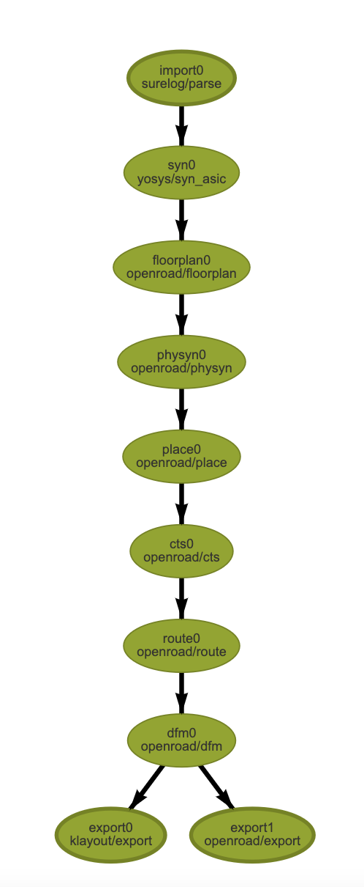

To activate the flowgraph, click on it once. This allows you to interact with the flowgraph.
You can drag nodes around, pan the view, and zoom in/out. You can also click nodes to select
them for the `Node Information Section`_. You can see a node is selected by it becoming bolded
(in the image below, that's floorplan0). Double clicking nodes will send you to a blank html page.
We are aware of this bug.

.. image::  ../../_images/dashboard_images/dashboard_metrics_flowgraph_node_selected.png
    :width: 200

Node Information Section
------------------------

The node information section consists of three subsections - node metrics, node details, and node files.

.. image::  ../../_images/dashboard_images/dashboard_metrics_node_information.png

You can select a node using the "Node Selection" expander. Click "Apply" to make the change.

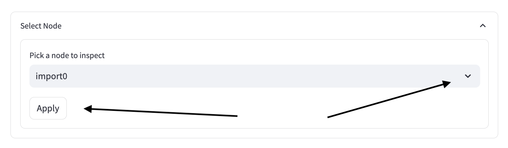

Node Metrics Subsection
+++++++++++++++++++++++

The node metrics subsection consists of all of the non-"None" values recorded for each of the metrics recorded for the selected node.

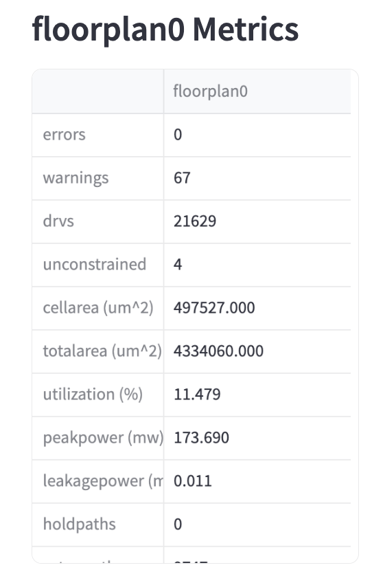

Node Details Subsection
+++++++++++++++++++++++

The node details subsection consists of all of the characteristics about this node that are not reflected in the metrics section.

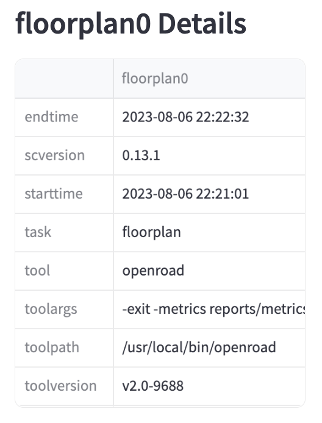

Node Files Subsection
+++++++++++++++++++++

The node files subsection consists of all of the files for a given node that are in the build directory.

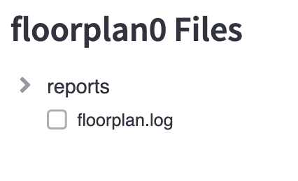

Selecting a node will display a list of the metrics that the file informs below the file tree. 

.. image::  ../../_images/dashboard_images/dashboard_node_information_file_explorer_node_list.png
    :width: 300

===============
File Viewer Tab
===============

The selected node you clicked in the `Node Files Subsection`_ will appear here.
The header is the name of the file selected. You may download the file by clicking the download button.

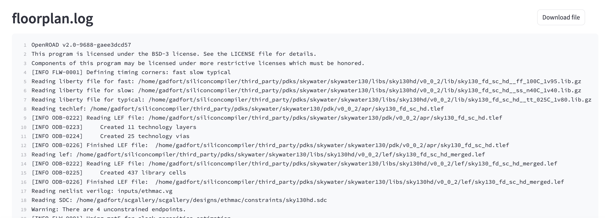

If no file is selected, an error message will be displayed telling you to select a file first.

.. image::  ../../_images/dashboard_images/dashboard_file_viewer_error.png

============
Manifest Tab
============

The next tab you can select is the manifest tab. This displays the manifest after it has been filtered through to make it more readable.
More specifically, if the 'pernode' value of the leaf of the Schema is 'never', the value of the leaf
is the value of the leaf['node']['global']['global']['value']. If there is no value for that, then 
it is the value of the leaf['node']['default']['default']['value']. Outside of that,
the nodes will be concatenated, or if the step and index is 'default' and 'default' or 'global' and 'global',
the node will be 'default' or 'global', respectively.

.. image::  ../../_images/dashboard_images/dashboard_manifest.png

To view the manifest, click the arrow on the dictionary.

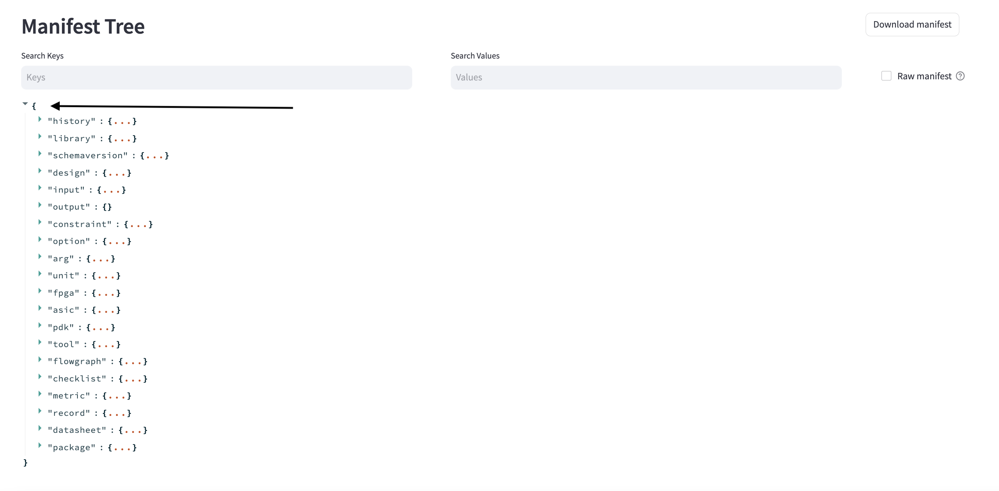

You can view the raw manifest by clicking the checkbox to the right of the search bar.

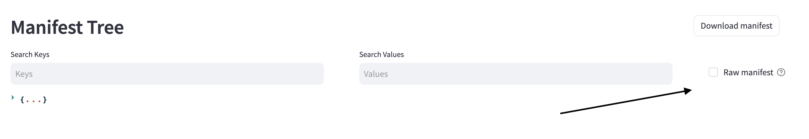

The search bars will return partial matches for either the keys of the JSON or the values. Press enter to search. If you do not want to search, delete any text in the search bars and press enter.

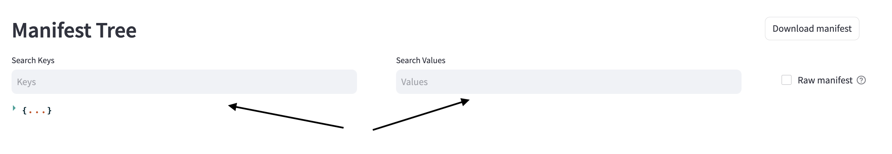

You may download the JSON as you view it at any point. The name of the folder is "manifest.json"

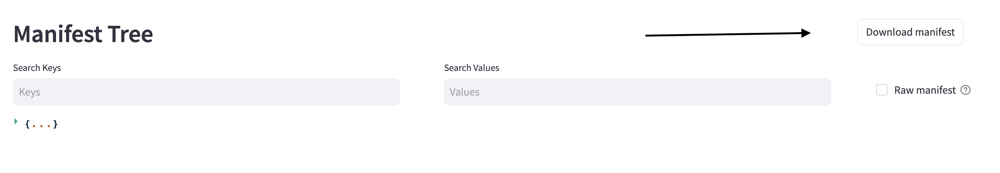

===================
Display Preview Tab
===================

This displays the preview image of the chip if there is one in the directory. If not, this tab will not be included.

.. image::  ../../_images/dashboard_images/dashboard_design_preview.png

==========
Graphs Tab
==========

This tab is meant to make comparisons between nodes for a given metric over many chip objects.

.. image::  ../../_images/dashboard_images/dashboard_graphs.png

At the top of the panel, select which runs/jobs to include for all the graphs. These are the runs
from the chip's history and the runs included with the -graph_cfg flag.

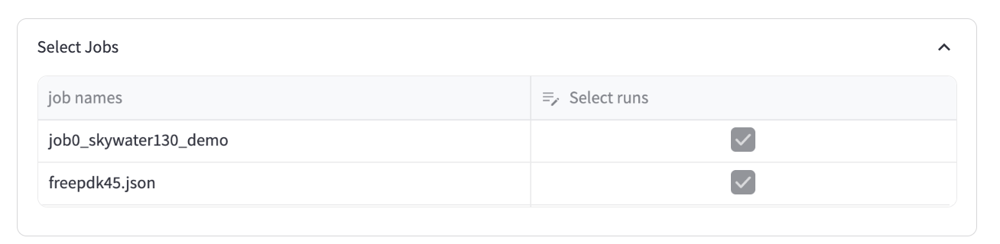

Move the slider to add more graphs or remove old ones. Removing old graphs will remove them in the reverse order in which they were added.

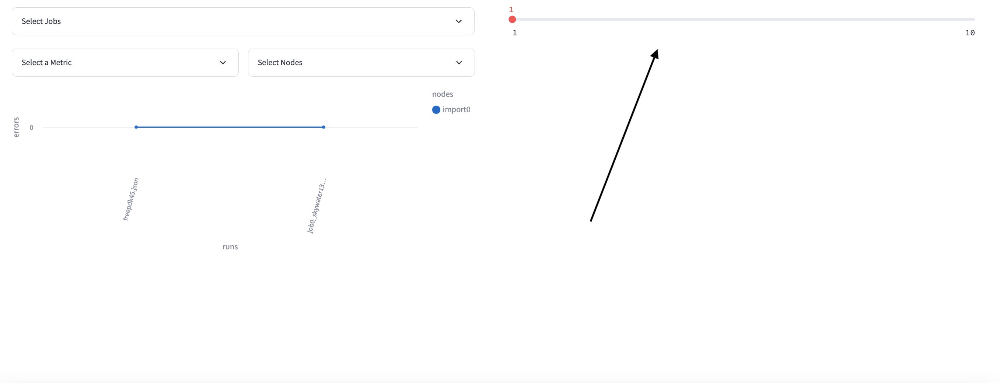

For each graph, you must select one metric. A random metric will be pre-selected. Click 'Apply' to see the changes.

.. image::  ../../_images/dashboard_images/dashboard_graphs_metric_selector.png
    :width: 300

You may select any amount of nodes. A random node will be pre-selected. If you select 0 nodes, a blank graph will appear.
Click 'Apply' to see the changes.

.. image::  ../../_images/dashboard_images/dashboard_graphs_nodes_selector.png
    :width: 300

Sometimes nodes may not have values for a metric, in which case they will not be included in the graph.

.. image::  ../../_images/dashboard_images/dashboard_graphs_nodes_selected_vs_nodes_displayed.png

Sometimes nodes that are in the legend are not visible on the graph. What has happened is that they have the exact same values as some other node. Consider deselecting other nodes in this case.

.. image::  ../../_images/dashboard_images/dashboard_graphs_nodes_displayed_vs_nodes_seen.png
