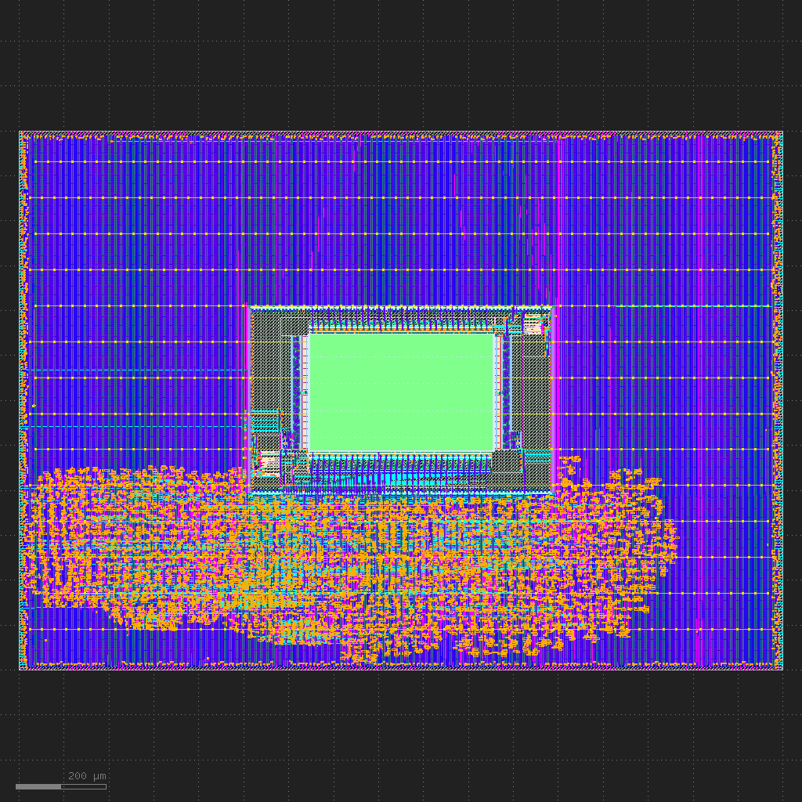

Hierarchical Flow
=================

This tutorial walks you through using SC's hierarchical flow to create a 
system-on-chip (SoC), the ZeroSoC, a simple system-on-chip meant to
demonstrate SiliconCompiler's end-to-end design capabilities.

.. image:: _images/zerosoc.png

ZeroSoC is based on a subset of the IP used in the open-source `OpenTitan SoC
<https://github.com/lowrisc/opentitan>`_. It includes:

* An `Ibex <https://github.com/lowrisc/ibex>`_ RV32I processor
* A GPIO controller with 32 configurable I/O ports
* A UART peripheral
* RAM (2KB for ASIC, 8KB for FPGA)

ZeroSoC's design and supporting files can be found at
`<https://github.com/siliconcompiler/zerosoc>`_.

Getting Started
---------------
Before we begin, the first thing to know is that the ZeroSoC ASIC is built in
two parts:

* First, the *core*, which contains the actual digital logic implementing the
  ZeroSoC.
* Second, the *top-level*, which wraps the core and places the ZeroSoC's padring
  (the portion that implements I/O) around it.

We build the ZeroSoC core and the top using SC's included :ref:`OpenROAD <openroad>`-based 
:ref:`asicflow <asicflow-ref>`.
For the *core*, we will use SC's 1) pin constraints (:keypath:`constraint,pin`)
to define the location of the pins around the core, 2) component placement constraints
(:keypath:`constraint,component`) to place the SRAM macro in the *core*, 3) supply a 
power grid script to OpenROAD to build a power grid compatible with the hierarchal flow.
For the *top-level*, we will reuse the *core* macro generated to demonstrate a 
hierarchal flow.

Let's begin by cloning the ZeroSoC Github repository. Be sure to initialize the
submodules to pull down the required third-party design files:

.. code-block:: console

  $ git clone https://github.com/siliconcompiler/zerosoc.git
  $ cd zerosoc
  $ git submodule update --init --recursive

In order to follow along, you should also :ref:`install
SiliconCompiler<Installation>`.

.. include:: ../user_guide/installation/installation_prep_path.rst

.. note::
   If you close your shell, you'll need to rerun the ``export`` command from the
   code block above in your next session. To avoid this, you can add the command
   to your ``~/.bashrc`` to have it always apply.

Quick Start
-----------

If you want top get started with building the ZeroSoC, you can use the provided "build.py"
to get started.

.. code-block::

  usage: build.py [-h] [--core-only] [--top-only] [--floorplan] [--verify] [--remote] [--resume]

  Build ZeroSoC

  options:
    -h, --help   show this help message and exit
    --core-only  Only build ASIC core GDS.
    --top-only   Only integrate ASIC core into padring. Assumes core already built.
    --floorplan  Break after floorplanning.
    --verify     Run DRC and LVS.
    --remote     Run on remote server. Requires SC remote credentials.
    --resume     Resume previous run.

Setting up SC
^^^^^^^^^^^^^

The first thing we need to do to is fill out our :class:`Chip` object
with a minimal configuration. The following items needs to be configured:

1) A design name, used to name the layout in the output file. This is always required when instantiating a chip object.
2) A technology target, for providing technology-specific information.
3) Macro libraries, in order to perform macro placement.

First, we instantiate a new chip and set its target to :ref:`Skywater 130 <skywater130-demo-ref>`,
an open-source PDK that has a demo build target bundled with SC. We'll provide the design name as a
parameter so that we can reuse this configuration function for testing both the
core and top padring::

  from siliconcompiler import Chip
  chip = Chip('asic_core')
  chip.load_target('skywater130_demo')

Next, we want to load SRAM macro library.  The setup files for this library is already
included in ZeroSoC (for the RAM) and load it into the chip object with :meth:`.use()`::

  from libs import sky130sram
  chip.use(sky130sram)

In addition, the names of the macro library must be added to the :keypath:`asic, macrolib`
parameter::

  chip.add('asic', 'macrolib', 'sky130sram')

Note that if you'd like to include a Verilog behavioral model of a macro, that
can be passed to SC just like any other Verilog source. However, keep in mind
that :ref:`Yosys <yosys>` creates a blackbox definition of all cells defined in liberty files
it reads, and if it reads a Verilog source that defines the same module, this
will trigger an error. Therefore, to switch between a behavioral model and a
blackbox, we recommend creating a wrapper that instantiates one or the other
based on a parameter or preprocessor macro. Since we don't need Verilog sources
for our minimal configuration, this isn't shown here.

Putting it all together into a function called ``configure_chip()`` should look like this::

  from siliconcompiler import Chip
  from libs import sky130sram

  def configure_chip():
      chip = Chip('asic_core')
      chip.load_target('skywater130_demo')

      chip.use(sky130sram)
      chip.add('asic', 'macrolib', 'sky130sram')

      return chip

Floorplanning
^^^^^^^^^^^^^

To begin we need to define from constants we can use later to make things a little simpler::

  GPIO  = 'sky130_ef_io__gpiov2_pad_wrapped'
  VDD   = 'sky130_ef_io__vccd_hvc_pad'
  VDDIO = 'sky130_ef_io__vddio_hvc_pad'
  VSS   = 'sky130_ef_io__vssd_hvc_pad'
  VSSIO = 'sky130_ef_io__vssio_hvc_pad'

  RAM   = 'sky130_sram_2kbyte_1rw1r_32x512_8'

Additionally, we need some helper methods to make it easier to determine the IO pad ring order.
The following method ``define_io_placement`` will generate the order of the pads in the padring for
each edge::

  def define_io_placement():
      we_io = [GPIO] * 5 + [VDD, VSS, VDDIO, VSSIO] + [GPIO] * 4
      no_io = [GPIO] * 9 + [VDDIO, VSSIO, VDD, VSS]
      ea_io = [GPIO] * 9 + [VDDIO, VSS, VDD, VSSIO]
      so_io = [GPIO] * 5 + [VDD, VSS, VDDIO, VSSIO] + [GPIO] * 4

      return we_io, no_io, ea_io, so_io

.. _core outline:

Core Outline
~~~~~~~~~~~~

First, we need to define the core outline (:keypath:`constraint,outline`) and margins in (:keypath:`constraint,corearea`).
For the ZeroSoC the core outline needs to be approximately 1700\ :math:`{\mu}`\ m by 1200\ :math:`{\mu}`\ m which will yield a design density around 20%.
The margin is chosen to be 10\ :math:`{\mu}`\ m.

.. code-block::

    core_w = 1700
    core_h = 1200
    core_margin = 10
    diearea = [(0, 0), (core_w, core_h)]
    corearea = [(core_margin, core_margin), (core_w - core_margin, core_h - core_margin)]

    chip.set('constraint', 'outline', diearea)
    chip.set('constraint', 'corearea', corearea)

Pin placement
~~~~~~~~~~~~~

Next, we need to define the pin constraints (:keypath:`constraint,pin`) for the pins around the core.

Since there are actually multiple control signals for each GPIO pad in the pad ring, we first construct a list that 
contains the name of each one, and some additional info needed to handle indexing into vectors. We also define some 
values that are the same for every pin we place::

    pins = [
        # (name, # bit in vector, width of vector)
        ('din', 0, 1), # in
        ('dout', 0, 1), # out
        ('ie', 0, 1), # inp_dis
        ('oen', 0, 1), # oe_n
        ('tech_cfg', 0, 18), # hld_h_n
        ('tech_cfg', 1, 18), # enable_h
        ('tech_cfg', 2, 18), # enable_inp_h
        ('tech_cfg', 3, 18), # enable_vdda_h
        ('tech_cfg', 4, 18), # enable_vswitch_h
        ('tech_cfg', 5, 18), # enable_vddio
        ('tech_cfg', 6, 18), # ib_mode_sel
        ('tech_cfg', 7, 18), # vtrip_sel
        ('tech_cfg', 8, 18), # slow
        ('tech_cfg', 9, 18), # hld_ovr
        ('tech_cfg', 10, 18), # analog_en
        ('tech_cfg', 11, 18), # analog_sel
        ('tech_cfg', 12, 18), # analog_pol
        ('tech_cfg', 13, 18), # dm[0]
        ('tech_cfg', 14, 18), # dm[1]
        ('tech_cfg', 15, 18), # dm[2]
        ('tech_cfg', 16, 18), # tie_lo_esd
        ('tech_cfg', 17, 18), # tie_hi_esd
    ]

Next we need to define the order we want OpenROAD to place the pins in for each edge of the core.
To do this we use :keypath:`constraint,pin,<name>,side` and :keypath:`constraint,pin,<name>,order`.

For the left/west side of the core, we use a for loop to determine the ordering of each pin::

    we_pads, no_pads, ea_pads, so_pads = define_io_placement()
    # Filter out GPIO pins for the we_pads list
    for i, _ in enumerate([pad for pad in we_pads if pad == GPIO]):
        order_offset = len(pins) * i
        for pin_order, pin_spec in enumerate(pins):
            pin, bit, width = pin_spec
            # Construct name based on side, pin name, and bit # in vector
            name = f'we_{pin}[{i * width + bit}]'
            # Place pin
            chip.set('constraint', 'pin', name, 'side', 1)
            chip.set('constraint', 'pin', name, 'order', order_offset + pin_order)

Here we use ``1`` for :keypath:`constraint,pin,<name>,side` to indicate the left edge, ``2`` corresponds
to the top, ``3`` corresponds to the right, and ``4`` corresponds to the bottom edges.
So now we just need to repeat for the other 3 edges.

SRAM placement
~~~~~~~~~~~~~~

Next, we would like to define the placement of the SRAM in the core using the component constraints :keypath:`constraint,component`. This is not required, since OpenROAD
should be capable of generating an automatic placement.
We arbitrarily choose to place the SRAM in the middle of the core using :keypath:`constraint,component,<name>,placement`::

    instance_name = 'soc.ram.u_mem.gen_sky130.u_impl_sky130.gen32x512.mem'
    chip.set('constraint', 'component', instance_name, 'placement', [core_w / 2, core_h / 2, 0])

If we wanted to place it somewhere else, we would simply need to change the ``core_w / 2`` and ``core_h / 2`` to something else.

Global connections
~~~~~~~~~~~~~~~~~~

Next, we need to define how current and new instances in the design should be
connected to the power and ground nets.
To do this, we use the OpenROAD variable :keypath:`tool,<openroad>,task,<floorplan>,var` to define ``global_connect``

To define the global connections in OpenROAD we use ``add_global_connection`` to specify that pins with the names
``VDD``, ``VPWR``, ``VPB``, and ``vccd1`` should connect to ``_vdd`` and pins with the names
``VSS``, ``VGND``, ``VNB``, and ``vssd1`` should connect to ``_vss``.
``VDD``, ``VPWR``, ``VPB``, ``VSS``, ``VGND``, and ``VNB`` all come from the :ref:`sky130hd` library and ``vccd1`` and ``vssd1``
are from the SRAM macro.

A copy of the tcl script is provided below it's in the ZeroSoC file "openroad/global_connect.tcl".
Please refer to `OpenROAD <https://openroad.readthedocs.io/en/latest/main/src/README.html#global-connections>`_ documentation.

.. code-block:: tcl

    ####################################
    # global connections
    ####################################
    add_global_connection -net {_vdd} -pin_pattern {VDD} -power
    add_global_connection -net {_vdd} -pin_pattern {VPWR}
    add_global_connection -net {_vdd} -pin_pattern {VPB}
    add_global_connection -net {_vdd} -pin_pattern {vccd1}
    add_global_connection -net {_vss} -pin_pattern {VSS} -ground
    add_global_connection -net {_vss} -pin_pattern {VGND}
    add_global_connection -net {_vss} -pin_pattern {VNB}
    add_global_connection -net {_vss} -pin_pattern {vssd1}

To setup the chip object to specify where this file is located::

    chip.set('tool', 'openroad', 'task', 'floorplan', 'var', 'global_connect', os.path.join(os.path.dirname(__file__), 'openroad', 'global_connect.tcl'))

Power grid
~~~~~~~~~~

Finally, we need to specify a power grid for the core.
The following tcl script specifies a grid for the core and the sram. Please refer to `PDNGEN <https://openroad.readthedocs.io/en/latest/main/src/pdn/README.html>`_
for a description of each command.

.. code-block:: tcl

    ####################################
    # voltage domains
    ####################################
    set_voltage_domain -name {CORE} -power {_vdd} -ground {_vss}
    ####################################
    # standard cell grid
    ####################################
    define_pdn_grid -name {grid} -voltage_domains {CORE} -pins met4
    add_pdn_stripe -grid {grid} -layer {met1} -width {0.48} -pitch {5.44} -offset {0} -followpins
    add_pdn_stripe -grid {grid} -layer {met4} -width {1.600} -pitch {27.140} -offset {13.570}
    # Set to large pitch as the chip grid needs to be able to get met5 straps in too
    add_pdn_stripe -grid {grid} -layer {met5} -width {1.600} -pitch {160.000} -offset {80.000}
    add_pdn_connect -grid {grid} -layers {met1 met4}
    add_pdn_connect -grid {grid} -layers {met4 met5}

    ####################################
    # grid for: sky130_sram_*
    ####################################
    define_pdn_grid -name {SRAM} -voltage_domains {CORE} -macro -cells "sky130_sram_*" -halo "2.0 2.0 2.0 2.0"
    add_pdn_connect -grid {SRAM} -layers {met4 met5}

This script will place straps on met1, met4, and met5 and ensure connectivite between them.
Because this block will be used as a submodule in another design, we specificy that straps on met4
should be added as pins so the next level in the hierarchy can access them and connect.
Normally, this would be done on the top metal layer, but because met5 is the highest metal, we need to provide pins below met5
so they can accessed.

.. code-block::

    chip.set('tool', 'openroad', 'task', 'floorplan', 'var', 'pdn_config', os.path.join(os.path.dirname(__file__), 'openroad', 'pdngen.tcl'))

Run
^^^

Now, we can run the core::

  chip.run()

The final layout for the core is shown here

Prepare Core as IP
^^^^^^^^^^^^^^^^^^

Now, we need to specify the output files for the core so we can use it as a input to the *top-level* design.
To do this we need to use the :meth:`.find_result()` method to find the correct outputs from the run and then
set then to the appropriate key :keypath:`output`::

    # set up pointers to final outputs for integration
    # Set physical outputs
    stackup = chip.get('option', 'stackup')
    chip.set('output', stackup, 'gds', chip.find_result('gds', step='export', index='0'))
    chip.set('output', stackup, 'lef', chip.find_result('lef', step='export', index='1'))

    # Set output netlist
    chip.set('output', 'netlist', 'verilog', chip.find_result('vg', step='export', index='1'))

    # Set timing libraries
    for scenario in chip.getkeys('constraint', 'timing'):
        corner = chip.get('constraint', 'timing', scenario, 'libcorner')[0]
        chip.set('output', corner, 'nldm', chip.find_result(f'{corner}.lib', step='export', index='1'))

    # Set pex outputs
    for scenario in chip.getkeys('constraint', 'timing'):
        corner = chip.get('constraint', 'timing', scenario, 'pexcorner')
        chip.set('output', corner, 'spef', chip.find_result(f'{corner}.spef', step='export', index='1'))

    chip.write_manifest("asic_core.pkg.json")

Build Chip
----------

We now have the core of the chip built, so we can move on to building the *top-level* design.

Setting up SC
^^^^^^^^^^^^^

First we need to setup a new :class:`.Chip` object.
We will follow a similar setup as the core, except this time we need to load the :ref:`sky130io` library and
the core to be able to complete the design.

We start with a new Chip::

  from siliconcompiler import Chip
  chip = Chip('asic_top')
  chip.load_target('skywater130_demo')

Next, we want to load the IO library.::

  from siliconcompiler.libs import sky130io
  chip.use(sky130io)

Now we need to load the previous core, this can be done in one of two ways.
First, if the core is still loaded then we can simply to::

  chip.use(core_chip)

Otherwise, we need to load it from disk::

  core_chip = Chip("asic_core")
  core_chip.read_manifest("asic_core.pkg.json")
  chip.use(core_chip)

Finally, the names of the libraries must be added to the :keypath:`asic, macrolib`
parameter::

  chip.add('asic', 'macrolib', 'sky130io')
  chip.add('asic', 'macrolib', core_chip.top())

Notice that here we can use :meth:`.top()` so we can modify the core name without needing
to update the script.

Putting it all together into a function called ``configure_chip()`` should look like this::

  from siliconcompiler import Chip
  from siliconcompiler.libs import sky130io

  def configure_chip(core_chip = None):
      chip = Chip('asic_top')
      chip.load_target('skywater130_demo')

      if not core_chip:
          core_chip = Chip("asic_core")
          core_chip.read_manifest("asic_core.pkg.json")

      chip.use(core_chip)
      chip.use(sky130io)
      chip.add('asic', 'macrolib', 'sky130sram')
      chip.add('asic', 'macrolib', core_chip.top())

      return chip

Floorplanning
^^^^^^^^^^^^^

Core Outline
~~~~~~~~~~~~

Again, we need to define the core outline (:keypath:`constraint,outline`) and margins in (:keypath:`constraint,corearea`).
Recall that in `core outline`_ the outline was 1700\ :math:`{\mu}`\ m by 1200\ :math:`{\mu}`\ m, now we need to make room for the 
IO pads, which are approximately 220\ :math:`{\mu}`\ m tall, plus some room around the chip core of 50\ :math:`{\mu}`\ m and die edges 10\ :math:`{\mu}`\ m.
This results in a chip that is almost 2300\ :math:`{\mu}`\ m by 1800\ :math:`{\mu}`\ m.

.. code-block::

    top_w = 2300
    top_h = 1800
    io_offset = 10
    core_offset = 220
    margin = core_offset + io_offset
    diearea = [(0, 0), (top_w, top_h)]
    corearea = [(margin, margin), (core_w - margin, core_h - margin)]

    chip.set('constraint', 'outline', diearea)
    chip.set('constraint', 'corearea', corearea)

Pad ring
~~~~~~~~

Next, we need to build the pad ring.
This is done seven basic steps:

* Define IO sites, because the :ref:`sky130io` library does not contain any sites, we need to define some for OpenROAD to use
* Define IO rows to use for pad placement
* Place pads
* Place corners
* Place IO filler cells
* Connect ring signals together
* Place bond pads

Please refer to `ICeWall <https://openroad.readthedocs.io/en/latest/main/src/pad/README.html>`_
for a description of each command.

.. code-block::

    # Create false IO sites, since sky130 does not have PAD sites available
    make_fake_io_site -name IO_HSITE -width 1 -height 200
    make_fake_io_site -name IO_VSITE -width 1 -height 200
    make_fake_io_site -name IO_CSITE -width 200 -height 204

    # Create IO Rows
    make_io_sites -horizontal_site IO_HSITE -vertical_site IO_VSITE -corner_site IO_CSITE -offset 10 -rotation R180

    # Place pads
    proc place_padring_edge { row dim edge } {
        upvar sc_cfg  sc_cfg
        upvar sc_tool sc_tool
        upvar sc_task sc_task
        set span [ord::dbu_to_microns [[[pad::get_row $row] getBBox] d$dim]]
        set span_start [ord::dbu_to_microns [[[pad::get_row $row] getBBox] ${dim}Min]]
        set pad_length [llength [dict get $sc_cfg tool $sc_tool task $sc_task {var} padring_${edge}_name]]
        set pad_interval [expr $span / ($pad_length + 1)]
        for { set i 0 } { $i < $pad_length } { incr i } {
            set pad_name   [lindex [dict get $sc_cfg tool $sc_tool task $sc_task {var} padring_${edge}_name] $i]
            set pad_master [lindex [dict get $sc_cfg tool $sc_tool task $sc_task {var} padring_${edge}_master] $i]
            puts "Placing IO pad: $pad_name"
            place_pad \
                -master $pad_master \
                -row $row \
                -location [expr $span_start + ($i + 0.5) * $pad_interval] \
                $pad_name
        }
    }

    place_padring_edge IO_WEST y west
    place_padring_edge IO_NORTH x north
    place_padring_edge IO_EAST y east
    place_padring_edge IO_SOUTH x south

    # Place corners
    place_corners sky130_ef_io__corner_pad

    # Place IO fill
    set iofill [dict get $sc_cfg library sky130io asic cells filler]
    place_io_fill -row IO_NORTH {*}$iofill
    place_io_fill -row IO_SOUTH {*}$iofill
    place_io_fill -row IO_WEST {*}$iofill
    place_io_fill -row IO_EAST {*}$iofill

    # Connect ring signals
    connect_by_abutment

    # Add bond pads
    place_bondpad -bond sky130_ef_io__bare_pad padring.*_pads\[0\].i0.*.gpio -offset "12.5 115"
    place_bondpad -bond sky130_ef_io__bare_pad padring.*_pads\[0\].i0.*.io* -offset "8 95"

In the script we depend on a couple of variables which we need to define in the manifest: 
``padring_west_name``, ``padring_west_master``, ``padring_north_name``, ``padring_north_master``, ``padring_east_name``, ``padring_east_master``, ``padring_south_name``, and ``padring_south_master``
In the following script, we will setup the padring and define all the variables for the edges.

.. code-block:: python

    def configure_padring(chip):
        ## Place pads ##
        chip.set('tool', 'openroad', 'task', 'floorplan', 'file', 'padring', os.path.join(os.path.dirname(__file__), 'openroad', 'padring.tcl'))

        we_pads, no_pads, ea_pads, so_pads = define_io_placement()
        indices = {}
        indices[GPIO] = 0
        indices[VDD] = 0
        indices[VSS] = 0
        indices[VDDIO] = 0
        indices[VSSIO] = 0

        for pad_type in we_pads:
            i = indices[pad_type]
            indices[pad_type] += 1
            if pad_type == GPIO:
                pad_name = f'padring.we_pads\[0\].i0.padio\[{i}\].i0.gpio'
                pin_name = f'we_pad[{i}]'
            else:
                if pad_type == VDD:
                    pin_name = 'vdd'
                elif pad_type == VSS:
                    pin_name = 'vss'
                elif pad_type == VDDIO:
                    pin_name = 'vddio'
                elif pad_type == VSSIO:
                    pin_name = 'vssio'
                pad_name = f'padring.we_pads\[0\].i0.pad{pin_name}\[0\].i0.io{pin_name}'

            chip.add('tool', 'openroad', 'task', 'floorplan', 'var', 'padring_west_name', pad_name)
            chip.add('tool', 'openroad', 'task', 'floorplan', 'var', 'padring_west_master', pad_type)

And then we repeat for the other three sides.

Core placement
~~~~~~~~~~~~~~

Next, we would like to define the placement of the core in the core using the component constraints :keypath:`constraint,component`::

    chip.set('constraint', 'component', 'core', 'placement', [top_w / 2, top_h / 2, 0])

Global connections
~~~~~~~~~~~~~~~~~~

Next, we need to define how current and new core in the design should be
connected to the power and ground nets.
To do this, we use the OpenROAD variable :keypath:`tool,<openroad>,task,<floorplan>,var` to define ``global_connect``

To define the global connections in OpenROAD we use ``add_global_connection`` to specify that pins with the names
``VDD``, ``VPWR``, ``VPB``, and ``_vdd`` should connect to ``vdd``, pins with the names
``VSS``, ``VGND``, ``VNB``, and ``_vss`` should connect to ``vss``, pins in the padring ``VDDIO`` and ``VSSIO`` connect to 
``vddio`` and ``vssio``, respectively.

A copy of the tcl script is provided below it's in the ZeroSoC file "openroad/global_connect_top.tcl".

.. code-block:: tcl

    ####################################
    # global connections
    ####################################
    add_global_connection -net {vddio} -pin_pattern {VDDIO} -power
    add_global_connection -net {vssio} -pin_pattern {VSSIO} -ground

    add_global_connection -net {vdd} -pin_pattern {VDD} -power
    add_global_connection -net {vdd} -pin_pattern {VPWR}
    add_global_connection -net {vdd} -pin_pattern {VPB}
    add_global_connection -net {vdd} -pin_pattern {_vdd}
    add_global_connection -net {vss} -pin_pattern {VSS} -ground
    add_global_connection -net {vss} -pin_pattern {VGND}
    add_global_connection -net {vss} -pin_pattern {VNB}
    add_global_connection -net {vss} -pin_pattern {_vss}

To setup the chip object to specify where this file is located::

    chip.set('tool', 'openroad', 'task', 'floorplan', 'var', 'global_connect', os.path.join(os.path.dirname(__file__), 'openroad', 'global_connect_top.tcl'))

Power grid
~~~~~~~~~~

Finally, we need to specify a power grid for the chip.
The following tcl script specifies a grid for the chip and the core.

.. code-block:: tcl

    ####################################
    # voltage domains
    ####################################
    set_voltage_domain -name {CORE} -power {vdd} -ground {vss}
    ####################################
    # standard cell grid
    ####################################
    define_pdn_grid -name {grid} -voltage_domains {CORE}
    add_pdn_stripe -grid {grid} -layer {met1} -width {0.48} -pitch {5.44} -offset {0} -followpins
    add_pdn_ring -connect_to_pads -layers {met4 met5} -widths {2.0 2.0} -spacings {2.0 2.0} -core_offsets {1.0 1.0 1.0 1.0}
    add_pdn_ring -connect_to_pads -layers {met2 met3} -widths {2.0 2.0} -spacings {2.0 2.0} -core_offsets {1.0 1.0 1.0 1.0}
    add_pdn_stripe -grid {grid} -layer {met4} -width {1.600} -pitch {27.140} -offset {13.570} -extend_to_core_ring
    add_pdn_stripe -grid {grid} -layer {met5} -width {1.600} -pitch {27.200} -offset {13.600} -extend_to_core_ring
    add_pdn_connect -grid {grid} -layers {met1 met4}
    add_pdn_connect -grid {grid} -layers {met2 met3}
    add_pdn_connect -grid {grid} -layers {met3 met4}
    add_pdn_connect -grid {grid} -layers {met4 met5}

    ####################################
    # grid for: core
    ####################################
    define_pdn_grid -name {chip_core} -voltage_domains {CORE} -macro -cells "asic*" -halo "1.0 1.0 1.0 1.0"
    add_pdn_connect -grid {chip_core} -layers {met4 met5}

To setup the chip object to specify where this file is located::

    chip.set('tool', 'openroad', 'task', 'floorplan', 'var', 'pdngen', os.path.join(os.path.dirname(__file__), 'openroad', 'pdngen_top.tcl'))

This script will place straps on met1, met4, and met5 and ensure connectivite between them.
Because we need to connect the padring to core power, we use the two rings formed on ``met2-met5`` to connect the pads
the core power.

Run
^^^

Now, we can run the chip level design::

  chip.run()

The final layout for the core is shown here

.. image:: _images/zerosoc.png

This will put together the entire ZeroSoC hierarchy. The final result will be found in
``<build_dir>/asic_top/job0/export/0/outputs/asic_top.gds``.

Followon Activities
-------------------

Here is a list of possible modifications which could be interesting to attempt
to get more familiar with SiliconCompiler

- Move the SRAM to the corner of the design
- Change the density of the placement
- Decrease the chip size to a 2000\ :math:`{\mu}`\ m by 1500\ :math:`{\mu}`\ m, adjusting the core area accordingly
- Change the distribution of the ``VDD``, ``VSS``, ``VDDIO``, and ``VSSIO`` pads in the padring
