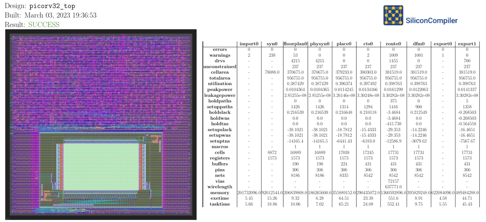
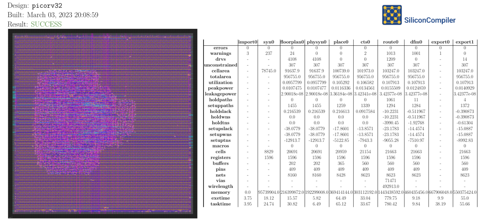

Building Your Own SoC
=====================

This tutorial will walk you through the process of building an ASIC containing one PicoRV32 RISC-V CPU core and 2 kilobytes of SRAM, on an open-source 130nm Skywater process node, with SiliconCompiler's remote workflow:

We will walk through the process of downloading the design files and writing a build script, but for your reference, you can find complete example designs which reflect the contents of this tutorial in the public SiliconCompiler repository. The first part of the tutorial will cover building the CPU core `without RAM <https://github.com/siliconcompiler/siliconcompiler/tree/main/examples/picorv32>`_, and the second part will describe how to `add an SRAM block <https://github.com/siliconcompiler/siliconcompiler/tree/main/examples/picorv32>`_.

See the :ref:`Installation <Installation>` section for information on how to install SiliconCompiler, and the :ref:`Remote Processing <Remote Processing>` section for instructions on setting up the remote workflow.

Download PicoRV32 Verilog Code
------------------------------

The heart of any digital design is its HDL code, typically written in a language such as Verilog or VHDL. High-level synthesis languages are gaining in popularity, but most of them still output their final design sources in a traditional HDL such as Verilog.

PicoRV32 is an open-source implementation of a small RISC-V CPU core, the sort you might find in a low-power microcontroller. Its source code, license, and various tooling can be found `in its GitHub repository <https://github.com/YosysHQ/picorv32>`_.

We have a copy of the core CPU module's Verilog at `examples/picorv32/picorv32.v <https://github.com/siliconcompiler/siliconcompiler/blob/main/examples/picorv32/picorv32.v>`_. Create a new directory for this project, and copy the ``picorv32.v`` file into it.

Build the PicoRV32 Core using SiliconCompiler
---------------------------------------------

Before we add the complexity of a RAM macro block, let's build the core design using the open-source :ref:`Skywater 130 <skywater130_demo>` PDK. Copy the following build script into the same directory which you copied ``picorv32.v`` into:

.. code-block:: python
    :caption: <project_dir>/picorv32.py

    import siliconcompiler

    chip = siliconcompiler.Chip('picorv32')
    chip.load_target('skywater130_demo')
    chip.input('picorv32.v')
    chip.set('option', 'remote', True)
    chip.run()

Note in the code snippet above that :ref:`remote` is set to ``True``. This means it is set up for :ref:`remote processing`, and if you run this example as a Python script, it should take approximately 20 minutes to run if the servers are not too busy. We have not added a RAM macro yet, but this script will build the CPU core with I/O signals placed pseudo-randomly around the edges of the die area. Once the job finishes, you should receive a screenshot of your final design, and a report containing metrics related to the build in ``build/picorv32/job0/report.pdf``. SiliconCompiler will try to open the file after the job completes, but it may not be able to do so if you are running in a headless environment.

For the full GDS-II results and intermediate build artifacts, you can run the build locally. See the :ref:`local run` section for more information.

.. note::

    We are not returning the full results during this early beta period because we want to minimize bandwidth, and we believe that our public beta is currently best suited for rapid prototyping and design exploration. See the :ref:`remote processing` section for more information.

Adding an SRAM block
--------------------

A CPU core is not very useful without any memory. Indeed, a real system-on-chip would need quite a few supporting IP blocks to be useful in the real world. At the very least, you would want a SPI interface for communicating with external non-volatile memory, a UART to get data in and out of the core, a debugging interface, and a small on-die cache.

In this tutorial, we'll take the first step by adding a small (2 kilobyte) SRAM block and wiring it to the CPU's memory interface. This will teach you how to import and place a hard IP block in your design.

The open-source Skywater130 PDK does not currently include foundry-published memory macros. Instead, they have a set of OpenRAM configurations which are blessed by the maintainers. You can use `those configurations <https://github.com/VLSIDA/OpenRAM/tree/stable/technology/sky130>`_ to generate RAM macros from scratch if you are willing to install the `OpenRAM utility <https://github.com/VLSIDA/OpenRAM>`_, or you can `download pre-built files <https://github.com/VLSIDA/sky130_sram_macros>`_.

We will use the `sky130_sram_2kbyte_1rw1r_32x512_8 <https://github.com/VLSIDA/sky130_sram_macros/tree/main/sky130_sram_2kbyte_1rw1r_32x512_8>`_ block in this example. You can download the required files through `GitHub's website <https://github.com/VLSIDA/sky130_sram_macros/tree/main/sky130_sram_2kbyte_1rw1r_32x512_8>`_, or using a tool like  ``curl``::

    curl https://raw.githubusercontent.com/VLSIDA/sky130_sram_macros/main/sky130_sram_2kbyte_1rw1r_32x512_8/sky130_sram_2kbyte_1rw1r_32x512_8.gds > sky130_sram_2kbyte_1rw1r_32x512_8.gds
    curl https://raw.githubusercontent.com/VLSIDA/sky130_sram_macros/main/sky130_sram_2kbyte_1rw1r_32x512_8/sky130_sram_2kbyte_1rw1r_32x512_8.lef > sky130_sram_2kbyte_1rw1r_32x512_8.lef

A GDS file and a LEF file for the memory macro are needed to provide basic placement and routing information for the build tools. Once you have those files, create a new directory called ``sram/`` in same location as your PicoRV32 build files, and move the macro files there. Then, create a Python script called ``sky130_sram_2k.py`` in that ``sram/`` directory to describe the RAM macro in a format which can be imported by SiliconCompiler:

.. code-block:: python
    :caption: <project_dir>/sram/sky130_sram_2k.py

    import siliconcompiler

    def setup(chip):
        # Core values.
        design = 'sky130_sram_2k'
        stackup = chip.get('option', 'stackup')

        # Create Library object to represent the macro.
        lib = siliconcompiler.Library(chip, design)
        lib.set('output', stackup, 'gds', f'sram/sky130_sram_2kbyte_1rw1r_32x512_8.gds')
        lib.set('output', stackup, 'lef', f'sram/sky130_sram_2kbyte_1rw1r_32x512_8.lef')
        # Set the 'copy' field to True to pull these files into the build directory during
        # the 'import' task, which makes them available for the remote workflow to use.
        lib.set('output', stackup, 'gds', True, field='copy')
        lib.set('output', stackup, 'lef', True, field='copy')

        return lib

You will also need a "blackbox" Verilog file to assure the synthesis tools that the RAM module exists: you can call this file ``sky130_sram_2k.bb.v``, and place it in your ``sram/`` directory. You don't need a full hardware description of the RAM block to generate an ASIC design, but the open-source workflow needs some basic information about the module:

.. code-block:: verilog
    :caption: <project_dir>/sram/sky130_sram_2k.bb.v

    (* blackbox *)
    module sky130_sram_2kbyte_1rw1r_32x512_8(
    `ifdef USE_POWER_PINS
        vccd1,
        vssd1,
    `endif
    // Port 0: RW
        input clk0,
        input csb0,
        input web0,
        input [3:0] wmask0,
        input [8:0] addr0,
        input [31:0] din0,
        output reg [31:0] dout0,
    // Port 1: R
        input clk1,
        input csb1,
        input [8:0] addr1,
        output reg [31:0] dout1
      );
    endmodule

Next, you need to create a top-level Verilog module containing one ``picorv32`` CPU core, one ``sky130_sram_2k`` memory, and signal wiring to connect their I/O ports together. Note that for the sake of brevity, this module does not include some optional parameters and signals. Check `our picorv32_ram example <https://github.com/siliconcompiler/siliconcompiler/blob/main/examples/picorv32_ram/picorv32_top.v>`_ for a more complete ``picorv32_top`` declaration:

.. code-block:: verilog
    :caption: <project_dir>/picorv32_top.v

    `timescale 1 ns / 1 ps

    module picorv32_top (
            input clk, resetn,
            output reg trap,

            // Look-Ahead Interface
            output            mem_la_read,
            output            mem_la_write,
            output     [31:0] mem_la_addr,
            output reg [31:0] mem_la_wdata,
            output reg [ 3:0] mem_la_wstrb,

            // Pico Co-Processor Interface (PCPI)
            output reg        pcpi_valid,
            output reg [31:0] pcpi_insn,
            output     [31:0] pcpi_rs1,
            output     [31:0] pcpi_rs2,
            input             pcpi_wr,
            input      [31:0] pcpi_rd,
            input             pcpi_wait,
            input             pcpi_ready,

            // IRQ Interface
            input      [31:0] irq,
            output reg [31:0] eoi,

            // Trace Interface
            output reg        trace_valid,
            output reg [35:0] trace_data
    );

        // Memory signals.
        reg mem_valid, mem_instr, mem_ready;
        reg [31:0] mem_addr;
        reg [31:0] mem_wdata;
        reg [ 3:0] mem_wstrb;
        reg [31:0] mem_rdata;

        // No 'ready' signal in sky130 SRAM macro; presumably it is single-cycle?
        always @(posedge clk)
            mem_ready <= mem_valid;

        // (Signals have the same name as the picorv32 module: use '.*' to autofill)
        picorv32 rv32_soc (
          .*
        );

        // SRAM with always-active chip select and write control bits.
        sky130_sram_2kbyte_1rw1r_32x512_8 sram (
            .clk0(clk),
            .csb0('b0),
            .web0(!(mem_wstrb != 0)),
            .wmask0(mem_wstrb),
            .addr0(mem_addr),
            .din0(mem_wdata),
            .dout0(mem_rdata),
            .clk1(clk),
            .csb1('b1),
            .addr1('b0),
            .dout1()
        );
    endmodule

Finally, your core build script will need to be updated to import the new SRAM Library, and specify some extra parameters such as die size and macro placement:

.. code-block:: python
    :caption: <project_dir>/picorv32_top.py

    import siliconcompiler

    design = 'picorv32_top'
    die_width = 1000
    die_height = 1000

    chip = siliconcompiler.Chip(design)
    chip.load_target('skywater130_demo')

    # Set input source files.
    chip.input(f'{design}.v')
    chip.input('picorv32.v')
    chip.input('sram/sky130_sram_2k.bb.v')

    # Set clock period, so that we won't need to provide an SDC constraints file.
    chip.clock('clk', period=10)

    # Set die outline and core area.
    chip.set('constraint', 'outline', [(0,0), (die_width, die_height)])
    chip.set('constraint', 'corearea', [(10,10), (die_width-10, die_height-10)])

    # Setup SRAM macro library.
    from sram import sky130_sram_2k
    chip.use(sky130_sram_2k)
    chip.add('asic', 'macrolib', 'sky130_sram_2k')

    # SRAM pins are inside the macro boundary; no routing blockage padding is needed.
    chip.set('tool', 'openroad', 'task', 'route', 'var', 'grt_macro_extension', '0')
    # Disable CDL file generation until we can find a CDL file for the SRAM block.
    chip.set('tool', 'openroad', 'task', 'export', 'var', 'write_cdl', 'false')

    # Place macro instance.
    chip.set('constraint', 'component', 'sram', 'placement', (500.0, 250.0, 0.0))
    chip.set('constraint', 'component', 'sram', 'rotation', 270)

    # Build on a remote server.
    chip.set('option', 'remote', True)
    chip.run()

With all of that done, your project directory tree should look something like this::

    <rundir>
    ├── sram
    │ ├── sky130_sram_2k.bb.v
    │ ├── sky130_sram_2k.py
    │ ├── sky130_sram_2kbyte_1rw1r_32x512_8.gds
    │ └── sky130_sram_2kbyte_1rw1r_32x512_8.lef
    ├── picorv32.py
    ├── picorv32.v
    ├── picorv32_top.py
    └── picorv32_top.v

Your ``picorv32_top.py`` build script should take about 20 minutes to run on the cloud servers if they are not too busy, with most of that time spent in the routing task. As with the previous designs, you should see updates on its progress printed every 30 seconds, and you should receive a screenshot and metrics summary once the job is complete:

Extending your design
---------------------

Now that you have a basic understanding of how to assemble modular designs using SiliconCompiler, why not try building a design of your own creation, or adding a custom accelerator to your new CPU core?
