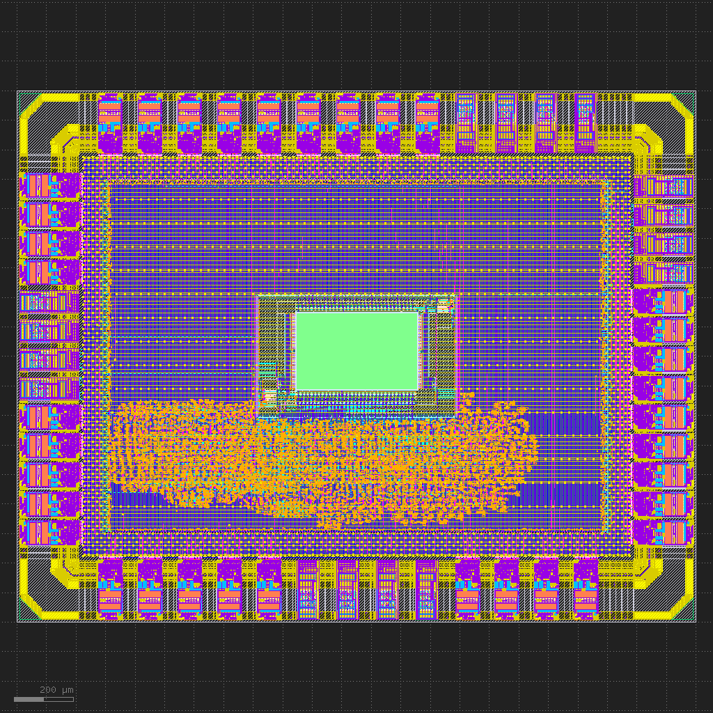
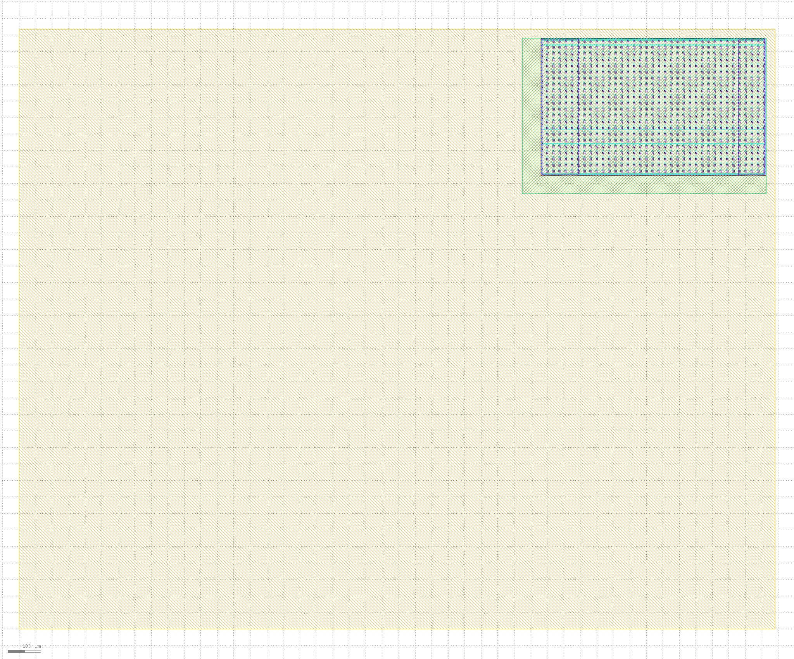
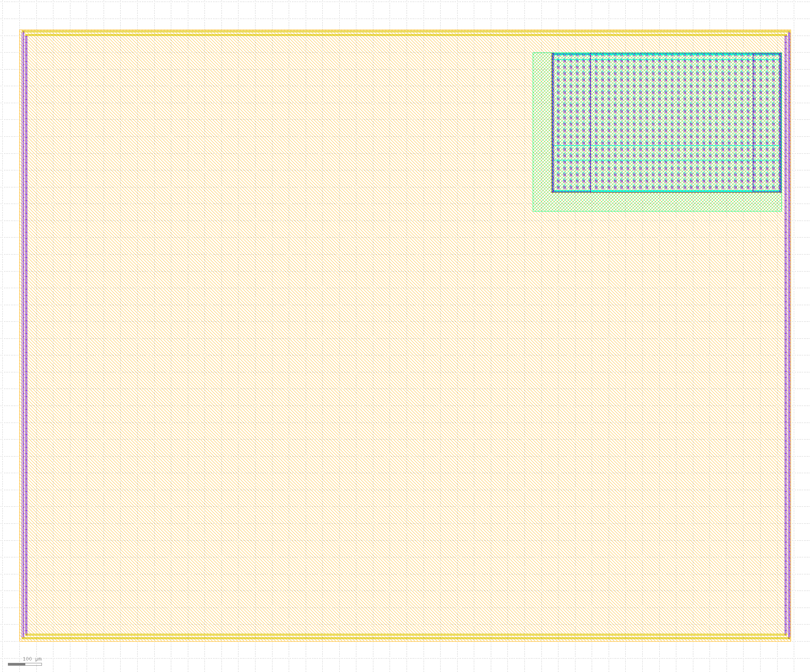
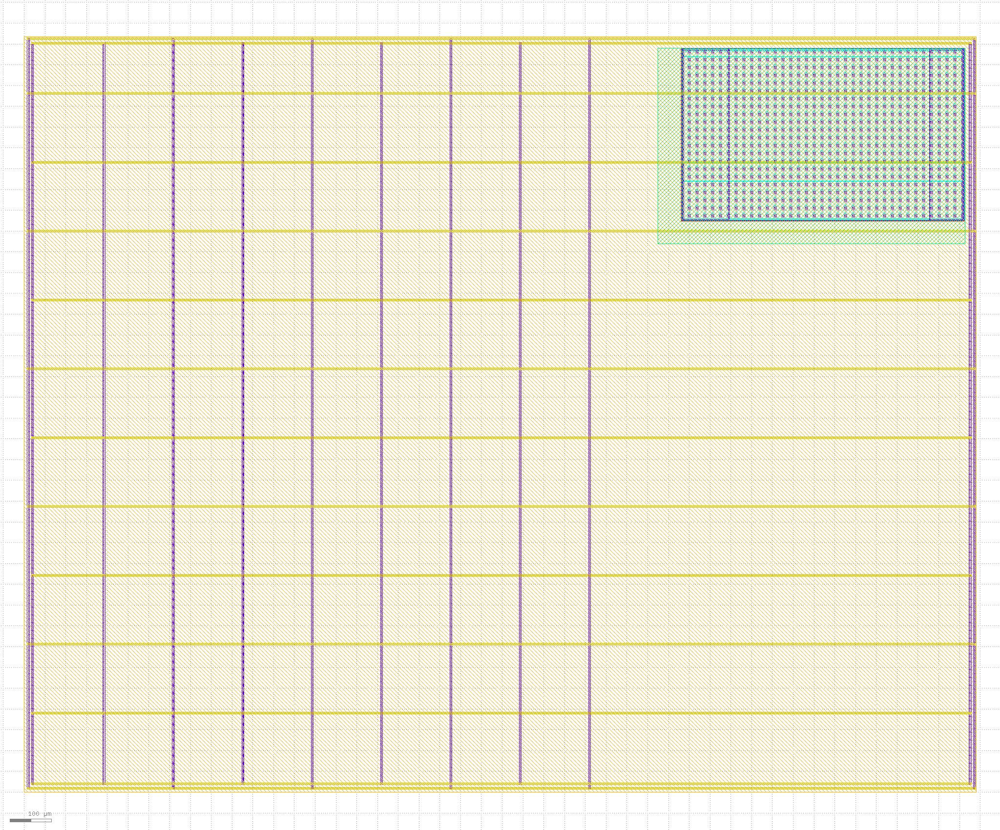
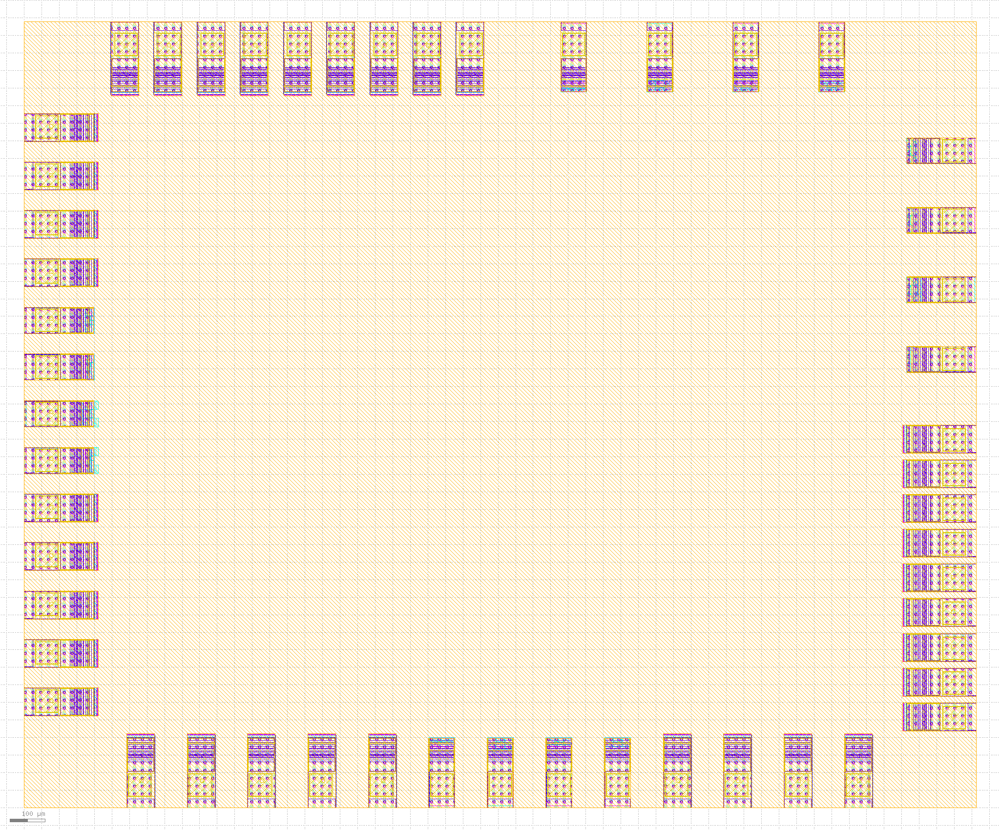
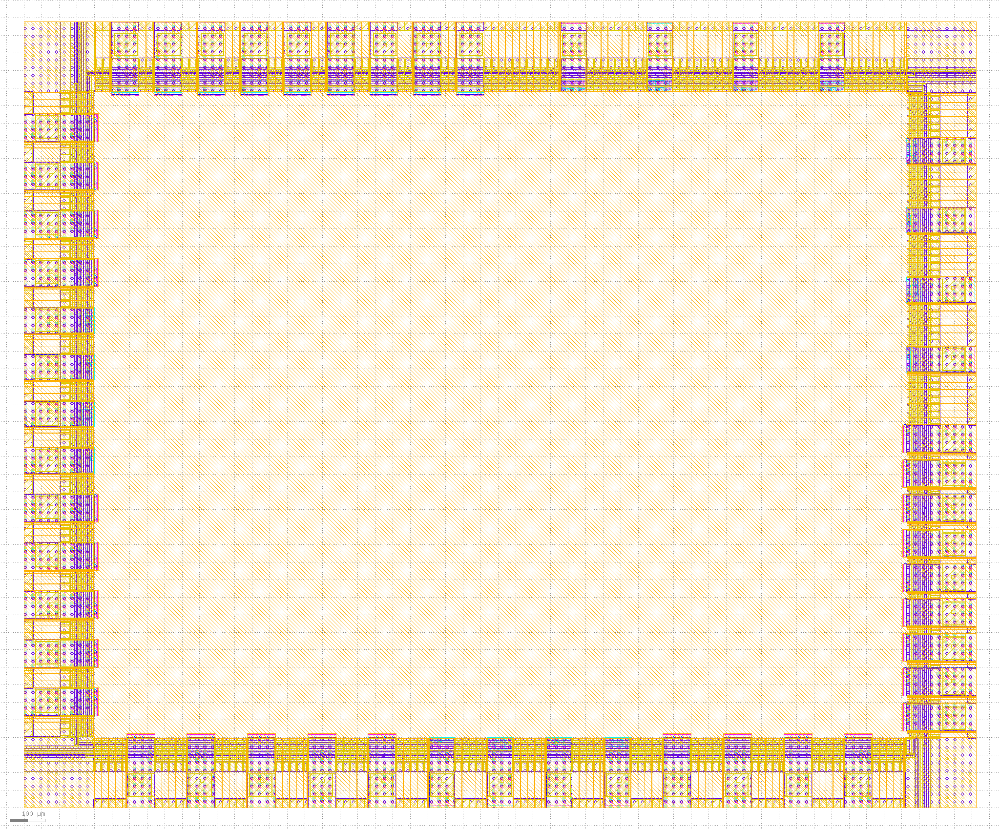

End-to-end design flow with ZeroSoC
===================================

[TODO - title: focus on physical design?]

ZeroSoC is a simple system-on-chip designed to demonstrate SiliconCompiler’s
capabilities for driving an end-to-end design flow, including FPGA testing and
full RTL-to-GDS compilation based on a custom floorplan and padring.

[TODO: regenerate image with up-to-date ZeroSoC]

This tutorial walks you through using SC to drive an ASIC compilation flow
for this design, with particular focus on how to use SC’s tech-agnostic
floorplanning API to develop a full-chip floorplan, including padring.

ZeroSoC is based on a subset of the IP used in the open-source `OpenTitan SoC
<https://github.com/lowrisc/opentitan>`_. In particular, it includes:

* An `Ibex <https://github.com/lowrisc/ibex>`_ RV32I processor
* A GPIO controller with 32 configurable I/O ports
* A UART peripheral
* RAM (2KB for ASIC, 8KB for FPGA)

ZeroSoC’s design and supporting files can be found at
https://github.com/siliconcompiler/zerosoc.

[TODO: add statement about assumed knowledge/other sections that should be read first?]

ZeroSoC Floorplan
------------------
SC includes a library for designing chip floorplans using Python, providing a
high degree of flexibility and easy automation of floorplan design
(:ref:`API Reference<Floorplan API>`). In this part of the tutorial, we describe how
to use this API to iteratively build up a floorplan for ZeroSoC from scratch.
We encourage you to check your progress using the layout visualizer `KLayout
<https://www.klayout.de/>`_ on each step, an approach that mirrors how you would
develop your own floorplan using this API.

Note that for this tutorial we chose to target the open-source Skywater130 PDK
to maximize accessibility, but we aimed to make the configuration as
technology-agnostic as possible. Throughout the tutorial, we highlight aspects
of SC's design that allows you to abstract away technology-specific details and
enable easy porting between technology nodes.

Getting Started
+++++++++++++++
Before we begin, the first thing to know is that the ZeroSoC ASIC is built in
two different parts:

* First, the *core*, which contains the actual digital logic implementing the
  ZeroSoC.
* Second, the *top-level*, which wraps the core and places the ZeroSoC's padring
  (the portion that implements I/O) around it.

The ZeroSoC core is built using SC's standard OpenROAD-based flow, including
automatic place-and-route, and it has metal pins around the core's boundary for
input and output. The core and padring are designed such that these pins route to
the inner pins of the I/O pads by abutment. Therefore, the top-level does not require
automatic place-and-route -- it is defined entirely by the top-level floorplan
file. This manual placement is verified through DRC and LVS, comparing the
design to a netlist. This two-part build is important to understand since we
will specify the floorplans of each component separately.

[TODO: show KLayout screenshot zoomed in to routing via abutment]

Let's begin by cloning the ZeroSoC Github repository. Be sure to initialize the
submodules to pull down the required third-party design files:

.. code-block:: bash

  git clone https://github.com/siliconcompiler/zerosoc.git
  git submodule update --init --recursive

Now, create a new Python file in the ZeroSoC directory called ``floorplan.py``,
and copy in the following boilerplate::

  from siliconcompiler.core import Chip
  from siliconcompiler.floorplan import Floorplan

  import math

  def configure_chip(design):
    # Minimal chip configuration goes here, for testing

  def core_floorplan(fp):
    # Definition of core floorplan goes here

  def main():
    core_chip = configure_chip('asic_core')
    core_chip.write_manifest('sc_manifest.json')
    core_fp = Floorplan(core_chip)
    core_floorplan(core_fp)
    core_fp.write_def('asic_core.def')

  if __name__ == '__main__':
    main()

This file gives us a framework to start designing ZeroSoC's core floorplan. The
``main()`` routine first calls a function ``configure_chip()``, which returns an
SC Chip object, and uses that to instantiate a Floorplan. We need to provide
this Chip object since it's considered best-practice to rely on aspects of the
Chip configuration to define floorplans in a technology-agnostic way. We'll
point out examples of this throughout the tutorial.

Next, ``main()`` calls ``core_floorplan()``, which will ultimately use the
functions defined by the fLoorplan API to define the floorplan itself. Finally,
``main()`` calls a method of the floorplan object, ``write_def()``, to generate
an output DEF file that we can either preview in KLayout or pass into an SC
compilaton flow.

Minimal chip configuration
++++++++++++++++++++++++++++++
The first thing we need to do to is fill out our ``configure_chip()`` function
with a minimal configuration. Floorplanning relies on the following items being
configured in the provided chip object:

1) A technology target, used for abstracting technology-specific information.
2) A design name, used to name the layout in the output file.
3) Macro libraries, in order to perform macro placement.

Let's fill out ``configure_chip()`` to accomplish these tasks one-by-one. First,
we instantiate a new chip and set its target to Skywater 130::

  chip = Chip()
  chip.target('skywater130')

Next, we'll provide the design name as a parameter so that we can reuse this
configuration function for testing both the core and top padring::

  chip.set('design', design)

Last, we want to configure two macro libraries, one for ZeroSoC's RAM and the
other for ZeroSoC's I/O cells.  The first step to including macros in a design
is to point SC to the relevant files in your build configuration. At a minimum,
you’ll need LEF, GDS, and liberty files for each of your libraries. In the
configuration schema, all macro library configurations live under a key path
starting with ``library``, followed by a designer-defined macro library name.
The following lines show how the ZeroSoC configuration points to its RAM macro
library::

  libname = 'ram'
  chip.add('library', libname, 'nldm', 'typical', 'lib', 'asic/sky130/ram/sky130_sram_2kbyte_1rw1r_32x512_8_TT_1p8V_25C.lib')
  chip.add('library', libname, 'lef', 'asic/sky130/ram/sky130_sram_2kbyte_1rw1r_32x512_8.lef')
  chip.add('library', libname, 'gds', 'asic/sky130/ram/sky130_sram_2kbyte_1rw1r_32x512_8.gds')

In addition, the name of the macro library must be added to the ``'asic', 'macrolib'``
parameter::

  chip.add('asic', 'macrolib', libname)

Finally, it's a good idea to specify the "type" of a macro libray in order to
distinguish it from the technology target-defined standard cell library used for
automatic place and route. The standard type for a macro library is
"component"::

  chip.set('library', libname, 'type', 'component')

Note that if you’d like to include a Verilog behavioral model of a macro, that
can be passed to SC just like any other Verilog source. However, keep in mind
that if Yosys notices a cell defined in a liberty file it will automatically
blackbox it, and any Verilog source that defines the same module will be
considered an error. Therefore, to switch between a behavioral model and a macro
blackbox, we recommend defining a wrapper that chooses between the two based on
a parameter or preprocessor macros. Since we don't need Verilog sources for our
minimal configuration, this isn't shown here.

In order to reference the long names of each macro we plan to use, we also put a
few constants above ``configure_chip``, which we can use throughout the
floorplan definition::

  GPIO = 'sky130_ef_io__gpiov2_pad_wrapped'
  VDD = 'sky130_ef_io__vccd_hvc_pad'
  VDDIO = 'sky130_ef_io__vddio_hvc_pad'
  VSS = 'sky130_ef_io__vssd_hvc_pad'
  VSSIO = 'sky130_ef_io__vssio_hvc_pad'
  CORNER = 'sky130_ef_io__corner_pad'
  FILL_CELLS = ['sky130_ef_io__com_bus_slice_1um',
                'sky130_ef_io__com_bus_slice_5um',
                'sky130_ef_io__com_bus_slice_10um',
                'sky130_ef_io__com_bus_slice_20um']

  RAM = 'sky130_sram_2kbyte_1rw1r_32x512_8'

With all these pieces included, along with additional configuration for the I/O
library, your definition of ``configure_chip()`` should look like this::

  def configure_chip(design):
      chip = Chip()
      chip.target('skywater130')

      chip.set('design', design)

      libname = 'ram'
      chip.add('library', libname, 'nldm', 'typical', 'lib', 'asic/sky130/ram/sky130_sram_2kbyte_1rw1r_32x512_8_TT_1p8V_25C.lib')
      chip.add('library', libname, 'lef', 'asic/sky130/ram/sky130_sram_2kbyte_1rw1r_32x512_8.lef')
      chip.add('library', libname, 'gds', 'asic/sky130/ram/sky130_sram_2kbyte_1rw1r_32x512_8.gds')
      chip.add('asic', 'macrolib', libname)
      chip.set('library', libname, 'type', 'component')

      libname = 'io'
      chip.add('library', libname, 'nldm', 'typical', 'lib', 'asic/sky130/io/sky130_dummy_io.lib')
      chip.set('library', libname, 'lef', 'asic/sky130/io/sky130_ef_io.lef')
      # Need both GDS files: ef relies on fd one
      chip.add('library', libname, 'gds', 'asic/sky130/io/sky130_ef_io.gds')
      chip.add('library', libname, 'gds', 'asic/sky130/io/sky130_fd_io.gds')
      chip.add('asic', 'macrolib', libname)
      chip.set('library', libname, 'type', 'component')

      return chip

Chip dimensions
++++++++++++++++
The first step to floorplanning a chip is to define the actual size and
placement area of the chip itself. Since ZeroSoC is implemented as a multi-step
build, we'll define these dimensions in a new function that can be reused by
both the core and top-level floorplan, so that we don't have any integration
bugs due to dimension mismatch. Let's call this function
``define_dimensions()``, and have it take in a floorplan object called ``fp``
(you can place this function right after ``configure_chip()``)::

  def define_dimensions(fp):

First, let's define two variables that specify the size of the area in the
middle of the chip where automated place-and-route can put standard cells::

  place_w = 4860 * fp.stdcell_width
  place_h = 648 * fp.stdcell_height

Note that these dimensions are calculated based on two values extracted from the
``fp`` object: the standard cell width and standard cell height.  This detail is
important, and we encourage this technique as best practice. By scaling the die
size based on these values, the floorplan becomes technology-agnostic [TODO: can
I make this claim? the floorplan itself isn't totally technology-agnostic, so
I'm not sure how best to express this idea] -- if we
wanted to change the underlying technology to a PDK with larger or smaller
standard cell placement sites, the die would be scaled automatically to
accommodate. This is also why we need to provide a configured chip object to
instantiate our Floorplan object -- that's how it extracts this information.

Next, we'll define two variables for the sizes of the margins around the
placement area::

  margin_left = 60 * fp.stdcell_width
  margin_bottom = 10 * fp.stdcell_height

We specify these margins to be large enough to allow us to route a ring for
power delivery around the standard cells (we'll describe how power delivery is
performed in more depth later on). We also once again use standard cell
dimensions to specify the size here, but for another reason besides scaling: it
is generally beneficial for tools to snap dimensions to relevant grids. In this
case, we want to ensure that the routing tracks generated are aligned with the
pins on our standard cells, and we can do this by making sure the bottom and
left margins around the placement areas are snapped to standard cell dimensions.

Based on these hardcoded margins and placement area, we can compute the size of
the core itself::

  core_w = place_w + 2 * margin_left
  core_h = place_h + 2 * margin_bottom

Although we're not going to use it right away, the last step is to compute the
size of the ZeroSoC top-level, which must be equal to the core plus the height
of the padring along each edge::

  gpio_h = fp.available_cells[GPIO].height
  top_w = math.ceil(core_w + 2 * gpio_h)
  top_h = math.ceil(core_h + 2 * gpio_h)

Our padring height is going to be equal to the height of our I/O library's GPIO
cell. The floorplan API handily provides us with the ability to look up the
dimensions of macros through its ``available_cells`` dictionary.

We use ``math.ceil`` here to ensure that our top-level width and height are each
a whole number of microns. This is crucial for us to be able to construct the
padring, which we'll discuss later on in the tutorial. The key behind this idea
is that our top and right margins don't need to be constrained by standard cell
dimensions, so by imposing that constraint on the bottom and left margins, then
taking rounding up the total dimensions, we can effectively "stretch" the top
and right margins by a bit to ensure this constraint is met. The final step is
to recalculate our final core width and height, based on these new stretched-out
margins::

  core_w = top_w - 2 * gpio_h
  core_h = top_h - 2 * gpio_h

Putting this all together along with a return statement to provide all the
important dimensions from this function to the caller, we get::

  def define_dimensions(fp):
      place_w = 4860 * fp.stdcell_width
      place_h = 648 * fp.stdcell_height
      margin_left = 60 * fp.stdcell_width
      margin_bottom = 10 * fp.stdcell_height

      core_w = place_w + 2 * margin_left
      core_h = place_h + 2 * margin_bottom

      # GPIO is largest I/O cell, so its height is the height of each side of the
      # padring.
      # Use math.ceil to ensure that chip's dimensions are whole microns, so we can
      # fill with I/O fill cells (this implicitly stretches our top/right margins a
      # bit to make this work out -- i.e. the place area is not entirely centered
      # within the core, but you can't tell)
      gpio_h = fp.available_cells[GPIO].height
      top_w = math.ceil(core_w + 2 * gpio_h)
      top_h = math.ceil(core_h + 2 * gpio_h)

      core_w = top_w - 2 * gpio_h
      core_h = top_h - 2 * gpio_h

      return (top_w, top_h), (core_w, core_h), (place_w, place_h), (margin_left, margin_bottom)

Specifying die area
+++++++++++++++++++
Now that we have the basic size of our chip defined, we can begin to define
the floorplan of ZeroSoC's core. To initialize a floorplan, we first need to
call ``create_die_area()`` on our floorplan object, passing in the relevant
dimensions. Put the following code in ``core_floorplan()``::

  _, (core_w, core_h), (place_w, place_h), (margin_left, margin_bottom) = define_dimensions(fp)
  fp.create_diearea([(0, 0), (core_w, core_h)], corearea=[(margin_left, margin_bottom), (place_w + margin_left, place_h + margin_bottom)])

The first two arguments to ``create_die_area`` specify the overall width and
height of the chip, and the ``core_area`` keyword argument specifies the legal
area for placing standard cells (note that the term "core" in ``core_area`` refers
to something other than the ZeroSoC "core").

With this function in place, we now have a minimal SC floorplan! To preview your
work, go ahead and run ``floorplan.py``. This should produce some log output, as
well as 2 files: ``asic_core.def``, and ``sc_manifest.json``. The ``.def`` file
contains our floorplan in DEF format, while ``sc_manifest.json`` contains our
chip configuration in SiliconCompiler’s JSON manifest format. We can display
this DEF file in KLayout by running the following command:

.. code-block:: bash

  $ sc-show asic_core.def -cfg sc_manifest.json

We point ``sc-show`` at ``sc_manifest.json`` since ``sc-show`` will use it to
configure KLayout according to our technology and macro library specifications
to give you a proper view of your DEF file.

Now, KLayout should show you an outline of the core, like in the following
image.

.. image:: _images/die_area.png

Placing RAM
+++++++++++
An orange rectangle isn't very exciting, so for our next step, let's try placing
the RAM macro. We'll do this using the floorplan API's ``place_macros``
function, which allows you to place a list of macros from a starting position
and a given pitch along the x and y-axes. However, to place a single macro like
the ZeroSoC’s RAM, we can just pass in a list of one instance, and 0s for the
pitch values [TODO: I think a scalar place function could be nice]. Note that we
specify ``snap=True`` to ensure the RAM's position is standard-cell aligned.
This can be helpful to ensure the router has an easier time wiring to the macro.
Insert the following code after our call to ``create_die_area()``::

  ram_w = fp.available_cells[RAM].width
  ram_h = fp.available_cells[RAM].height
  ram_x = place_w + margin_left - ram_w
  ram_y = place_h + margin_bottom - ram_h
  fp.place_macros([('soc.ram.u_mem.gen_sky130.u_impl_sky130.genblk1.mem', RAM)], ram_x, ram_y, 0, 0, 'N', snap=True)

We utilize our pre-existing dimensions, as well as the RAM size information
stored in ``available_cells`` to place the macro in the upper-right corner of
the design. We place it here since the only pins we need to access are on the
left and bottom of the macro, and this ensures those pins are easily accessible.

It's important to pay attention to how macro instances are specified. Each
macro is specified as a tuple of two strings: the first is the particular
instance name in the design, and the second is the name of the macro itself.
Getting this instance name correct (accounting for hierarchy, indexing into
generate blocks, etc.) can be tricky, and it’s important to get it right for the
macro placement to be honored by the design tool. Here are the rules for
converting from your design hierarchy to the name extracted by Yosys:

[TODO: figure out how the heck this really works and/or give users a tool to
figure it out more easily]

Along with the macro placement itself, we add a placement blockage layer to
ensure that standard cells aren't placed too close to the RAM pins, which can
result in routing congestion::

  ram_core_space_x = 120 * fp.stdcell_width
  ram_core_space_y = 20 * fp.stdcell_height
  fp.place_blockage(ram_x - ram_core_space_x, ram_y - ram_core_space_y, ram_w + ram_core_space_x, ram_h + ram_core_space_y)

Now, if we run ``floorplan.py`` and view the resulting DEF, we can see the RAM
macro placed in the top right of the die area, with the blockage area besides
and below it highlighted.

Placing Pins
++++++++++++
To complete the core, we need to place pins around the edges of the block so
that these pins abut the I/O pad control signals. Just like with the chip
dimensions, we need to share data between both levels of the ZeroSoC hierarchy
here, so we'll specify these dimensions in a new common Python function. We'll
call this function ``define_io_placement()``, and start off by defining four
lists with the order of the I/O pad types on each side::

  def define_io_placement(fp):
      we_io = [GPIO] * 5 + [VDD, VSS, VDDIO, VSSIO] + [GPIO] * 4
      no_io = [GPIO] * 9 + [VDD, VSS, VDDIO, VSSIO]
      ea_io = [GPIO] * 9 + [VDD, VSS, VDDIO, VSSIO]
      so_io = [GPIO] * 5 + [VDD, VSS, VDDIO, VSSIO] + [GPIO] * 4

We want to design the floorplan so that the pads are all evenly spaced along
each side. Although we could calculate out the positions by hand, since we're
using Python, we can just calculate this programatically instead!

First, we'll define a helper function called ``calculate_even_spacing()``::

  def calculate_even_spacing(fp, pads, distance, start):
      n = len(pads)
      pads_width = sum(fp.available_cells[pad].width for pad in pads)
      spacing = (distance - pads_width) // (n + 1)

      pos = start + spacing
      io_pos = []
      for pad in pads:
          io_pos.append((pad, pos))
          pos += fp.available_cells[pad].width + spacing

      return io_pos

This function takes in a pad list, calculates the spacing between pads, and then
returns a new list, pairing each entry with the position of that pad.

Putting this all together, we can make use of this helper function to give us
what we want::

  def define_io_placement(fp):
      we_io = [GPIO] * 5 + [VDD, VSS, VDDIO, VSSIO] + [GPIO] * 4
      no_io = [GPIO] * 9 + [VDD, VSS, VDDIO, VSSIO]
      ea_io = [GPIO] * 9 + [VDD, VSS, VDDIO, VSSIO]
      so_io = [GPIO] * 5 + [VDD, VSS, VDDIO, VSSIO] + [GPIO] * 4

      (top_w, top_h), _, _, _ = define_dimensions(fp)
      corner_w = fp.available_cells[CORNER].width
      corner_h = fp.available_cells[CORNER].height

      we_io_pos = calculate_even_spacing(fp, we_io, top_h - corner_h - corner_w, corner_h)
      so_io_pos = calculate_even_spacing(fp, so_io, top_w - corner_h - corner_w, corner_w)

      # For east and north, we crowd GPIO on the first half of the side to make
      # sure we don't run into routing congestion issues due to the RAM in the
      # top-right corner.
      mid_w = (top_w - corner_h - corner_w) // 2
      no_io_pos = (calculate_even_spacing(fp, no_io[:9], mid_w, corner_h) +
                   calculate_even_spacing(fp, no_io[9:], mid_w, mid_w + corner_h))
      mid_h = (top_h - corner_h - corner_w) // 2
      ea_io_pos = (calculate_even_spacing(fp, ea_io[:9], mid_h, corner_w) +
                   calculate_even_spacing(fp, ea_io[9:], mid_h, mid_h + corner_w))

      return we_io_pos, no_io_pos, ea_io_pos, so_io_pos

Now, back to the pins! Since there are actually multiple control signals for
each GPIO pad, we first construct a list that contains the name of each one, as
well as their offset in microns from the edge of the pad. We also include some
constants that are the same for every pin we place. Add the following below the
``fp.place_blockage()`` call in ``core_floorplan()``::

  pin_width = 0.28
  pin_depth = 1
  layer = 'm2'
  pins = [
      ('din', 0, 1, 75.085), # in
      ('dout', 0, 1, 19.885), # out
      ('ie', 0, 1, 41.505), # inp_dis
      ('oen', 0, 1, 4.245), # oe_n
      ('tech_cfg', 0, 16, 31.845), # hld_h_n
      ('tech_cfg', 1, 16, 35.065), # enable_h
      ('tech_cfg', 2, 16, 38.285), # enable_inp_h
      ('tech_cfg', 3, 16, 13.445), # enable_vdda_h
      ('tech_cfg', 4, 16, 16.665), # enable_vswitch_h
      ('tech_cfg', 5, 16, 69.105), # enable_vddio
      ('tech_cfg', 6, 16, 7.465), # ib_mode_sel
      ('tech_cfg', 7, 16, 10.685), # vtrip_sel
      ('tech_cfg', 8, 16, 65.885), # slow
      ('tech_cfg', 9, 16, 22.645), # hld_ovr
      ('tech_cfg', 10, 16, 50.705), # analog_en
      ('tech_cfg', 11, 16, 29.085), # analog_sel
      ('tech_cfg', 12, 16, 44.265), # analog_pol
      ('tech_cfg', 13, 16, 47.485), # dm[0]
      ('tech_cfg', 14, 16, 56.685), # dm[1]
      ('tech_cfg', 15, 16, 25.865), # dm[2]
  ]

Now, we can write two nested for-loops for each side, the first over the list of
pad positions, and the second over the pin offsets, to calculate the position of
and place each I/O pin::

  we_pads, no_pads, ea_pads, so_pads = define_io_placement(fp)

  gpio_w = fp.available_cells[GPIO].width
  gpio_h = fp.available_cells[GPIO].height

  we_gpio_pos = [pos for pad, pos in we_pads if pad == GPIO]
  for i, y in enumerate(we_gpio_pos):
      y -= gpio_h
      for pin, bit, width, offset in pins:
          name = f'we_{pin}[{i * width + bit}]'
          fp.place_pins([name], 0, y + offset, 0, 0, pin_depth, pin_width, layer)

  no_gpio_pos = [pos for pad, pos in no_pads if pad == GPIO]
  for i, x in enumerate(no_gpio_pos):
      x -= gpio_h
      for pin, bit, width, offset in pins:
          name = f'no_{pin}[{i * width + bit}]'
          fp.place_pins([name], x + offset, core_h - pin_depth, 0, 0, pin_width, pin_depth, layer)

  ea_gpio_pos = [pos for pad, pos in ea_pads if pad == GPIO]
  for i, y in enumerate(ea_gpio_pos):
      y -= gpio_h
      for pin, bit, width, offset in pins:
          name = f'ea_{pin}[{i * width + bit}]'
          fp.place_pins([name], core_w - pin_depth, y + gpio_w - offset - pin_width, 0, 0, pin_depth, pin_width, layer)

  so_gpio_pos = [pos for pad, pos in so_pads if pad == GPIO]
  for i, x in enumerate(so_gpio_pos):
      x -= gpio_h
      for pin, bit, width, offset in pins:
          name = f'so_{pin}[{i * width + bit}]'
          fp.place_pins([name], x + gpio_w - offset - pin_width, 0, 0, 0, pin_width, pin_depth, layer)

If we build the core DEF now, and zoom in closely to one side of the die, we
should see the same clustered pattern of pins spaced out along it.

[TODO: insert image]

PDN
+++
The last important aspect of the core floorplan is the power delivery network.
Since this piece is relatively complicated, we'll create a new function,
``place_pdn``, that encapsulates all the PDN generation logic::

  def place_pdn(fp, ram_x, ram_y, ram_core_space):
      _, (core_w, core_h), (place_w, place_h), (margin_left, margin_bottom) = define_dimensions(fp)
      we_pads, no_pads, ea_pads, so_pads = define_io_placement(fp)

We'll also add a call to this function at the bottom of ``core_floorplan``::

  place_pdn(fp, ram_x, ram_y, ram_core_space_x)

``place_pdn`` takes in the floorplan to modify, as well as the position of the
RAM macro and border around it. These extra values are important to ensure we
can properly distribute power to the RAM macro itself. We'll also begin with two
calls to our helper functions to get the other relevant dimensions of our design.

The goal of our power delivery network is to create a grid over our entire
design that delivers VDD and GND signals from our I/O pads to each standard cell
in the design, as well as the RAM macro. This grid consists of horizontal and
vertical straps, and we'll add some variables to our PDN generator to
parameterize how these straps are created, and we'll use these parameters to
calculate an even pitch for the grid in both directions::

  ## Power grid configuration ##
  n_vert = 8 # how many vertical straps to place
  vwidth = 5 # width of vertical straps in microns
  n_hori = 10 # how many horizontal straps to place
  hwidth = 5 # width of horizontal straps
  vlayer = 'm4' # metal layer for vertical straps
  hlayer = 'm5' # metal layer for horizontal straps

  ## Calculate even spacing for straps ##
  vpitch = ((ram_x - ram_core_space - margin_left) - n_vert * vwidth) / (n_vert + 1)
  hpitch = (core_h - n_hori * hwidth) / (n_hori + 1)

Note that we don't calculate ``vpitch`` across the entire distance of the chip:
the vertical straps don't cross the RAM macro, since this would cause a short.

The first thing we have to do before we can define any of the actual objects in
our PDN is to add the definitions of the two "special" power nets used for
powering the design. We do this with the floorplan API's ``add_net`` call::

  ## Set up special nets ##
  # vdd connects to VPWR pins (standard cells) and vccd1 (SRAM)
  fp.add_net('_vdd', ['VPWR', 'vccd1'], 'power')
  # vss connects to VGND pins (standard cells) and vssd1 pin (SRAM)
  fp.add_net('_vss', ['VGND', 'vssd1'], 'ground')

We have one call for our power net, and one call for our ground net. The first
parameter gives the name of the net in our Verilog design. The second parameter
is a list of pin names that should be connected to that net (in our case,
"VPWR"/"VGND" for the standard cells, and "vccd1"/"vssd1" for the RAM macro).
Finally, the last paremeter gives the type of net, based on a set of labels
defined in the DEF standard. In our case, "_vdd" is of type "power" and "_vss"
is of type "ground".

With this configuration done, any calls to the floorplan API relating to special
nets can either refer to the "_vdd" net or the "_vss" net.

The first piece of PDN geometry we'll set up are the power and ground rings that
encircle the entire design. These form the interface between the power signals
coming from our padring and the power grid that distributes those signals. To do
so, we'll do a bunch of calculations to get the dimensions of these rings, and
then use the convenient ``place_ring`` helper function to create them::

  vss_ring_left_x = margin_left - 4 * vwidth
  vss_ring_bottom_y = margin_bottom - 4 * hwidth
  vss_ring_width = place_w + 9 * vwidth
  vss_ring_height = place_h + 9 * hwidth
  vss_ring_right_x = vss_ring_left_x + vss_ring_width
  vss_ring_top_y = vss_ring_bottom_y + vss_ring_height

  vdd_ring_left_x = vss_ring_left_x + 2 * vwidth
  vdd_ring_bottom_y = vss_ring_bottom_y + 2 * hwidth
  vdd_ring_width = vss_ring_width - 4 * vwidth
  vdd_ring_height = vss_ring_height - 4 * hwidth
  vdd_ring_right_x = vdd_ring_left_x + vdd_ring_width
  vdd_ring_top_y = vdd_ring_bottom_y + vdd_ring_height

  fp.place_ring('_vdd', vdd_ring_left_x, vdd_ring_bottom_y, vdd_ring_width, vdd_ring_height, hwidth, vwidth, hlayer, vlayer)
  fp.place_ring('_vss', vss_ring_left_x, vss_ring_bottom_y, vss_ring_width, vss_ring_height, hwidth, vwidth, hlayer, vlayer)

If you regenerate the DEF file, you can now see two rings of wires circling the
ZeroSoC core.

Next, we'll place the power straps that form our grid. These stretch from one
end of the ring to the other, and alternate power and ground::

  # Place horizontal power straps
  fp.place_wires(['_vdd'] * (n_hori // 2), vdd_ring_left_x, margin_bottom + hpitch, 0, 2 * (hpitch + hwidth), vdd_ring_width, hwidth, hlayer, 'STRIPE')
  fp.place_wires(['_vss'] * (n_hori // 2), vss_ring_left_x, margin_bottom + hpitch + (hpitch + hwidth), 0, 2 * (hpitch + hwidth), vss_ring_width, hwidth, hlayer, 'STRIPE')

  # Place vertical power straps
  fp.place_wires(['_vdd'] * (n_vert // 2), margin_left + vpitch, vdd_ring_bottom_y, 2 * (vpitch + vwidth), 0, vwidth, vdd_ring_height, vlayer, 'STRIPE')
  fp.place_wires(['_vss'] * (n_vert // 2), margin_left + vpitch + (vpitch + vwidth), vss_ring_bottom_y, 2 * (vpitch + vwidth), 0, vwidth, vss_ring_height, vlayer, 'STRIPE')

Rebuild the floorplan and you should see a result like this:

Top-level padring
++++++++++++++++++
Now that we've completed floorplanning the core, it's time to put together the
padring and complete the picture! Since we've laid a lot of the groundwork
already via our common functions, this shouldn't take quite as much code.

However, before we can work on the padring, we need to add a bit more to our
boilerplate. First, we'll add a new function within which we'll define the
top-level floorplan::

  def top_floorplan(fp):
    # Design top-level floorplan here...

We'll also add some code to ``main()`` to let us test it::

  def main():
    chip = configure_chip('asic_core')
    fp = Floorplan(chip)
    core_floorplan(fp)
    fp.write_def('asic_core.def')
    fp.write_lef('asic_core.lef') # NEW

    # NEW:
    chip = configure_chip('asic_top')

    # Add asic_core as library
    libname = 'asic_core'
    chip.add('asic', 'macrolib', libname)
    chip.set('library', libname, 'type', 'component')
    chip.set('library', libname, 'lef', 'asic_core.lef')
    chip.set('library', libname, 'cells', 'asic_core', 'asic_core')

    fp = Floorplan(chip)
    top_floorplan(fp)
    fp.write_def('asic_top.def')

There are several differences here between our old boilerplate and the new.
First, we add a line to write out an abstracted LEF file of the core. This is
because we need to incorporate the core as a library that will be used as a
top-level. To do so, we also have to include a few lines of additional chip
configuration to set up this library, just like we did for the RAM and I/O.

With the setup completed, we can work on designing the padring itself. Our main
task is to place the proper type of I/O pad at its corresponding location
specified in ``define_io_placement()``. We can do this by looping over the list
and using ``place_macros``, much like how we placed the pins in the core (but
without having to worry about pin offsets)::

  for pad_type, y in we_pads:
      i = indices[pad_type]
      indices[pad_type] += 1
      if pad_type == GPIO:
          pad_name = f'padring.we_pads\\[0\\].i0.padio\\[{i}\\].i0.gpio'
          pin_name = f'we_pad[{i}]'
      else:
          # TODO: does this pad name actually correlate with instance? does it
          # matter? do we need to use fancy pad names for gpio then??
          pad_name = f'{pad_type}{i}'
          if pad_type == VDD:
              pin_name = 'vdd'
          elif pad_type == VSS:
              pin_name = 'vss'
          elif pad_type == VDDIO:
              pin_name = 'vddio'
          elif pad_type == VSSIO:
              pin_name = 'vssio'

      fp.place_macros([(pad_name, pad_type)], 0, y, 0, 0, 'W')
      fp.place_pins([pin_name], pin_offset_depth, y + pin_offset_width, 0, 0, pin_dim, pin_dim, 'm5')

Note that for layout-versus-schematic verification, our top-level floorplan
needs to have pins defined that correspond to the top-level I/O of the Verilog
module. Since our module's ports correspond to the pads on the padring cells, we
place pins directly underneath these pads, shorted to the pads by being placed
on the same layer (in this case, metal 5).

Now, if we build this and open ``asic_top.def``, you should see I/O macros
evenly spaced out along four sides, with the ordering of GPIO versus power pads
corresponding to the lists defined earlier.

Next, we need to fill in the padring in order to allow power to be routed
throughout it. First, we'll place corner cells on each of the four corners,
using another set of ``place_macros()`` calls::

  fp.place_macros([('corner_sw', CORNER)], 0, 0, 0, 0, 'S')
  fp.place_macros([('corner_nw', CORNER)], 0, top_h - corner_w, 0, 0, 'W')
  fp.place_macros([('corner_se', CORNER)], top_w - corner_h, 0, 0, 0, 'E')
  fp.place_macros([('corner_ne', CORNER)], top_w - corner_w, top_h - corner_h, 0, 0, 'N')

Note that since the corner cells aren't represented in our Verilog netlist
(since they are just dummy metal cells that don't implement any logic), we don't
have to worry about the instance names here.

With our corners in place properly, the padring should now look something like
this. We can zoom in to check that the pins on the edges of the corners are
pointing towards the padring to make sure we got the orientation of each corner
correct.

Since our pads are spaced out, we also need to insert I/O filler cells to
complete the padring. In order to save you the effort of manually specifying
the location of these cells, the floorplan API has a convenience function that
allows you to simply specify a region and a list of I/O fill cells, and will
fill the region for you. To complete the ring, we can simply call this function
four times, once for each of the four sides::

  fp.fill_io_region([(0, 0), (fill_cell_h, top_h)], FILL_CELLS, 'W', 'v')
  fp.fill_io_region([(0, top_h - fill_cell_h), (top_w, top_h)], FILL_CELLS, 'N', 'h')
  fp.fill_io_region([(top_w - fill_cell_h, 0), (top_w, top_h)], FILL_CELLS, 'E', 'v')
  fp.fill_io_region([(0, 0), (top_w, fill_cell_h)], FILL_CELLS, 'S', 'h')

Looking at the padring now, we can see that it is a complete ring!

Finally, to implement the full ZeroSoC hierarchy, we place the core as a macro
offset inside the padring::

  fp.place_macros([('core', 'asic_core')], gpio_h, gpio_h, 0, 0, 'N')

Here's the completed function for building the ZeroSoC top-level::

  def top_floorplan(fp):
      ## Create die area ##
      (top_w, top_h), _, _, _ = define_dimensions(fp)
      fp.create_diearea([(0, 0), (top_w, top_h)])

      ## Place pads ##
      we_pads, no_pads, ea_pads, so_pads = define_io_placement(fp)
      indices = {}
      indices[GPIO] = 0
      indices[VDD] = 0
      indices[VSS] = 0
      indices[VDDIO] = 0
      indices[VSSIO] = 0

      gpio_h = fp.available_cells[GPIO].height
      pow_h = fp.available_cells[VDD].height
      corner_w = fp.available_cells[CORNER].width
      corner_h = fp.available_cells[CORNER].height
      fill_cell_h = fp.available_cells[FILL_CELLS[0]].height

      pin_dim = 10
      pin_offset_width = (11.2 + 73.8) / 2 - pin_dim / 2
      pin_offset_depth = gpio_h - ((102.525 + 184.975) / 2 - pin_dim / 2)

      for pad_type, y in we_pads:
          i = indices[pad_type]
          indices[pad_type] += 1
          if pad_type == GPIO:
              pad_name = f'padring.we_pads\\[0\\].i0.padio\\[{i}\\].i0.gpio'
              pin_name = f'we_pad[{i}]'
          else:
              # TODO: does this pad name actually correlate with instance? does it
              # matter? do we need to use fancy pad names for gpio then??
              pad_name = f'{pad_type}{i}'
              if pad_type == VDD:
                  pin_name = 'vdd'
              elif pad_type == VSS:
                  pin_name = 'vss'
              elif pad_type == VDDIO:
                  pin_name = 'vddio'
              elif pad_type == VSSIO:
                  pin_name = 'vssio'

          fp.place_macros([(pad_name, pad_type)], 0, y, 0, 0, 'W')
          fp.place_pins([pin_name], pin_offset_depth, y + pin_offset_width, 0, 0, pin_dim, pin_dim, 'm5')

      indices[GPIO] = 0
      for pad_type, x in no_pads:
          i = indices[pad_type]
          indices[pad_type] += 1
          if pad_type == GPIO:
              pad_name = f'padring.no_pads\\[0\\].i0.padio\\[{i}\\].i0.gpio'
              pin_name = f'no_pad[{i}]'
              fp.place_pins([pin_name], x + pin_offset_width, top_h - pin_offset_depth, 0, 0, pin_dim, pin_dim, 'm5')
          else:
              pad_name = f'{pad_type}{i}'
              if pad_type == VDD:
                  pin_name = 'vdd'
              elif pad_type == VSS:
                  pin_name = 'vss'
              elif pad_type == VDDIO:
                  pin_name = 'vddio'
              elif pad_type == VSSIO:
                  pin_name = 'vssio'

          pad_h = fp.available_cells[pad_type].height
          fp.place_macros([(pad_name, pad_type)], x, top_h - pad_h, 0, 0, 'N')

      indices[GPIO] = 0
      for pad_type, y in ea_pads:
          i = indices[pad_type]
          indices[pad_type] += 1
          if pad_type == GPIO:
              pad_name = f'padring.ea_pads\\[0\\].i0.padio\\[{i}\\].i0.gpio'
              pin_name = f'ea_pad[{i}]'
              fp.place_pins([pin_name], top_w - pin_offset_depth, y + pin_offset_width, 0, 0, pin_dim, pin_dim, 'm5')
          else:
              pad_name = f'{pad_type}{i}'
              if pad_type == VDD:
                  pin_name = 'vdd'
              elif pad_type == VSS:
                  pin_name = 'vss'
              elif pad_type == VDDIO:
                  pin_name = 'vddio'
              elif pad_type == VSSIO:
                  pin_name = 'vssio'

          pad_h = fp.available_cells[pad_type].height
          fp.place_macros([(pad_name, pad_type)], top_w - pad_h, y, 0, 0, 'E')

          # if pad_type in (VDD, VSS):
          #     fp.place_wires([pad_type], top_w - pow_h - (gpio_h - pow_h), y + 0.495, 0, 0, gpio_h - pow_h, 23.9, 'm3', 'stripe')
          #     fp.place_wires([pad_type], top_w - pow_h - (gpio_h - pow_h), y + 50.39, 0, 0, gpio_h - pow_h, 23.9, 'm3', 'stripe')

      indices[GPIO] = 0
      for pad_type, x in so_pads:
          i = indices[pad_type]
          indices[pad_type] += 1
          if pad_type == GPIO:
              pad_name = f'padring.so_pads\\[0\\].i0.padio\\[{i}\\].i0.gpio'
              pin_name = f'so_pad[{i}]'
              fp.place_pins([pin_name], x + pin_offset_width, pin_offset_depth, 0, 0, pin_dim, pin_dim, 'm5')
          else:
              pad_name = f'{pad_type}{i}'
              if pad_type == VDD:
                  pin_name = 'vdd'
              elif pad_type == VSS:
                  pin_name = 'vss'
              elif pad_type == VDDIO:
                  pin_name = 'vddio'
              elif pad_type == VSSIO:
                  pin_name = 'vssio'

          fp.place_macros([(pad_name, pad_type)], x, 0, 0, 0, 'S')

          # if pad_type in (VDD, VSS):
          #     fp.place_wires([pad_type], x + 0.495, pow_h, 0, 0, 23.9, gpio_h - pow_h, 'm3', 'stripe')
          #     fp.place_wires([pad_type], x + 50.39, pow_h, 0, 0, 23.9, gpio_h - pow_h, 'm3', 'stripe')

      ## Set up special nets ##
      # vdd connects to VPWR pins (standard cells) and vccd1 (SRAM)
      fp.add_net('vdd', ['VPWR', 'vccd1'], 'power')
      # vss connects to VGND pins (standard cells) and vssd1 pin (SRAM)
      fp.add_net('vss', ['VGND', 'vssd1'], 'ground')

      for pad_type, y in we_pads:
          if pad_type == VDD:
              fp.place_wires(['vdd'], pow_h, y + 0.495, 0, 0, gpio_h - pow_h, 23.9, 'm3', 'followpin')
              fp.place_wires(['vdd'], pow_h, y + 50.39, 0, 0, gpio_h - pow_h, 23.9, 'm3', 'followpin')
          elif pad_type == VSS:
              fp.place_wires(['vss'], pow_h, y + 0.495, 0, 0, gpio_h - pow_h, 23.9, 'm3', 'followpin')
              fp.place_wires(['vss'], pow_h, y + 50.39, 0, 0, gpio_h - pow_h, 23.9, 'm3', 'followpin')

      ## Place corner cells ##
      fp.place_macros([('corner_sw', CORNER)], 0, 0, 0, 0, 'S')
      fp.place_macros([('corner_nw', CORNER)], 0, top_h - corner_w, 0, 0, 'W')
      fp.place_macros([('corner_se', CORNER)], top_w - corner_h, 0, 0, 0, 'E')
      fp.place_macros([('corner_ne', CORNER)], top_w - corner_w, top_h - corner_h, 0, 0, 'N')

      ## Fill I/O ring ##
      fp.fill_io_region([(0, 0), (fill_cell_h, top_h)], FILL_CELLS, 'W', 'v')
      fp.fill_io_region([(0, top_h - fill_cell_h), (top_w, top_h)], FILL_CELLS, 'N', 'h')
      fp.fill_io_region([(top_w - fill_cell_h, 0), (top_w, top_h)], FILL_CELLS, 'E', 'v')
      fp.fill_io_region([(0, 0), (top_w, fill_cell_h)], FILL_CELLS, 'S', 'h')

      ## Place core ##
      fp.place_macros([('core', 'asic_core')], gpio_h, gpio_h, 0, 0, 'N')

To check your work, you should zoom in on each edge to make sure that the pins
from the core are abutting the control and power signals to the padring, like
so:

[TODO: insert images]

Verification
------------
* DRC

  * Overriding broken macros with LEFs (could also put this up in tool options
    section?)

* LVS

  * Setting up top-level Verilog to integrate everything?/more on Verilog -
    floorplan correspondence

Build Configuration
-------------------
The build script that coordinates building ZeroSOC is implemented in a
file called `build.py
<https://github.com/siliconcompiler/zerosoc/blob/main/build.py>`_. This file
provides a variety of options for driving the build that aid debugging. Although
SC can be driven through its own command-line interface for simple use cases,
ZeroSoC is sufficiently complex that using the Python API is preferred.

[TODO: figure out if we can leverage SC cmdline()]]

Flow setup
++++++++++
* SC allows us to define custom flows, stitching together tools based on
  configurations it provides
* SV flow for building core -- similar to default asicflow, but needs to be
  expanded for handling SV conversion
* Phys flow that skips automated PNR
* Point out that verification can run in parallel!

Tool options
+++++++++++++
* OpenROAD routing density?
* Magic override stuff?

RTL
---
We use the OH library's padring module for describing the ZeroSoC padring in
Verilog. This module is a parameterized generator for building a generic
padring. In order for your netlist to describe the padring implementation for a
specific technology, you need to fill in several shim modules that wrap
the declarations of technology-specific I/O macros. In particular, you must
define the following modules:

* ``asic_iobuf.v``
* ``asic_iovdd.v``
* ``asic_iovss.v``
* ``asic_iovddio.v``
* ``asic_iovssio.v``
* ``asic_iocut.v``
* ``asic_iopoc.v``

Each of these modules exposes some generic ports that are common to all I/O
libraries, as well as configurable-width passthrough vectors for
technology-specific signals that aren't captured by the generic ports.

It's important to note that since we implement the ZeroSoC padring without
automatic place-and-route, and simply route it to the core via abutment, *there
can't be any logic in these modules*. They may only instantiate the appropriate
technology-specific macro, and wire its ports to the ports of the wrapper.

The ZeroSoC implementation of these padring wrappers can be found under
``asic/sky130/io``. The padring itself is instantiated in ``hw/asic_top.v``.

[TODO: probably want to go into more detail in this section]

FPGA
----
TODO: do we want to include instructions for FPGA simulation here, or just focus
on ASIC/floorplanning stuff?

