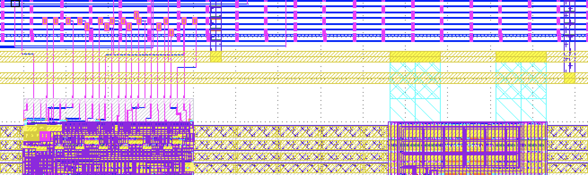
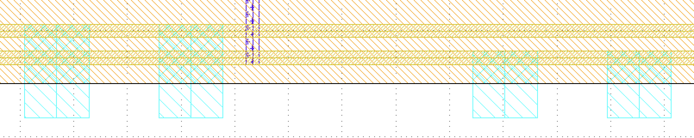
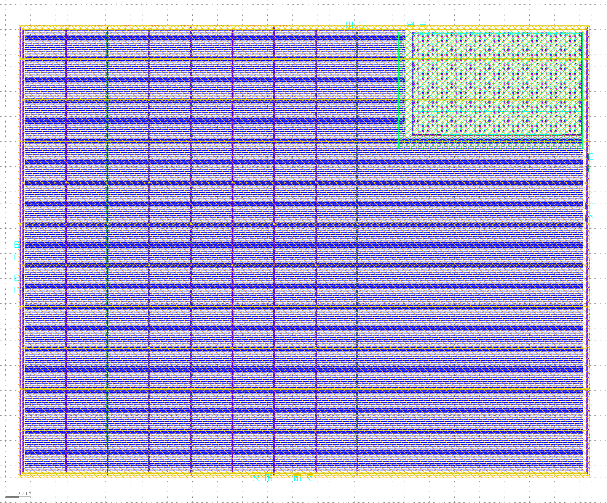

Floorplanning
==========================

This tutorial walks you through using SC's Python-based floorplanning API to
create a full floorplan for the ZeroSoC, a simple system-on-chip meant to
demonstrate SiliconCompiler’s end-to-end design capabilities.

.. image:: _images/zerosoc.png

ZeroSoC is based on a subset of the IP used in the open-source `OpenTitan SoC
<https://github.com/lowrisc/opentitan>`_. It includes:

* An `Ibex <https://github.com/lowrisc/ibex>`_ RV32I processor
* A GPIO controller with 32 configurable I/O ports
* A UART peripheral
* RAM (2KB for ASIC, 8KB for FPGA)

ZeroSoC’s design and supporting files can be found at
https://github.com/siliconcompiler/zerosoc.

Floorplanning methodology
-------------------------
SC includes a library for designing chip floorplans using Python, providing a
high degree of flexibility and easy automation of floorplan design (:ref:`API
Reference<Floorplan API>`). In this tutorial, we describe how to use this API to
iteratively build up a floorplan for ZeroSoC from scratch.  We encourage you to
check your progress using the layout visualizer `KLayout
<https://www.klayout.de/>`_ on each step, an approach that mirrors how you would
develop your own floorplan using this API.

Getting Started
---------------
Before we begin, the first thing to know is that the ZeroSoC ASIC is built in
two parts:

* First, the *core*, which contains the actual digital logic implementing the
  ZeroSoC.
* Second, the *top-level*, which wraps the core and places the ZeroSoC's padring
  (the portion that implements I/O) around it.

We build the ZeroSoC core using SC's included OpenROAD-based flow, and it has
metal pins along its sides for input and output. The core and padring are
designed so that these pins route to the inner pins of the I/O pads by
abutment. Therefore, the top-level does not require automated place and route --
it is defined entirely by the top-level floorplan file. This manual placement is
verified through DRC and LVS, ensuring that it satisfies foundry design rules
and that it matches the Verilog netlist. Understanding this two-part build is
important since we will specify the floorplans of each component separately.

  Note how the pins on the edge of the ZeroSoC core (white background) line up
  with the pins along the edge of the GPIO pads (gray background).

Let's begin by cloning the ZeroSoC Github repository. Be sure to initialize the
submodules to pull down the required third-party design files:

.. code-block:: console

  $ git clone https://github.com/siliconcompiler/zerosoc.git
  $ git submodule update --init --recursive

In order to follow along, you should also :ref:`install
SiliconCompiler<Installation from PyPI>` and the :ref:`KLayout layout
viewer<Layout viewer>`.

If you install SC from PyPI rather than from source, you'll need to clone the
SiliconCompiler repository and configure your SC path to point to the repo in
order to access the included PDK files:

.. code-block:: console

  $ git clone https://github.com/siliconcompiler/siliconcompiler.git
  $ export SCPATH=$PWD/siliconcompiler/siliconcompiler

.. note::
   If you close your shell, you'll need to rerun the ``export`` command from the
   code block above in your next session. To avoid this, you can add the command
   to your ``~/.bashrc`` to have it always apply.

The ZeroSoC repo already includes a completed floorplan, ``floorplan.py``. If
you want to follow along with each step of this tutorial, go ahead and delete or
rename that file and create a blank ``floorplan.py`` in its place. Then, copy in
the following boilerplate::

  from siliconcompiler.core import Chip
  from siliconcompiler.floorplan import Floorplan

  import math

  def configure_chip(design):
    # Minimal chip configuration goes here, for testing

  def core_floorplan(fp):
    # Definition of core floorplan goes here

  def main():
    core_chip = configure_chip('asic_core')
    core_chip.write_manifest('core_manifest.json')
    core_fp = Floorplan(core_chip)
    core_floorplan(core_fp)
    core_fp.write_def('asic_core.def')

  if __name__ == '__main__':
    main()

This file gives us a framework to start designing ZeroSoC's core floorplan. The
``main()`` routine first calls a function ``configure_chip()``, which returns an
SC :class:`~siliconcompiler.core.Chip` object, and uses that to instantiate a
:class:`~siliconcompiler.floorplan.Floorplan` object. The ``Floorplan``
constructor requires a ``Chip`` object since aspects of the floorplan are
defined based on the chip configuration.  We'll point out examples of this
throughout the tutorial.

Next, ``main()`` calls ``core_floorplan()``, which will ultimately use the
functions provided by the floorplan API to generate the floorplan itself.
Finally, ``main()`` calls a method of the floorplan object, ``write_def()``, to
generate an output DEF file that we can either preview in KLayout or pass into
an SC compilaton flow.

Minimal chip configuration
------------------------------
The first thing we need to do to is fill out our ``configure_chip()`` function
with a minimal configuration. Floorplanning relies on the following items being
configured in the provided chip object:

1) A technology target, for providing technology-specific information.
2) A design name, used to name the layout in the output file.
3) Macro libraries, in order to perform macro placement.

Let's fill out ``configure_chip()`` to accomplish these tasks one-by-one. First,
we instantiate a new chip and set its target to Skywater 130, an open-source PDK
that has its configuration bundled with SC::

  chip = Chip()
  chip.target('skywater130')

Next, we'll provide the design name as a parameter so that we can reuse this
configuration function for testing both the core and top padring::

  chip.set('design', design)

Last, we want to configure two macro libraries, one for ZeroSoC's RAM and the
other for ZeroSoC's I/O cells.  The first step to including macros in a design
is to point SC to the relevant files in your build configuration. At a minimum,
you’ll need LEF, GDS, and liberty files for each of your libraries. In the
configuration schema, all macro library configurations live under a key path
starting with ``library``, followed by a designer-defined macro library name.
The following lines show how the ZeroSoC configuration points to its RAM macro
library::

  libname = 'ram'
  chip.add('library', libname, 'nldm', 'typical', 'lib', 'asic/sky130/ram/sky130_sram_2kbyte_1rw1r_32x512_8_TT_1p8V_25C.lib')
  chip.add('library', libname, 'lef', 'asic/sky130/ram/sky130_sram_2kbyte_1rw1r_32x512_8.lef')
  chip.add('library', libname, 'gds', 'asic/sky130/ram/sky130_sram_2kbyte_1rw1r_32x512_8.gds')

In addition, the name of the macro library must be added to the ``'asic', 'macrolib'``
parameter::

  chip.add('asic', 'macrolib', libname)

Finally, it's a good idea to specify the "type" of a macro library in order to
distinguish it from the technology target-defined standard cell library used for
automated place and route. The standard type for a macro library is
"component"::

  chip.set('library', libname, 'type', 'component')

Note that if you’d like to include a Verilog behavioral model of a macro, that
can be passed to SC just like any other Verilog source. However, keep in mind
that Yosys creates a blackbox definition of all cells defined in liberty files
it reads, and if it reads a  Verilog source that defines the same module, this
will trigger an error. Therefore, to switch between a behavioral model and a
blackbox, we recommend creating a wrapper that instantiates one or the other
based on a parameter or preprocessor macro. Since we don't need Verilog sources
for our minimal configuration, this isn't shown here.

With all these pieces included, along with additional configuration for the I/O
library, your definition of ``configure_chip()`` should look like this::

  def configure_chip(design):
      chip = Chip()
      chip.target('skywater130')

      chip.set('design', design)

      libname = 'ram'
      chip.add('library', libname, 'nldm', 'typical', 'lib', 'asic/sky130/ram/sky130_sram_2kbyte_1rw1r_32x512_8_TT_1p8V_25C.lib')
      chip.add('library', libname, 'lef', 'asic/sky130/ram/sky130_sram_2kbyte_1rw1r_32x512_8.lef')
      chip.add('library', libname, 'gds', 'asic/sky130/ram/sky130_sram_2kbyte_1rw1r_32x512_8.gds')
      chip.add('asic', 'macrolib', libname)
      chip.set('library', libname, 'type', 'component')

      libname = 'io'
      chip.add('library', libname, 'nldm', 'typical', 'lib', 'asic/sky130/io/sky130_dummy_io.lib')
      chip.set('library', libname, 'lef', 'asic/sky130/io/sky130_ef_io.lef')
      # Need both GDS files: "ef" relies on "fd"
      chip.add('library', libname, 'gds', 'asic/sky130/io/sky130_ef_io.gds')
      chip.add('library', libname, 'gds', 'asic/sky130/io/sky130_fd_io.gds')
      chip.add('asic', 'macrolib', libname)
      chip.set('library', libname, 'type', 'component')

      chip.set('showtool', 'def', 'klayout')
      chip.set('showtool', 'gds', 'klayout')

      return chip

Note we've also added a few lines to set up the chip's ``showtool`` parameter.
While this isn't part of the minimal configuration required for using the
floorplan API, it is required to use ``sc-show``, a tool we'll use to preview
your floorplan later on in the tutorial. This will usually be handled for you by
SC's built-in flows, but we need to do it ourselves here since we don't have a
flow target for this minimal config.

Before moving on, we'll also define some constants above ``configure_chip()`` in
order to concisely reference the names of each macro we plan to use::

  GPIO = 'sky130_ef_io__gpiov2_pad_wrapped'
  VDD = 'sky130_ef_io__vccd_hvc_pad'
  VDDIO = 'sky130_ef_io__vddio_hvc_pad'
  VSS = 'sky130_ef_io__vssd_hvc_pad'
  VSSIO = 'sky130_ef_io__vssio_hvc_pad'
  CORNER = 'sky130_ef_io__corner_pad'
  FILL_CELLS = ['sky130_ef_io__com_bus_slice_1um',
                'sky130_ef_io__com_bus_slice_5um',
                'sky130_ef_io__com_bus_slice_10um',
                'sky130_ef_io__com_bus_slice_20um']

  RAM = 'sky130_sram_2kbyte_1rw1r_32x512_8'

Chip dimensions
----------------
The first step to floorplanning a chip is to define the actual size and
placement area of the chip itself. Since ZeroSoC is implemented as a multi-step
build, we'll define these dimensions in a new function that can be reused by
both the core and top-level floorplan, so that we don't have any integration
bugs due to dimension mismatch. Let's call this function
``define_dimensions()``, and have it take in a floorplan object called ``fp``.
You can place this function right after ``configure_chip()``::

  def define_dimensions(fp):

First, let's define two variables that specify the size of the area in the
middle of the chip where automated place and route can put standard cells, as
well as two variables that specify the size of the bottom and left margins
around this area. The power delivery rings will go in this margin::

  place_w = 4860 * fp.stdcell_width
  place_h = 648 * fp.stdcell_height
  margin_left = 60 * fp.stdcell_width
  margin_bottom = 10 * fp.stdcell_height

Note that these dimensions are calculated based on two values extracted from the
``fp`` object: the standard cell width and standard cell height. Making sure the
margins are multiples of the standard cell size ensures that routing tracks and
standard cell placement are aligned properly for the automated place and route
tool to easily route to each cell. This is an example of why we need to provide
a configured ``Chip`` object to instantiate our ``Floorplan`` object -- that's
how it extracts this information.

Based on these margins and placement area, we can compute the size of the core
itself::

  core_w = place_w + 2 * margin_left
  core_h = place_h + 2 * margin_bottom

Although we're not going to use it right away, we next compute the size of the
ZeroSoC top-level, which must be equal to the core plus the height of the
padring along each edge::

  gpio_h = fp.available_cells[GPIO].height
  top_w = math.ceil(core_w + 2 * gpio_h)
  top_h = math.ceil(core_h + 2 * gpio_h)

Our padring height is going to be equal to the height of our I/O library's GPIO
cell. The floorplan API provides us with the ability to look up the dimensions
of macros through its ``available_cells`` dictionary.

We also wrap this calculation in ``math.ceil()`` to round these dimensions up to
a whole number of microns. Having these dimensions be whole numbers is necessary
for us to construct the padring, which we'll discuss later on in the tutorial.

Since we round up the top-level dimensions a bit, as a final step we need to
adjust our core dimensions to compensate. This implicitly stretches the
top and right margins to ensure that all of our alignment constraints are met::

  core_w = top_w - 2 * gpio_h
  core_h = top_h - 2 * gpio_h

Putting this all together along with a return statement to provide all the
important dimensions from this function to the caller, we get::

  def define_dimensions(fp):
      place_w = 4860 * fp.stdcell_width
      place_h = 648 * fp.stdcell_height
      margin_left = 60 * fp.stdcell_width
      margin_bottom = 10 * fp.stdcell_height

      core_w = place_w + 2 * margin_left
      core_h = place_h + 2 * margin_bottom

      # Use math.ceil to ensure that top-level's dimensions are a whole number of
      # microns. This implicitly stretches out the top/right margins around the
      # placement area a bit.
      gpio_h = fp.available_cells[GPIO].height
      top_w = math.ceil(core_w + 2 * gpio_h)
      top_h = math.ceil(core_h + 2 * gpio_h)

      core_w = top_w - 2 * gpio_h
      core_h = top_h - 2 * gpio_h

      return (top_w, top_h), (core_w, core_h), (place_w, place_h), (margin_left, margin_bottom)

Specifying die area
-------------------
Now that we have the basic size of our chip defined, we can begin to define
ZeroSoC's core floorplan. To initialize a floorplan, we first need to call
:meth:`~siliconcompiler.floorplan.Floorplan.create_diearea()` on our floorplan
object, passing in the relevant dimensions. Put the following code in
``core_floorplan()``::

  dims = define_dimensions(fp)
  _, (core_w, core_h), (place_w, place_h), (margin_left, margin_bottom) = dims
  diearea = [(0, 0), (core_w, core_h)]
  corearea = [(margin_left, margin_bottom), (place_w + margin_left, place_h + margin_bottom)]
  fp.create_diearea(diearea, corearea=corearea)

The first argument to ``create_diearea`` specifies the overall size of the chip,
provided as a list containing the coordinates of the bottom-left and top-right
corners, respectively (the bottom-left is generally ``(0, 0)``).  The
``corearea`` keyword argument takes input in the same form and specifies the
legal area for placing standard cells (note that the term "core" in ``corearea``
refers to something other than the ZeroSoC "core").

With this call, we now have a minimal SC floorplan! To preview your work, go
ahead and run ``floorplan.py``. This should produce some log output, as well as
2 files: ``asic_core.def`` and ``core_manifest.json``. The ``.def`` file contains
our floorplan in DEF format, while ``core_manifest.json`` contains our chip
configuration in SiliconCompiler’s JSON manifest format. We can display this DEF
file in KLayout by running the following command:

.. code-block:: console

  $ sc-show -asic_def asic_core.def -cfg core_manifest.json

``sc-show`` uses the information in ``core_manifest.json`` to configure KLayout
according to our technology and macro library specifications to give you a
proper view of your DEF file. KLayout should open up and show you an outline of
the core, like in the following image.

.. image:: _images/die_area.png

Placing RAM
-----------
An orange rectangle isn't very exciting, so let's spruce things up by placing
the RAM macro. We'll do this using the floorplan API's
:meth:`~siliconcompiler.floorplan.Floorplan.place_macros` function, which allows
you to place a list of macros from a starting position and a given pitch along
the x and y-axes. To place a single macro like the ZeroSoC’s RAM, we'll just
pass in a list of one instance, and 0s for the pitch values. Note that we
specify ``snap=True`` to ensure the RAM's position is standard-cell aligned.
This ensures proper alignment for routing.  Insert the following code after our
call to ``create_diearea()``::

  ram_w = fp.available_cells[RAM].width
  ram_h = fp.available_cells[RAM].height
  ram_x = place_w + margin_left - ram_w
  ram_y = place_h + margin_bottom - ram_h - 15 * fp.stdcell_height

  instance_name = 'soc.ram.u_mem.gen_sky130.u_impl_sky130.gen32x512.mem'
  fp.place_macros([(instance_name, RAM)], ram_x, ram_y, 0, 0, 'N', snap=True)

We use our predefined dimensions as well as the RAM size information stored in
``available_cells`` to place the macro in the upper-right corner of the design.
We place it here because most of the pins we need to access are on the left and
bottom of the macro, and this ensures those pins are easily accessible. We lower
its height by a bit to make space for the router to tie-off a couple pins on the
other sides of the macro.

It's important to pay attention to how macro instances are specified. Each
macro is specified as a tuple of two strings: the first is the particular
instance name in the design, and the second is the name of the macro itself.
Getting this instance name correct (accounting for the flattened hierarchy,
indexing into generate blocks, etc.) can be tricky, and it’s important to get it
right for the macro placement to be honored by design tools. The following
naming rules apply for the Yosys synthesis tool in particular:

* When the hierarchy is flattened, instance names include the instance names
  of all parent modules separated by a ``.``.
* Generate blocks are included in this hierarchy. We recommend naming all
  generate blocks, since they'll otherwise be assigned a name generated by
  Yosys.
* When a generate for-loop is used, an index is placed after the name of the
  block, in between square brackets. The square brackets must be escaped with
  ``\\`` in Python code, in order to escape it with a single ``\`` in the DEF
  file.

Examples:

* ``soc.ram.u_mem.gen_sky130.u_impl_sky130.gen32x512.mem``
* ``padring.we_pads\\[0\\].i0.padio\\[5\\].i0.gpio``

Along with the macro placement itself, we use
:meth:`~siliconcompiler.floorplan.Floorplan.place_blockage` to define a
placement blockage layer to ensure that standard cells aren't placed too close
to the RAM pins, which can result in routing congestion::

  ram_margin_x = 120 * fp.stdcell_width
  ram_margin_y = 20 * fp.stdcell_height
  blockage_x = ram_x - ram_margin_x
  blockage_y = ram_y - ram_margin_y
  blockage_w = ram_w + ram_margin_x
  blockage_h = ram_h + ram_margin_y
  fp.place_blockage(blockage_x, blockage_y, blockage_w, blockage_h)

Now, if we run ``floorplan.py`` and view the resulting DEF, we can see the RAM
macro placed in the top right of the die area, with the blockage area besides
and below it highlighted.

.. image:: _images/ram.png

Placing Pins
------------
To complete the core, we need to place pins around the edges of the block in the
right places to ensure these pins contact the I/O pad control signals. Just like
with the chip dimensions, we need to share data between both levels of the
ZeroSoC hierarchy here, so we'll specify these dimensions in a new common Python
function. We'll call this function ``define_io_placement()``, and start off by
defining four lists with the order of the I/O pad types on each side::

  def define_io_placement(fp):
      we_io = [GPIO] * 5 + [VDD, VSS, VDDIO, VSSIO] + [GPIO] * 4
      no_io = [GPIO] * 9 + [VDDIO, VSSIO, VDD, VSS]
      ea_io = [GPIO] * 9 + [VDDIO, VSS, VDD, VSSIO]
      so_io = [GPIO] * 5 + [VDD, VSS, VDDIO, VSSIO] + [GPIO] * 4

We want to design the floorplan so that the pad cells are evenly spaced along the
west and south sides of the chip, and evenly spaced in two groups on the north
and east sides. We could calculate the positions by hand, but since we're using
Python, we can do it programatically instead!

First, we'll define a helper function called ``calculate_even_spacing()``::

  def calculate_even_spacing(fp, pads, distance, start):
      n = len(pads)
      pads_width = sum(fp.available_cells[pad].width for pad in pads)
      spacing = (distance - pads_width) // (n + 1)

      pos = start + spacing
      io_pos = []
      for pad in pads:
          io_pos.append((pad, pos))
          pos += fp.available_cells[pad].width + spacing

      return io_pos

This function takes in a list of padcell names, does some math to calculate the
required spacing between cells, and then returns a new list, pairing each entry
with the position of that padcell.

Putting this all together, we can make use of this helper function to give us
what we want::

  def define_io_placement(fp):
      we_io = [GPIO] * 5 + [VDD, VSS, VDDIO, VSSIO] + [GPIO] * 4
      no_io = [GPIO] * 9 + [VDDIO, VSSIO, VDD, VSS]
      ea_io = [GPIO] * 9 + [VDDIO, VSS, VDD, VSSIO]
      so_io = [GPIO] * 5 + [VDD, VSS, VDDIO, VSSIO] + [GPIO] * 4

      (top_w, top_h), _, _, _ = define_dimensions(fp)
      corner_w = fp.available_cells[CORNER].width
      corner_h = fp.available_cells[CORNER].height

      we_io_pos = calculate_even_spacing(fp, we_io, top_h - corner_h - corner_w, corner_h)
      so_io_pos = calculate_even_spacing(fp, so_io, top_w - corner_h - corner_w, corner_w)

      # For east and north, we crowd GPIO on the first half of the side to make
      # sure we don't run into routing congestion issues due to the RAM in the
      # top-right corner.
      mid_w = (top_w - corner_h - corner_w) // 2
      no_io_pos = (calculate_even_spacing(fp, no_io[:9], mid_w, corner_h) +
                   calculate_even_spacing(fp, no_io[9:], mid_w, mid_w + corner_h))
      mid_h = (top_h - corner_h - corner_w) // 2
      ea_io_pos = (calculate_even_spacing(fp, ea_io[:9], mid_h, corner_w) +
                   calculate_even_spacing(fp, ea_io[9:], mid_h, mid_h + corner_w))

      return we_io_pos, no_io_pos, ea_io_pos, so_io_pos

Now, back to the pins! Since there are actually multiple control signals for
each GPIO pad, we first construct a list that contains the name of each one,
their offset in microns from the edge of the pad, and some additional info
needed to handle indexing into vectors. We also define some values that are the
same for every pin we place. Add the following below the ``fp.place_blockage()``
call in ``core_floorplan()``::

  pins = [
      # (name, offset from cell edge, # bit in vector, width of vector)
      ('din', 75.085, 0, 1), # in
      ('dout', 19.885, 0, 1), # out
      ('ie', 41.505, 0, 1), # inp_dis
      ('oen', 4.245, 0, 1), # oe_n
      ('tech_cfg', 31.845, 0, 18), # hld_h_n
      ('tech_cfg', 35.065, 1, 18), # enable_h
      ('tech_cfg', 38.285, 2, 18), # enable_inp_h
      ('tech_cfg', 13.445, 3, 18), # enable_vdda_h
      ('tech_cfg', 16.665, 4, 18), # enable_vswitch_h
      ('tech_cfg', 69.105, 5, 18), # enable_vddio
      ('tech_cfg',  7.465, 6, 18), # ib_mode_sel
      ('tech_cfg', 10.685, 7, 18), # vtrip_sel
      ('tech_cfg', 65.885, 8, 18), # slow
      ('tech_cfg', 22.645, 9, 18), # hld_ovr
      ('tech_cfg', 50.705, 10, 18), # analog_en
      ('tech_cfg', 29.085, 11, 18), # analog_sel
      ('tech_cfg', 44.265, 12, 18), # analog_pol
      ('tech_cfg', 47.485, 13, 18), # dm[0]
      ('tech_cfg', 56.685, 14, 18), # dm[1]
      ('tech_cfg', 25.865, 15, 18), # dm[2]
      ('tech_cfg', 78.305, 16, 18), # tie_lo_esd
      ('tech_cfg', 71.865, 17, 18), # tie_hi_esd
  ]
  pin_width = 0.28
  pin_depth = 1
  pin_layer = 'm2'

Now we can write two nested for-loops for each side, the first over the list of
pad positions, and the second over the pin offsets, to calculate the position of
each pin. We place the pins using
:meth:`~siliconcompiler.floorplan.Floorplan.place_pins`. Here's the code for placing
all four sides, with the logic in the first loop annotated with comments::

  we_pads, no_pads, ea_pads, so_pads = define_io_placement(fp)

  gpio_w = fp.available_cells[GPIO].width
  gpio_h = fp.available_cells[GPIO].height

  # Filter out GPIO pins
  we_gpio_pos = [pos for pad, pos in we_pads if pad == GPIO]
  # Constant x position for west side
  pin_x = 0
  for i, pad_y in enumerate(we_gpio_pos):
      pad_y -= gpio_h # account for padring height
      for pin, offset, bit, width in pins:
          # Construct name based on side, pin name, and bit # in vector
          name = f'we_{pin}[{i * width + bit}]'
          # Calculate pin position based on cell and offset
          pin_y = pad_y + offset
          # Place pin!
          fp.place_pins([name], pin_x, pin_y, 0, 0, pin_depth, pin_width, pin_layer)

  # Repeat the same logic for each of the other 3 sides, with positions/axes
  # adjusted accordingly...
  no_gpio_pos = [pos for pad, pos in no_pads if pad == GPIO]
  pin_y = core_h - pin_depth
  for i, pad_x in enumerate(no_gpio_pos):
      pad_x -= gpio_h
      for pin, offset, bit, width in pins:
          name = f'no_{pin}[{i * width + bit}]'
          pin_x = pad_x + offset
          fp.place_pins([name], pin_x, pin_y, 0, 0, pin_width, pin_depth, pin_layer)

  ea_gpio_pos = [pos for pad, pos in ea_pads if pad == GPIO]
  pin_x = core_w - pin_depth
  for i, pad_y in enumerate(ea_gpio_pos):
      pad_y -= gpio_h
      for pin, offset, bit, width in pins:
          name = f'ea_{pin}[{i * width + bit}]'
          pin_y = pad_y + gpio_w - offset - pin_width
          fp.place_pins([name], pin_x, pin_y, 0, 0, pin_depth, pin_width, pin_layer)

  so_gpio_pos = [pos for pad, pos in so_pads if pad == GPIO]
  pin_y = 0
  for i, pad_x in enumerate(so_gpio_pos):
      pad_x -= gpio_h
      for pin, offset, bit, width in pins:
          name = f'so_{pin}[{i * width + bit}]'
          pin_x = pad_x + gpio_w - offset - pin_width
          fp.place_pins([name], pin_x, pin_y, 0, 0, pin_width, pin_depth, pin_layer)

If we build the core DEF now, and zoom in closely to one side of the die, we
should see the same clustered pattern of pins spaced out along it.

.. image:: _images/pins.png

PDN
---
The last important aspect of the core floorplan is the PDN, or power delivery
network.  Since this piece is relatively complicated, we'll create a new
function, ``place_pdn()``, that encapsulates all the PDN generation logic::

  def place_pdn(fp, ram_x, ram_y, ram_margin):
      dims = define_dimensions(fp)
      _, (core_w, core_h), (place_w, place_h), (margin_left, margin_bottom) = dims
      we_pads, no_pads, ea_pads, so_pads = define_io_placement(fp)

We'll also add a call to this function at the bottom of ``core_floorplan()``::

  place_pdn(fp, ram_x, ram_y, ram_margin_x)

``place_pdn()`` takes in the floorplan to modify, as well as the RAM macro's
position and margin. These additional values are important to ensure the PDN
doesn't accidentally short anything in the RAM macro. We also call our helper
functions to get the other relevant dimensions of our design.

The goal of the power delivery network is to create a grid over our entire
design that connects VDD and GND from our I/O pads to each standard cell, as
well as the RAM macro. This grid consists of horizontal and vertical straps, and
we'll add some variables to our function to parameterize how these straps are
created. Then, we'll use these parameters to calculate an even pitch for the
grid in both directions::

  n_vert = 8 # how many vertical straps to place
  vwidth = 5 # width of vertical straps in microns
  n_hori = 10 # how many horizontal straps to place
  hwidth = 5 # width of horizontal straps
  vlayer = 'm4' # metal layer for vertical straps
  hlayer = 'm5' # metal layer for horizontal straps

  # Calculate even spacing for straps
  vpitch = ((ram_x - ram_margin - margin_left) - n_vert * vwidth) / (n_vert + 1)
  hpitch = (core_h - n_hori * hwidth) / (n_hori + 1)

Note that we don't calculate ``vpitch`` across the entire distance of the chip:
the vertical straps don't cross the RAM macro, since the macro includes wiring
on metal layer 4, and this could cause a short.

The first thing we have to do before we can define any of the actual objects in
our PDN is to add the definitions of the two "special nets" that are associated
with our power signals.  We do this with
:meth:`~siliconcompiler.floorplan.Floorplan.add_net`::

  fp.add_net('_vdd', ['VPWR', 'vccd1'], 'power')
  fp.add_net('_vss', ['VGND', 'vssd1'], 'ground')

We have one call for our power net, and one call for our ground net. The first
parameter gives the name of the net in our Verilog design, while the second
parameter is a list of pin names that should be connected to that net (in our
case, "VPWR" and "VGND" for the standard cells, and "vccd1" and "vssd1" for the RAM
macro).  Finally, the last parameter gives the type of net, based on a set of
labels defined in the DEF standard. In our case, "_vdd" is of type "power" and
"_vss" is of type "ground."

With this configuration done, any calls to the floorplan API relating to our
power nets can refer to either the "_vdd" net or the "_vss" net by name.

The first pieces of PDN geometry we'll set up are the power and ground rings
that circle the design. These rings form the interface between the power signals
coming from our padring and the power grid that distributes those signals. To
instantiate the rings, we'll do some math to calculate their dimensions, and
then call :meth:`~siliconcompiler.floorplan.Floorplan.place_ring` to create
them::

  vss_ring_left = margin_left - 4 * vwidth
  vss_ring_bottom = margin_bottom - 4 * hwidth
  vss_ring_width = place_w + 9 * vwidth
  vss_ring_height = place_h + 9 * hwidth
  vss_ring_right = vss_ring_left + vss_ring_width
  vss_ring_top = vss_ring_bottom + vss_ring_height

  vdd_ring_left = vss_ring_left + 2 * vwidth
  vdd_ring_bottom = vss_ring_bottom + 2 * hwidth
  vdd_ring_width = vss_ring_width - 4 * vwidth
  vdd_ring_height = vss_ring_height - 4 * hwidth
  vdd_ring_right = vdd_ring_left + vdd_ring_width
  vdd_ring_top = vdd_ring_bottom + vdd_ring_height

  fp.place_ring('_vdd', vdd_ring_left, vdd_ring_bottom, vdd_ring_width,
                vdd_ring_height, hwidth, vwidth, hlayer, vlayer)
  fp.place_ring('_vss', vss_ring_left, vss_ring_bottom, vss_ring_width,
                vss_ring_height, hwidth, vwidth, hlayer, vlayer)

If you regenerate the DEF file, you can now see two rings of wires circling the
ZeroSoC core.

.. image:: _images/pdn_ring.png

Next, we'll place the straps that form the power grid itself. These stretch from
one end of the ring to the other, and alternate power and ground. We place these
by calling :meth:`~siliconcompiler.floorplan.Floorplan.place_wires`, and we'll
duplicate the net name in the first argument and use the pitch parameter to
place multiple straps with each call::

  # Horizontal stripes
  spacing = 2 * (hpitch + hwidth)

  bottom = margin_bottom + hpitch
  fp.place_wires(['_vdd'] * (n_hori // 2), vdd_ring_left, bottom, 0, spacing,
                 vdd_ring_width, hwidth, hlayer, shape='stripe')

  bottom = margin_bottom + hpitch + (hpitch + hwidth)
  fp.place_wires(['_vss'] * (n_hori // 2), vss_ring_left, bottom, 0, spacing,
                 vss_ring_width, hwidth, hlayer, shape='stripe')

  # Vertical stripes
  spacing = 2 * (vpitch + vwidth)

  left = margin_left + vpitch
  fp.place_wires(['_vdd'] * (n_vert // 2), left, vdd_ring_bottom, spacing, 0,
                 vwidth, vdd_ring_height, vlayer, shape='stripe')

  left = margin_left + vpitch + (vpitch + vwidth)
  fp.place_wires(['_vss'] * (n_vert // 2), left, vss_ring_bottom, spacing, 0,
                 vwidth, vss_ring_height, vlayer, shape='stripe')

Rebuild the floorplan and you should see a result like this:

.. image:: _images/power_straps.png

Now, we need a way to deliver power from the padring to the power rings. To do
so, we'll add a few pieces of metal that will abut the correct ports on the
power padcells, and overlap the corresponding wires in the ring. We do this with
a few for-loops over the pads::

  gpio_h = fp.available_cells[GPIO].height
  pow_h = fp.available_cells[VDD].height
  # account for GPIO padcells being larger than power padcells
  pow_gap = gpio_h - pow_h

  pin_width = 23.9
  pin_offsets = (0.495, 50.39)

  # Place wires/pins connecting power pads to the power ring
  for pad_type, y in we_pads:
      y -= gpio_h
      for offset in pin_offsets:
          if pad_type == VDD:
              fp.place_wires(['_vdd'], -pow_gap, y + offset, 0, 0,
                             vdd_ring_left + vwidth + pow_gap, pin_width, 'm3')
              fp.place_pins (['_vdd'], 0, y + offset, 0, 0,
                             vdd_ring_left + vwidth, pin_width, 'm3', use='power')
          elif pad_type == VDDIO:
              fp.place_pins (['_vddio'], 0, y + offset, 0, 0,
                             margin_left, pin_width, 'm3')
          elif pad_type == VSS:
              fp.place_wires(['_vss'], -pow_gap, y + offset, 0, 0,
                             vss_ring_left + vwidth + pow_gap, pin_width, 'm3')
              fp.place_pins(['_vss'], 0, y + offset, 0, 0,
                            vss_ring_left + vwidth, pin_width, 'm3', use='power')

  for pad_type, x in no_pads:
      x -= gpio_h
      for offset in pin_offsets:
          if pad_type == VDD:
              fp.place_wires(['_vdd'], x + offset, vdd_ring_top - hwidth, 0, 0,
                             pin_width, core_h - vdd_ring_top + hwidth + pow_gap, 'm3')
              fp.place_pins(['_vdd'], x + offset, vdd_ring_top - hwidth, 0, 0,
                            pin_width, core_h - vdd_ring_top + hwidth, 'm3', use='power')
          elif pad_type == VDDIO:
              fp.place_pins(['_vddio'], x + offset, margin_bottom + place_h, 0, 0,
                            pin_width, core_h - (margin_bottom + place_h), 'm3')
          elif pad_type == VSS:
              fp.place_wires(['_vss'], x + offset, vss_ring_top - hwidth, 0, 0,
                             pin_width, core_h - vss_ring_top + hwidth + pow_gap, 'm3')
              fp.place_pins(['_vss'], x + offset, vss_ring_top - hwidth, 0, 0,
                            pin_width, core_h - vss_ring_top + hwidth, 'm3', use='power')

  for pad_type, y in ea_pads:
      y -= gpio_h
      pad_w = fp.available_cells[pad_type].width
      for offset in pin_offsets:
          if pad_type == VDD:
              fp.place_wires(['_vdd'], vdd_ring_right - vwidth, y + pad_w - offset - pin_width, 0, 0,
                             core_w - vdd_ring_right + vwidth + pow_gap, pin_width, 'm3')
              fp.place_pins(['_vdd'], vdd_ring_right - vwidth, y + pad_w - offset - pin_width, 0, 0,
                            core_w - vdd_ring_right + vwidth, pin_width, 'm3', use='power')
          elif pad_type == VDDIO:
              fp.place_pins(['_vddio'], margin_left + place_w, y + pad_w - offset - pin_width, 0, 0,
                            core_w - (margin_left + place_w), pin_width, 'm3')
          elif pad_type == VSS:
              fp.place_wires(['_vss'], vss_ring_right - vwidth, y + pad_w - offset - pin_width, 0, 0,
                             core_w - vss_ring_right + vwidth + pow_gap, pin_width, 'm3')
              fp.place_pins(['_vss'], vss_ring_right - vwidth, y + pad_w - offset - pin_width, 0, 0,
                            core_w - vss_ring_right + vwidth, pin_width, 'm3', use='power')

  for pad_type, x in so_pads:
      x -= gpio_h
      pad_w = fp.available_cells[pad_type].width
      for offset in pin_offsets:
          if pad_type == VDD:
              fp.place_wires(['_vdd'], x + pad_w - offset - pin_width, -pow_gap, 0, 0,
                             pin_width, vdd_ring_bottom + hwidth + pow_gap, 'm3')
              fp.place_pins(['_vdd'], x + pad_w - offset - pin_width, 0, 0, 0,
                            pin_width, vdd_ring_bottom + hwidth, 'm3', use='power')
          elif pad_type == VDDIO:
              fp.place_pins(['_vddio'], x + pad_w - offset - pin_width, 0, 0, 0,
                            pin_width, margin_bottom, 'm3')
          elif pad_type == VSS:
              fp.place_wires(['_vss'], x + pad_w - offset - pin_width, -pow_gap, 0, 0,
                             pin_width, vss_ring_bottom + hwidth + pow_gap, 'm3')
              fp.place_pins(['_vss'], x + pad_w - offset - pin_width, 0, 0, 0,
                            pin_width, vss_ring_bottom + hwidth, 'm3', use='power')

We use ``place_pins()`` here since these wires are all associated with the
top-level power pins of the core. However, for the VDD and VSS pads we also have
to make a call to ``place_wires()`` overlapping these pins for two reasons:

1. Via generation (covered later) only looks at special nets, and we need to
   ensure that there are vias inserted between these pins and the power ring
   (since they're on different layers).
2. Some automated place and route tools such as OpenROAD can't handle pins that
   extend beyond the design's boundaries, but we need the pads to extend further
   to account for the difference in height between the GPIO and power padcells.
   This is why ``pow_gap`` is used in the dimension calculations for the wires,
   but not the pins.

The VDDIO pins don't need an overlapping special net because VDDIO is routed to
GPIO pin tie-offs automatically by the signal router.

With these wires added, you should see something like the following along each
side of your design:

There are now two steps left to finishing up the PDN. First, we need to connect
together all overlapping wires that are part of the same net. Next, we need to
connect these wires to the wires that supply power to the standard cells, as
well as the pins that supply power to the RAM macro.

In order to accomplish both these tasks, we'll need to insert vias in the
design. The floorplan API has a useful helper function that will insert vias
between all common nets on specified layers. However, before we call this
function, we're going to add a few more wires that will enable us to set up all
the power connections to the design itself.

The standard cells are automatically placed in rows with alternating power and
ground stripes on metal layer 1. We can power them by placing wires over these
stripes, and connecting vias to these wires. We perform some calculations based
on the standard cell info in the floorplan object in order to determine the
positions of these stripes, and then place them::

  rows_below_ram = (ram_y - margin_bottom) // fp.stdcell_height
  rows_above_ram = len(fp.rows) - rows_below_ram

  npwr_below = 1 + math.floor(rows_below_ram / 2)
  ngnd_below = math.ceil(rows_below_ram / 2)

  npwr_above = 1 + math.floor(rows_above_ram / 2)
  ngnd_above = math.ceil(rows_above_ram / 2)

  stripe_w = 0.48
  spacing = 2 * fp.stdcell_height

  bottom = margin_bottom - stripe_w/2
  fp.place_wires(['_vdd'] * npwr_below, margin_left, bottom, 0, spacing,
                 place_w, stripe_w, 'm1', 'followpin')

  bottom = margin_bottom - stripe_w/2 + fp.stdcell_height
  fp.place_wires(['_vss'] * ngnd_below, margin_left, bottom, 0, spacing,
                 place_w, stripe_w, 'm1', 'followpin')

  bottom = margin_bottom - stripe_w/2 + npwr_below * 2 * fp.stdcell_height
  fp.place_wires(['_vdd'] * npwr_above, margin_left, bottom, 0, spacing,
                 ram_x - 2 * margin_left, stripe_w, 'm1', 'followpin')

  bottom = margin_bottom - stripe_w/2 + fp.stdcell_height + ngnd_below * 2 * fp.stdcell_height
  fp.place_wires(['_vss'] * ngnd_above, margin_left, bottom, 0, spacing,
                 ram_x - 2 * margin_left, stripe_w, 'm1', 'followpin')

Note that we have to be careful not to place these over the RAM macro, which
interrupts the standard cell placement in the top-right corner. We handle this
by placing the stripes in two groups, the bottom ones taking up the full width
of the core and the top ones only going until the RAM macro. We also set the
"followpin" attribute on these wires, which indicates to our design tool that
they are overlapping the power pins of cells in the design.

Next, we place some wires over the RAM macro's power pins::

  ram_x = fp.snap(ram_x, fp.stdcell_width)
  ram_y = fp.snap(ram_y, fp.stdcell_height)

  ram_vdd_pin_bottom = 4.76
  ram_vdd_pins_left = (4.76, 676.6)
  ram_vdd_pins_width = 6.5 - 4.76
  ram_vdd_pins_height = 411.78 - 4.76
  for x_offset in ram_vdd_pins_left:
      fp.place_wires(['_vdd'], ram_x + x_offset, ram_y + ram_vdd_pin_bottom,
                     0, 0, ram_vdd_pins_width, ram_vdd_pins_height, 'm4')

  ram_vss_pin_bottom = 1.36
  ram_vss_pins_left = (1.36, 680)
  ram_vss_pins_width = 3.1 - 1.36
  ram_vss_pins_height = 415.18 - 1.36
  for x_offset in ram_vss_pins_left:
      fp.place_wires(['_vss'], ram_x + x_offset, ram_y + ram_vss_pin_bottom,
                     0, 0, ram_vss_pins_width, ram_vss_pins_height, 'm4')

Once these are all set up, we can now insert vias between wires by calling
:meth:`~siliconcompiler.floorplan.Floorplan.insert_vias`::

  fp.insert_vias(layers=[('m1', 'm4'), ('m3', 'm4'), ('m3', 'm5'), ('m4', 'm5')])

The ``layers`` argument to this function takes in a list of pairs of layer
names, describing which pairs should be connected with vias. In our case, we
need to connect ``m1`` and ``m4`` to power the standard cells, ``m3`` to ``m4``
and ``m5`` to connect the power pins to the rings, and ``m4`` and ``m5`` to
connect the grid wires together as well as power the RAM macro.

The final floorplan should look like the following. All the blue lines are the
dense metal 1 stripes providing power to each standard cell.

If you zoom in closer, you should be able to see the vias inserted in various
places:

.. image:: _images/vias.png

Top-level padring
------------------
Now that we've completed floorplanning the core, it's time to put together the
padring and complete the picture! Since we've laid a lot of the groundwork
already via our common functions, this shouldn't take quite as much code.

However, before we can work on the padring, we need to add a bit more to our
boilerplate. First, we'll add a new function within which we'll define the
top-level floorplan::

  def top_floorplan(fp):
    # Design top-level floorplan here...

We'll also add some code to ``main()`` to let us test it::

  def main():
    chip = configure_chip('asic_core')
    chip.write_manifest('core_manifest.json')
    fp = Floorplan(chip)
    core_floorplan(fp)
    fp.write_def('asic_core.def')
    fp.write_lef('asic_core.lef') # NEW

    # NEW:
    chip = configure_chip('asic_top')

    # Add asic_core as library
    libname = 'asic_core'
    chip.add('asic', 'macrolib', libname)
    chip.set('library', libname, 'type', 'component')
    chip.set('library', libname, 'lef', 'asic_core.lef')

    chip.write_manifest('top_manifest.json')

    fp = Floorplan(chip)
    top_floorplan(fp)
    fp.write_def('asic_top.def')

There are several differences here between our old boilerplate and the new.
First, we add a line to write out an abstracted LEF file of the core. This is
because we need to incorporate the core as a library that will be used within
the top-level. We also have to include a few lines of additional chip
configuration to set up this library, just like we did for the RAM and I/O.

With the setup completed, we can work on designing the padring itself. Our main
task is to place the proper type of I/O pad at its corresponding location
specified in ``define_io_placement()``. We can do this by looping over the list
and using :meth:`~siliconcompiler.floorplan.Floorplan.place_macros`, much like
how we placed the pins in the core (but without having to worry about pin
offsets)::

  for pad_type, y in we_pads:
      i = indices[pad_type]
      indices[pad_type] += 1
      if pad_type == GPIO:
          pad_name = f'padring.we_pads\\[0\\].i0.padio\\[{i}\\].i0.gpio'
          pin_name = f'we_pad[{i}]'
      else:
          if pad_type == VDD:
              pin_name = 'vdd'
          elif pad_type == VSS:
              pin_name = 'vss'
          elif pad_type == VDDIO:
              pin_name = 'vddio'
          elif pad_type == VSSIO:
              pin_name = 'vssio'
          pad_name = f'{pin_name}{i}'

      fp.place_macros([(pad_name, pad_type)], 0, y, 0, 0, 'W')
      fp.place_pins([pin_name], pin_offset_depth, y + pin_offset_width,
                    0, 0, pin_dim, pin_dim, 'm5')

Note that for layout-versus-schematic verification, our top-level floorplan
needs to have pins defined that correspond to the top-level I/O of the Verilog
module. Since our module's ports correspond to the pads on the padring cells, we
place pins directly underneath these pads, shorted to the pads by being placed
on the same layer (in this case, metal 5).

Now, if we build this and open ``asic_top.def``, you should see I/O macros
spaced out along each side, with the ordering of GPIO versus power pads
corresponding to the lists defined earlier.

.. image:: _images/unfilled_padring.png

One other thing we need to do is insert wires connecting the VDDIO power pads to
the pins on the core. We can accomplish this with another set of four loops over
the pads on each side::

  pin_width = 23.9
  pin_offsets = (0.495, 50.39)

  pad_h = fp.available_cells[VDDIO].height
  pow_gap = fp.available_cells[GPIO].height - pad_h

  # Place wires/pins connecting power pads to the power ring
  fp.add_net('_vddio', [], 'power')
  for pad_type, y in we_pads:
      if pad_type == VDDIO:
          for offset in pin_offsets:
              fp.place_wires (['_vddio'], pad_h, y + offset, 0, 0,
                              margin_left + pow_gap, pin_width, 'm3')

  margin_top = core_h - (margin_bottom + place_h)
  for pad_type, x in no_pads:
      if pad_type == VDDIO:
          for offset in pin_offsets:
              fp.place_wires (['_vddio'], x + offset, top_h - pad_h - (margin_top + pow_gap), 0, 0,
                              pin_width, margin_top + pow_gap, 'm3')

  margin_right = core_w - (margin_left + place_w)
  for pad_type, y in ea_pads:
      if pad_type == VDDIO:
          for offset in pin_offsets:
              fp.place_wires (['_vddio'], top_w - pad_h - (margin_right + pow_gap), y + offset, 0, 0,
                              margin_right + pow_gap, pin_width, 'm3')

  for pad_type, x in so_pads:
      if pad_type == VDDIO:
          for offset in pin_offsets:
              fp.place_wires (['_vddio'], x + offset, pad_h, 0, 0,
                              pin_width, margin_bottom + pow_gap, 'm3')

Next, we need to fill in the padring in order to allow power to be routed
throughout it. First, we'll place corner cells on each of the four corners,
using another set of ``place_macros()`` calls::

  fp.place_macros([('corner_sw', CORNER)], 0, 0, 0, 0, 'S')
  fp.place_macros([('corner_nw', CORNER)], 0, top_h - corner_w, 0, 0, 'W')
  fp.place_macros([('corner_se', CORNER)], top_w - corner_h, 0, 0, 0, 'E')
  fp.place_macros([('corner_ne', CORNER)], top_w - corner_w, top_h - corner_h, 0, 0, 'N')

Note that the corner cells aren't represented in our Verilog netlist (since they
are just dummy metal cells that don't implement any logic), so we don't have to
worry about the instance names here.

Since our pads have gaps between them, we also need to insert I/O filler cells
to complete the padring. In order to save you the effort of manually specifying
the location of these cells, the floorplan API provides a function
:meth:`~siliconcompiler.floorplan.Floorplan.fill_io_region` to do this
automatically. This function takes in a region and a list of I/O fill cells, and
places fill cells inside the empty space in the region. To complete the ring, we
call this function four times, once for each of the four sides::

  fp.fill_io_region([(0, 0), (fill_cell_h, top_h)], FILL_CELLS, 'W', 'v')
  fp.fill_io_region([(0, top_h - fill_cell_h), (top_w, top_h)], FILL_CELLS, 'N', 'h')
  fp.fill_io_region([(top_w - fill_cell_h, 0), (top_w, top_h)], FILL_CELLS, 'E', 'v')
  fp.fill_io_region([(0, 0), (top_w, fill_cell_h)], FILL_CELLS, 'S', 'h')

Looking at the padring now, we can see that it is a complete ring!

.. image:: _images/padring.png

If you zoom in one part of the padring you should see that the metal wires cutting
through the fill cells are aligned with pins on each side of the corner and pad
cells:

.. image:: _images/ring_complete.png

Finally, to implement the full ZeroSoC hierarchy, we place the core as a macro
inside the padring::

  fp.place_macros([('core', 'asic_core')], gpio_h, gpio_h, 0, 0, 'N')

We can now generate our final top-level floorplan, and zoom in on the interface
between a padcell and the core to make sure the I/O aligns correctly:

.. image:: _images/pins_connect.png

Note that the wires extending beyond the core boundary to connect the power pad
cells won't be visible, since special nets are not included in the abstracted
LEF view.

Here's the completed function for building the ZeroSoC top-level::

  def top_floorplan(fp):
      ## Create die area ##
      (top_w, top_h), (core_w, core_h), (place_w, place_h), (margin_left, margin_bottom) = define_dimensions(fp)
      fp.create_diearea([(0, 0), (top_w, top_h)])

      ## Place pads ##
      we_pads, no_pads, ea_pads, so_pads = define_io_placement(fp)
      indices = {}
      indices[GPIO] = 0
      indices[VDD] = 0
      indices[VSS] = 0
      indices[VDDIO] = 0
      indices[VSSIO] = 0

      gpio_h = fp.available_cells[GPIO].height
      pow_h = fp.available_cells[VDD].height
      corner_w = fp.available_cells[CORNER].width
      corner_h = fp.available_cells[CORNER].height
      fill_cell_h = fp.available_cells[FILL_CELLS[0]].height

      pin_dim = 10
      # Calculate where to place pin based on hardcoded GPIO pad pin location
      pin_offset_width = (11.2 + 73.8) / 2 - pin_dim / 2
      pin_offset_depth = gpio_h - ((102.525 + 184.975) / 2 - pin_dim / 2)

      for pad_type, y in we_pads:
          i = indices[pad_type]
          indices[pad_type] += 1
          if pad_type == GPIO:
              pad_name = f'padring.we_pads\\[0\\].i0.padio\\[{i}\\].i0.gpio'
              pin_name = f'we_pad[{i}]'
          else:
              if pad_type == VDD:
                  pin_name = 'vdd'
              elif pad_type == VSS:
                  pin_name = 'vss'
              elif pad_type == VDDIO:
                  pin_name = 'vddio'
              elif pad_type == VSSIO:
                  pin_name = 'vssio'
              pad_name = f'{pin_name}{i}'

          fp.place_macros([(pad_name, pad_type)], 0, y, 0, 0, 'W')
          fp.place_pins([pin_name], pin_offset_depth, y + pin_offset_width,
                        0, 0, pin_dim, pin_dim, 'm5')

      indices[GPIO] = 0
      for pad_type, x in no_pads:
          i = indices[pad_type]
          indices[pad_type] += 1
          if pad_type == GPIO:
              pad_name = f'padring.no_pads\\[0\\].i0.padio\\[{i}\\].i0.gpio'
              pin_name = f'no_pad[{i}]'
          else:
              if pad_type == VDD:
                  pin_name = 'vdd'
              elif pad_type == VSS:
                  pin_name = 'vss'
              elif pad_type == VDDIO:
                  pin_name = 'vddio'
              elif pad_type == VSSIO:
                  pin_name = 'vssio'
              pad_name = f'{pin_name}{i}'

          pad_h = fp.available_cells[pad_type].height
          fp.place_macros([(pad_name, pad_type)], x, top_h - pad_h, 0, 0, 'N')
          fp.place_pins([pin_name], x + pin_offset_width, top_h - pin_offset_depth,
                        0, 0, pin_dim, pin_dim, 'm5')

      indices[GPIO] = 0
      for pad_type, y in ea_pads:
          i = indices[pad_type]
          indices[pad_type] += 1
          if pad_type == GPIO:
              pad_name = f'padring.ea_pads\\[0\\].i0.padio\\[{i}\\].i0.gpio'
              pin_name = f'ea_pad[{i}]'
          else:
              if pad_type == VDD:
                  pin_name = 'vdd'
              elif pad_type == VSS:
                  pin_name = 'vss'
              elif pad_type == VDDIO:
                  pin_name = 'vddio'
              elif pad_type == VSSIO:
                  pin_name = 'vssio'
              pad_name = f'{pin_name}{i}'

          pad_h = fp.available_cells[pad_type].height
          fp.place_macros([(pad_name, pad_type)], top_w - pad_h, y, 0, 0, 'E')
          fp.place_pins([pin_name], top_w - pin_offset_depth, y + pin_offset_width,
                        0, 0, pin_dim, pin_dim, 'm5')

      indices[GPIO] = 0
      for pad_type, x in so_pads:
          i = indices[pad_type]
          indices[pad_type] += 1
          if pad_type == GPIO:
              pad_name = f'padring.so_pads\\[0\\].i0.padio\\[{i}\\].i0.gpio'
              pin_name = f'so_pad[{i}]'
          else:
              if pad_type == VDD:
                  pin_name = 'vdd'
              elif pad_type == VSS:
                  pin_name = 'vss'
              elif pad_type == VDDIO:
                  pin_name = 'vddio'
              elif pad_type == VSSIO:
                  pin_name = 'vssio'
              pad_name = f'{pin_name}{i}'

          fp.place_macros([(pad_name, pad_type)], x, 0, 0, 0, 'S')
          fp.place_pins([pin_name], x + pin_offset_width, pin_offset_depth,
                         0, 0, pin_dim, pin_dim, 'm5')

      ## Connections to vddio pins ##
      pin_width = 23.9
      pin_offsets = (0.495, 50.39)

      pad_h = fp.available_cells[VDDIO].height
      pow_gap = fp.available_cells[GPIO].height - pad_h

      # Place wires/pins connecting power pads to the power ring
      fp.add_net('_vddio', [], 'power')
      for pad_type, y in we_pads:
          if pad_type == VDDIO:
              for offset in pin_offsets:
                  fp.place_wires (['_vddio'], pad_h, y + offset, 0, 0,
                                  margin_left + pow_gap, pin_width, 'm3')

      margin_top = core_h - (margin_bottom + place_h)
      for pad_type, x in no_pads:
          if pad_type == VDDIO:
              for offset in pin_offsets:
                  fp.place_wires (['_vddio'], x + offset, top_h - pad_h - (margin_top + pow_gap), 0, 0,
                                  pin_width, margin_top + pow_gap, 'm3')

      margin_right = core_w - (margin_left + place_w)
      for pad_type, y in ea_pads:
          if pad_type == VDDIO:
              for offset in pin_offsets:
                  fp.place_wires (['_vddio'], top_w - pad_h - (margin_right + pow_gap), y + offset, 0, 0,
                                  margin_right + pow_gap, pin_width, 'm3')

      for pad_type, x in so_pads:
          if pad_type == VDDIO:
              for offset in pin_offsets:
                  fp.place_wires (['_vddio'], x + offset, pad_h, 0, 0,
                                  pin_width, margin_bottom + pow_gap, 'm3')

      ## Place corner cells ##
      fp.place_macros([('corner_sw', CORNER)], 0, 0, 0, 0, 'S')
      fp.place_macros([('corner_nw', CORNER)], 0, top_h - corner_w, 0, 0, 'W')
      fp.place_macros([('corner_se', CORNER)], top_w - corner_h, 0, 0, 0, 'E')
      fp.place_macros([('corner_ne', CORNER)], top_w - corner_w, top_h - corner_h, 0, 0, 'N')

      ## Fill I/O ring ##
      fp.fill_io_region([(0, 0), (fill_cell_h, top_h)], FILL_CELLS, 'W', 'v')
      fp.fill_io_region([(0, top_h - fill_cell_h), (top_w, top_h)], FILL_CELLS, 'N', 'h')
      fp.fill_io_region([(top_w - fill_cell_h, 0), (top_w, top_h)], FILL_CELLS, 'E', 'v')
      fp.fill_io_region([(0, 0), (top_w, fill_cell_h)], FILL_CELLS, 'S', 'h')

      ## Place core ##
      fp.place_macros([('core', 'asic_core')], gpio_h, gpio_h, 0, 0, 'N')

Congratulations! You've successfully floorplanned an entire SoC using Python and
SiliconCompiler.

Building ZeroSoC
--------------------

To see your floorplan in action, you can go ahead and build ZeroSoC with the
following command:

.. code-block:: bash

  $ python build.py

Note that this requires installing all the EDA tools used by SC's SystemVerilog
ASIC flow.

This will put together the entire ZeroSoC hierarchy and run DRC/LVS
verification. The final result will be found in
``<build_dir>/asic_top/job0/export/0/outputs/asic_top.gds``.

