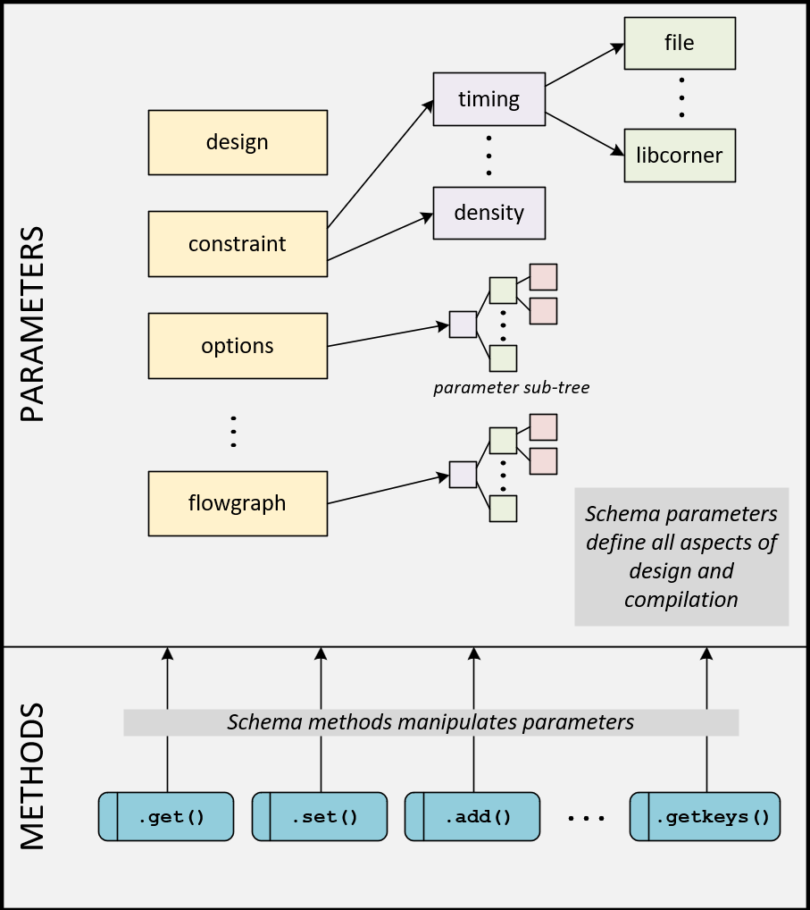

.. _data_model:

##############################################
The Schema: A Centralized Data Model
##############################################

At the core of every SiliconCompiler project is the Schema, a centralized data structure that holds all information about the design and the compilation process.
Think of it as the single source of truth or the digital blueprint for your hardware compilation project.

The Schema is designed to capture everything needed to produce a repeatable build. This includes, but is not limited to:

* **Design Definition**: Hardware sources, top-level module, and clock specifications.
* **Compilation Strategy**: The sequence of tools to run (the "flow"), and settings for each tool.
* **Target Technology**: Information about the target process design kit (PDK).
* **Metrics & Results**: Data gathered from the compilation, such as cell area, timing, and power.

This data is stored in Schema parameters, which are accessed through a simple and consistent set of API methods.

The diagram above illustrates how different types of data are organized within the Schema and accessed via methods.

The following sections detail how to interact with the Schema.

Working with the Schema
^^^^^^^^^^^^^^^^^^^^^^^

You interact with the Schema's parameters through a Project object.
Parameters are organized hierarchically and accessed using a "keypath"—a list of strings that specifies the unique location of a parameter.

The following example demonstrates how to create a Project object and manipulate the :keypath:`option,fileset` parameter, which tracks the types of input files for the compilation.

.. code-block:: python

    >>> from siliconcompiler import Project

    # Create a project, which contains a schema.
    >>> project = Project()

    # The 'fileset' parameter is initially empty.
    >>> print(project.get('option', 'fileset'))
    []

    # Use the set() method to assign a value.
    >>> project.set('option', 'fileset', 'rtl')
    >>> print(project.get('option', 'fileset'))
    ['rtl']

    # Use the add() method to append a new value to the list.
    >>> project.add('option', 'fileset', 'sdc')
    >>> print(project.get('option', 'fileset'))
    ['rtl', 'sdc']

The Manifest: Saving and Loading the Schema
^^^^^^^^^^^^^^^^^^^^^^^^^^^^^^^^^^^^^^^^^^^

The entire state of the Schema can be saved to a file called a manifest. This file, typically in JSON format, serves two critical purposes:

1. **Reference**: It provides a complete, human-readable record of every setting used in a compilation.
2. **Reproducibility**: It allows you to reload the exact configuration of a previous run, ensuring that builds are repeatable and shareable.

If you ran the :ref:`asic demo`, you can find the project manifest here: ::

build/<design>/job0/<design>.pkg.json

The :meth:`.BaseSchema.write_manifest`, :meth:`.BaseSchema.read_manifest`, and :meth:`.BaseSchema.from_manifest` methods handle serializing the Schema to and from disk.
While JSON is the default, other supported formats include Tcl, YAML, and CSV.

Writing and Reading a Manifest
------------------------------

.. code-block:: python

    >>> from siliconcompiler import Project

    # Create and configure a project.
    >>> project = Project()
    >>> project.set('option', 'design', 'my_design')
    >>> project.set('option', 'flow', 'asicflow')

    # Write the entire schema configuration to a file.
    >>> project.write_manifest('manifest.json')

    # You can later reload this configuration into a new project.
    >>> new_project = Project()
    >>> new_project.read_manifest('manifest.json')
    >>> print(new_project.get('option', 'design'))
    my_design

    # Or you can directly load it
    >>> new_project = Project.from_manifest('manifest.json')
    >>> print(new_project.get('option', 'design'))
    my_design

The manifest.json file written by the code above would contain a record of all schema parameters, including the design name we configured:

.. code-block:: json

    "design": {
        "lock": false,
        "node": {
            "default": {
               "default": {
                    "signature": null,
                    "value": null
               }
            },
            "global": {
                "global": {
                    "signature": null,
                    "value": "hello_world"
                }
            }
        },
        "notes": null,
        "pernode": "never",
        "require": "all",
        "scope": "global",
        "shorthelp": "Design top module name",
        "switch": [
            "-design <str>"
        ],
        "type": "str"
    },

Further Reading
^^^^^^^^^^^^^^^

For a comprehensive list of all parameters and their definitions, refer to the :ref:`Schema Reference <schema>`.
For more details on the API methods, see the :ref:`Python API <schema_api>` documentation.