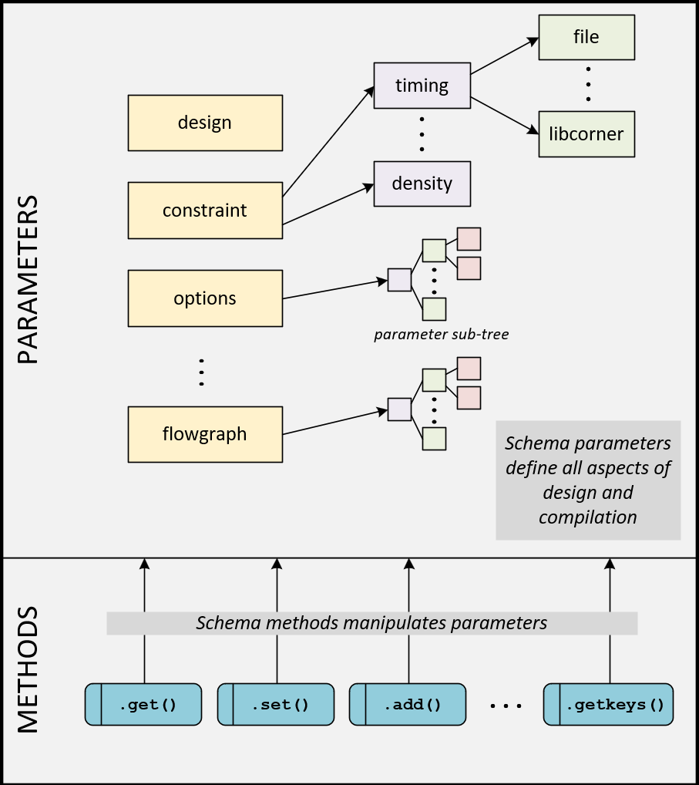

.. _data_model:

##############################################
The Schema: A Centralized Data Model
##############################################

At the core of every SiliconCompiler project is the Schema, a centralized data structure that holds all information about the design and the compilation process.
Think of it as the single source of truth or the digital blueprint for your hardware compilation project.

The Schema is designed to capture everything needed to produce a repeatable build. This includes, but is not limited to:

* **Design Definition**: Hardware sources, top-level module, and clock specifications.
* **Compilation Strategy**: The sequence of tools to run (the "flow"), and settings for each tool.
* **Target Technology**: Information about the target process design kit (PDK).
* **Metrics & Results**: Data gathered from the compilation, such as cell area, timing, and power.

This data is stored in Schema :term:`parameters <parameter>`, which are accessed through a simple and consistent set of API methods.

The diagram above illustrates how different types of data are organized within the Schema and accessed via methods.

The following sections detail how to interact with the Schema.

.. _schema_access:

Working with the Schema
^^^^^^^^^^^^^^^^^^^^^^^

You interact with the Schema's parameters through a Project object.
The recommended way to do so is through **typed accessors** -- named methods, grouped by area, that set and read one parameter each.

The following example creates a Project and manipulates :keypath:`option,fileset`, which selects which :term:`filesets <fileset>` of the design to compile.

.. code-block:: python

    >>> from siliconcompiler import Project

    # Create a project, which contains a schema.
    >>> project = Project()

    # The 'fileset' option is initially empty.
    >>> print(project.option.get_fileset())
    []

    # Append values with the matching add_ accessor.
    >>> project.option.add_fileset('rtl')
    >>> project.option.add_fileset('sdc')
    >>> print(project.option.get_fileset())
    ['rtl', 'sdc']

Typed accessors are ordinary Python methods, so they are discoverable by autocompletion, checked by your editor, and documented with their own argument types.
Each one is listed in the :ref:`Python API <schema_api>` reference.

Keypaths: the layer underneath
------------------------------

Underneath, every parameter lives at a **keypath** -- an ordered list of strings giving its unique location in the Schema, written in this documentation as :keypath:`option,fileset`.
The generic :meth:`.BaseSchema.get`, :meth:`.BaseSchema.set`, and :meth:`.BaseSchema.add` methods address parameters by keypath directly:

.. code-block:: python

    # The same parameter the accessors above operated on.
    >>> print(project.get('option', 'fileset'))
    ['rtl', 'sdc']

There is no second copy of the data and no conversion between the two forms: ``project.option.get_fileset()`` and ``project.get('option', 'fileset')`` read the same stored value.
The typed accessor is a thin, named wrapper around the keypath call.

.. admonition:: Which should you write?
   :class: tip

   **Prefer the typed accessor whenever one exists.** It is the supported,
   self-documenting interface, and it is what the
   :ref:`tutorials <tutorials>` and the ``examples/`` directory use.

   **Reach for a keypath when there is no accessor to use.** Two cases account
   for most of them:

   * **Reading results.** :term:`Metrics <metric>` and :term:`records <record>`
     are keyed by name and recorded per :term:`flowgraph node`, so they are read
     with an explicit keypath plus a step and index::

         >>> project.get('metric', 'cellarea', step='synthesis', index='0')
         67.032

   * **Parameters an accessor has not been written for.** The Schema is larger
     than the accessor surface; the keypath API reaches every parameter in the
     :ref:`Schema Reference <schema>`, including those contributed by tools and
     PDKs.

   Keypaths are not deprecated or discouraged in these cases -- they are the
   general mechanism the accessors are built on. What you should avoid is using
   a keypath for a parameter that already has an accessor, because the accessor
   carries the type and the name checking that a bare string list cannot.

The Manifest: Saving and Loading the Schema
^^^^^^^^^^^^^^^^^^^^^^^^^^^^^^^^^^^^^^^^^^^

The entire state of the Schema can be saved to a file called a manifest. This file, typically in JSON format, serves two critical purposes:

1. **Reference**: It provides a complete, human-readable record of every setting used in a compilation.
2. **Reproducibility**: It allows you to reload the exact configuration of a previous run, ensuring that builds are repeatable and shareable.

If you ran the :ref:`asic demo <asic_demo>`, you can find the project manifest here: ::

    build/<design>/job0/<design>.pkg.json

Every :term:`flowgraph node` also writes its own manifest, capturing the schema
as that node received and left it.
See :ref:`Directory structures <directory_structures>` for the full build tree.

The :meth:`.BaseSchema.write_manifest`, :meth:`.BaseSchema.read_manifest`, and :meth:`.BaseSchema.from_manifest` methods handle serializing the Schema to and from disk.

Writing and Reading a Manifest
------------------------------

.. code-block:: python

    >>> from siliconcompiler import Project
    >>> from siliconcompiler.flows.asicflow import ASICFlow

    # Create and configure a project.
    >>> project = Project()
    >>> project.option.set_design('my_design')
    >>> project.set_flow(ASICFlow())

    # Write the entire schema configuration to a file.
    >>> project.write_manifest('manifest.json')

    # You can later reload this configuration into a new project.
    >>> new_project = Project()
    >>> new_project.read_manifest('manifest.json')
    >>> print(new_project.option.get_design())
    my_design

    # Or you can directly load it
    >>> new_project = Project.from_manifest('manifest.json')
    >>> print(new_project.option.get_design())
    my_design

The manifest.json file written by the code above would contain a record of all schema parameters, including the design name we configured:

.. scdict::
    :class: siliconcompiler/Project
    :keypath: option
    :select: design

Further Reading
^^^^^^^^^^^^^^^

For a comprehensive list of all parameters and their definitions, refer to the :ref:`Schema Reference <schema>`.
For more details on the API methods, see the :ref:`Python API <schema_api>` documentation.
