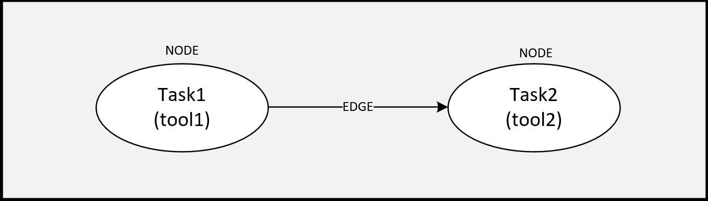
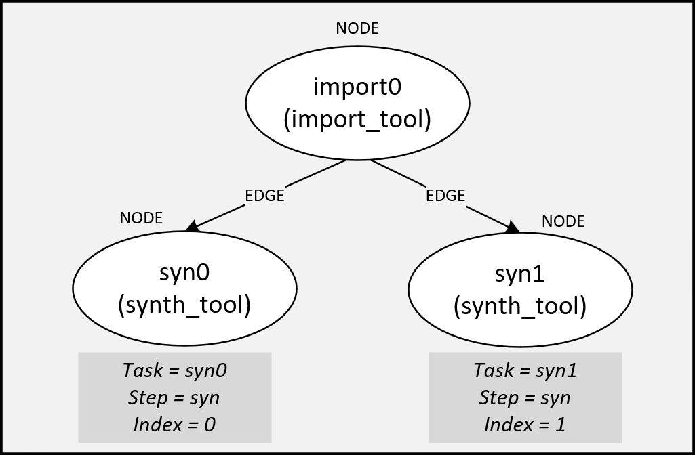

.. _execution_model:

###################
Compilation Process
###################

The complete SiliconCompiler compilation is handled by a single call to the :meth:`.run()` function.
Within that function call, a static data :term:`flowgraph`, consisting of :term:`nodes <node>` and :term:`edges <edge>` is traversed and "executed."

.. rst-class:: page-break

The static flowgraph approach was chosen for a number reasons:

* Performance scalability ("cloud-scale")
* High abstraction level (not locked into one language and/or shared memory model)
* Deterministic execution
* Ease of implementation (synchronization is hard)

The Flowgraph
-------------

Nodes and Edges
^^^^^^^^^^^^^^^

A SiliconCompiler flowgraph consists of a set of connected nodes and edges, where:

* A :term:`node` is an executable :term:`tool` performing some (":term:`task`"), and
* An :term:`edge` is the connection between those tasks, specifying execution order.

Tasks
^^^^^
SiliconCompiler breaks down a "task" into an atomic combination of a step and an index, where:

1.
A :term:`step` is defined as discrete function performed within compilation flow such as synthesis, linting, placement, routing, etc, and
2.
An :term:`index` is defined as variant of a step operating on identical data.

An example of this might be two parallel synthesis runs with different settings after an import task.
The two synthesis "tasks" might be called ``syn0`` and ``syn1``, where:

See :ref:`using index for optimization` for more information on why using indices to build your flowgraph are helpful.

Execution
^^^^^^^^^

Flowgraph execution is done through the :meth:`.run()` function which checks the flowgraph for correctness and then executes all tasks in the flowgraph from start to finish.

Flowgraph Examples
------------------

The flowgraph, used in the :ref:`asic demo`, is a built-in compilation flow, called :ref:`asicflow <flows-asicflow-ref>`. This compilation flow is a pre-defined flowgraph customized for an ASIC build flow, and is called through the :meth:`.use()` function, which calls a :ref:`pre-defined PDK module <pdks>` that `uses the asicflow flowgraph <https://github.com/siliconcompiler/siliconcompiler/blob/main/siliconcompiler/targets/skywater130_demo.py>`_.

.. rst-class:: page-break

You can design your own chip compilation build flows by easily creating custom flowgraphs through:

* :meth:`.node()`/:meth:`.edge()` methods

The user is free to construct a flowgraph by defining any reasonable combination of steps and indices based on available tools and PDKs.

A Two-Node Flowgraph
^^^^^^^^^^^^^^^^^^^^

The example below shows a snippet which creates a simple two-step (import + synthesis) compilation pipeline.

.. The built in functions are important to minimize data movement in remote processing workflows, where intermediate results may not be accessible.

.. literalinclude:: examples/heartbeat_flowgraph.py
   :caption: Snippet from `examples/heartbeat_flowgraph.py <https://github.com/siliconcompiler/siliconcompiler/blob/main/docs/user_guide/examples/heartbeat_flowgraph.py>`_
   :start-after: start of flowgraph setup
   :end-before: end of flowgraph setup

At this point, you can visually examine your flowgraph by using :meth:`.write_flowgraph()`. This function is very useful in debugging graph definitions. ::

  chip.write_flowgraph("flowgraph.svg", landscape=True)

.. image:: _images/flowgraph.svg
       :align: center

.. note::

   **[In Progress]** Insert link to tutorial which has step-by-step instruction on how to set up this flow with libs and pdk through run and execution.

Using Index for Optimization
^^^^^^^^^^^^^^^^^^^^^^^^^^^^

The previous example did not include any mention of :term:`index`, so the index defaults to ``0``.

.. rst-class:: page-break

While not essential to basic execution, the 'index' is fundamental to searching and optimizing tool and design options.

.. rst-class:: page-break

One example use case for the index feature would be to run a design through synthesis with a range of settings and then selecting the optimal settings based on power, performance, and area.
The snippet below shows how a massively parallel optimization flow can be programmed using the SiliconCompiler Python API.

.. literalinclude:: examples/flowgraph_doe.py
   :caption: Snippet from `examples/flowgraph_doe.py <https://github.com/siliconcompiler/siliconcompiler/blob/main/docs/user_guide/examples/flowgraph_doe.py>`_ that sets up parallel synthesis runs for optimization
   :start-after: # set synthesis strategies
   :end-before: write_flowgraph

.. image:: _images/flowgraph_doe.svg

.. note::
   **[In Progress]** Provide pointer to a tutorial on optimizing a metric

