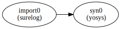
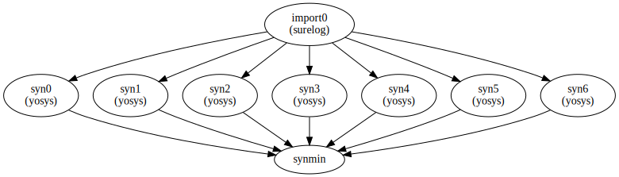

Execution model
===================================

The complete SiliconCompiler compilation is handled by a single call to the run() function. Within that function call, the execution model is based on a directed static data flow graph consisting of nodes and edges. The static flowgraph approach was chosen for a number reasons:

* Performance scalability ("cloud-scale")
* High abstraction level (not locked into one language and/or shared memory model)
* Deterministic execution
* Ease of implementation (synchronization is hard)

A SiliconCompiler flowgraph consists of a set of connected nodes and edges, where a node is an executable tool performing some ("task"), and an edge is the connection between those tasks. SiliconCompiler defines a "task" as an atomic combination of a step and an index, where: 1.) STEP is defined as discrete function performed within compilation flow such as synthesis, linting, placement, routing, etc, and 2.) INDEX is defined as variant of a step operating on identical data.  Flowgraph execution is done through the run() function which checks the flowgraph for correctness and then executes all tasks in the flowgraph from start to finish.

The :ref:`quickstart guide` example called the built in "`asicflow <https://github.com/siliconcompiler/siliconcompiler/blob/main/siliconcompiler/flows/asicflow.py>`_" compilation flow through the target function. Custom flowgraphs can be easily created through the set()/get() methods or the node()/edge methods (**recommended**). All flows must contain an import step that 'imports' source files into the SiliconCompiler schema. Otherwise the user is free to define any reasonable combination of steps and indices based on available tools and PDKs. The example below shows the 'heartbeat' example modified to include a simple three step (import + synthesis + minimum) compilation pipeline. The built in functions are important to minimize data movement in remote processing workflows, where intermediate results may not be accessible.

.. literalinclude:: examples/heartbeat_flowgraph.py

The execution flowgraph can be rendered using the write_flowgraph(), which proves very helpful in debugging graph definitions. ::

  chip.write_flowgraph("flowgraph.svg", landscape=True)

The previous heartbeat example did not include any mention of index, so the index defaults to 0. While not essential to basic execution, the 'index' is fundamental to searching and optimizing tool and design options. One example use case for the index feature would be to run a design through synthesis with a range of settings and then selecting the optimal settings based on power, performance, and area. The snippet below shows how a massively parallel optimization flow can be programmed using the SiliconCompiler Python API.

.. literalinclude:: examples/flowgraph_doe.py

The SiliconCompiler directory structure follows the convention shown below. Each step/index combination ("task") has a separate work directory, with all data inputs read from a local 'inputs' directory and all data outputs placed in a local 'outputs' directory. Reports are placed in the task's local  'reports' directory. Control communication between tasks is done entirely through file based communication. The compilation schema containing all setup parameters and run time metrics are read from 'inputs' directory at the start of a task and written to the 'outputs' directory at the end of a task.

::

    heartbeat
    └── jobname
        ├── floorplan
        │   └── index
        │       ├── inputs
        │       ├── outputs
        │       └── reports
        ├── import
        │   └── index
        │       ├── inputs
        │       ├── outputs
        │       └── reports
        └── syn
            └── index
                ├── inputs
                ├── outputs
                └── reports

The combination of the flowgraph execution mode and file based communication enables support for distributed processing of any static execution pattern, including serial pipelines, fork-join patterns, and parallel pipelines.

The ubiquitous fork-join execution pattern can be created by adding steps associated with built in function steps to the flowgraph. The built in 'asicflow' is an example of a flow that supports fork-join optimization at every step.

.. image:: ../_images/forkjoin.png

Parallel pipelines is another common pattern found in parallel programming. It's especially useful for embarrassingly parallel applications such as constrained random verification and brute force search design of experiments. SiliconCompiler enables parallel pipelines by: 1) supporting any step/index output to any step/index input within the flowgraph and by 2.) Inclusion of built in join, minimum, and maximum functions. The flowgraph below shows a place and route experiment that imports source files, runs 4 separate sets of experiments on the same data, and then picks the best one based on the metrics reported and metrics weights set in the flowgraph.

.. image:: ../_images/pipes.png

At the end of each run() call, the current in memory job schema entries are copied into a job history dictionary to more complex flow creation. which can be accessed by the user to to create sophisticated non-linear flows that take into account run history and gradients. The code snippet below shows a minimal sequence leveraging the multi-job feature.::

  chip.run()
  chip.set('jobname', 'newname')
  chip.set('some parameter..')
  chip.run()

Complex iterative compilation flows can be created with Python programs that 1.) calls run() multiple times using a different jobname and 2.) leverages Python logic to query per job metrics to control the compilation flow decision.

.. image:: ../_images/complex.png
