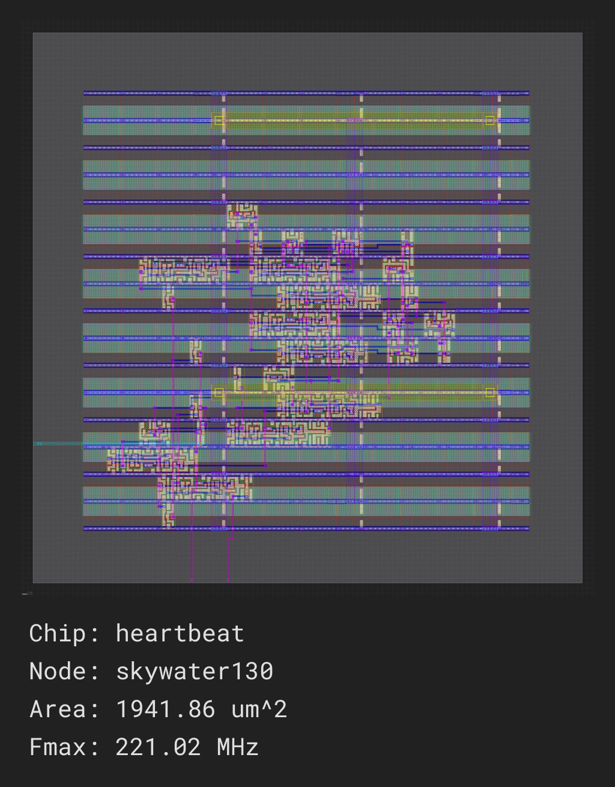

Installation
===================================

Installing Python
-----------------

Before installing the SiliconCompiler package you will need to set up a Python environment. Currently Python 3 is supported.
The following sections will walk you through how to install the appropriate python dependencies and start a Python virtual environment. Note that at any time, if you need to exit the Python virtual environment, type 'deactivate' and hit enter. 

.. _Python install:

Ubuntu (>=18.04)
^^^^^^^^^^^^^^^^
Open up a terminal and enter the following command sequence.

.. code-block:: bash

    python3 --version                                      # check for Python 3
    sudo apt update                                        # update package information
    sudo apt install python3-dev python3-pip python3-venv  # install dependencies
    python3 -m venv  ./venv                                # create a virtual env
    source ./venv/bin/activate                             # active virtual env (bash/zsh)

   
.. note::
   If you plan to generate any docs or create any flowgraphs, you'll also need to install Graphviz.
   You can make sure you have this dependency by running ``sudo apt install graphviz xdot``

Skip ahead to `SC Install`_.

RHEL (>=RHEL 7)
^^^^^^^^^^^^^^^^^^^
Open up a terminal and enter the following command sequence.

..  Note: when testing on AWS I had to use a different repository name in the first command:
.. sudo subscription-manager repos --enable rhel-server-rhui-rhscl-7-rpms
.. However, that seemed AWS-specific, and the command used in the docs comes from Red Hat itself:
.. https://developers.redhat.com/blog/2018/08/13/install-python3-rhel#

.. code-block:: bash

   sudo subscription-manager repos --enable rhel-server-rhscl-7-rpms  # enable Red Hat Software Collections repository
   sudo yum -y install rh-python38                                    # install Python 3.8
   scl enable rh-python38 bash                                        # enable Python in current environment
   python3 --version                                                  # check for Python 3
   python3 -m venv ./venv                                             # create a virtual env
   source ./venv/bin/activate                                         # active virtual env (bash/zsh)
   pip install --upgrade pip                                          # upgrade Pip

.. note::
   If you plan to generate any docs or create any flowgraphs, you'll also need to install Graphviz.
   You can make sure you have this dependency by running ``sudo yum -y install graphviz xdot``

	     
Skip ahead to `SC Install`_.

macOS (>=10.15)
^^^^^^^^^^^^^^^
Open up a terminal and enter the following command sequence.

.. code-block:: bash

   /bin/bash -c "$(curl -fsSL https://raw.githubusercontent.com/Homebrew/install/HEAD/install.sh)"
   export PATH="/usr/local/opt/python/libexec/bin:$PATH"
   brew update
   brew install python
   python3 --version                                      # check for Python 3
   python3 -m venv  ./venv                                # create a virtual env
   source ./venv/bin/activate                             # active virtual env

.. note::
   If you plan to generate any docs or create any flowgraphs, you'll also need to install Graphviz.
   You can make sure you have this dependency by running ``brew install graphviz xdot``

   
Skip ahead to `SC Install`_.

Windows (>= Windows 10)
^^^^^^^^^^^^^^^^^^^^^^^^

Install the latest Python package from `Python.org <https://www.python.org/downloads>`_ using the Windows installer. Open up a Windows shell by:

1. Pressing the 'Windows' key
2. Typing 'cmd', and pressing enter.

From the command shell, enter the following sequence to create and activate a virtual environment.

.. code-block:: doscon

  python -m venv  .\venv
  .\venv\Scripts\activate

.. note::
   If you plan to generate any docs or create any flowgraphs, you'll also need to `install Graphviz <https://graphviz.org/download/#windows>`_.
   
.. _SC Install:

Installing SiliconCompiler
--------------------------

After you've got the python dependencies installed, you will need to install SiliconCompiler. There are a few different ways to do this:

1. The `recommended method`_ is to install the last stable version published to `pypi.org <https://pypi.org>`_, or
2. You can do an `offline install`_ with a tarball (for Linux only), or
3. You can install `directly from the git repository`_ (best for developers).

.. _recommended method:

Install from pypi.org 
^^^^^^^^^^^^^^^^^^^^^
SiliconCompiler can be installed directly from `pypi.org <https://pypi.org>`_ using pip. Activate your `Python Virtual Environment <https://docs.python.org/3/library/venv.html>`_ and follow the instructions below. 

.. code-block:: bash

 (venv) pip install --upgrade pip                # upgrade pip in virtual env
 (venv) pip list                                 # show installed packages in venv
 (venv) pip install --upgrade siliconcompiler    # install SiliconCompiler in venv
 (venv) python -m pip show siliconcompiler       # will display SiliconCompiler package information

.. include:: installation/installation_confirm_version.rst

.. include:: installation/installation_prep_path.rst 

Skip to `asic demo`_.
	     
.. _offline install:

Offline Install (Linux only)
^^^^^^^^^^^^^^^^^^^^^^^^^^^^
We also provide packages that bundle SC with all of its Python dependencies to enable installation on machines without an external internet connection. 

To access them:

1. Go our  `builds page <https://github.com/siliconcompiler/siliconcompiler/actions/workflows/wheels.yml>`_. 
2. Click on the most recent, passing Wheels package. This should be the first green-colored build in the list.
3. On the bottom of that page, you will see an "Artifacts" section. Click on the "artifact" to download it.
4. The packages are named ``scdeps-<pyversion>.tar.gz``, depending on which Python version they are associated with.

Then untar the package and install SiliconCompiler:

.. code-block:: bash

   (venv) tar -xzvf scdeps-<pyversion>.tar.gz
   (venv) pip install --upgrade pip --no-index --find-links scdeps
   (venv) pip install siliconcompiler --no-index --find-links scdeps

.. include:: installation/installation_confirm_version.rst

.. include:: installation/installation_prep_path.rst

Skip to `asic demo`_.

.. _directly from the git repository:

Install from GitHub Repo (Linux/MacOS)
^^^^^^^^^^^^^^^^^^^^^^^^^^^^^^^^^^^^^^
You can also install SiliconCompiler from the latest `SiliconCompiler GitHub Repository <https://github.com/siliconcompiler/siliconcompiler>`_. 

**Install Dependencies, Bison and Flex**

For Linux, you can use:

.. code-block:: bash

   sudo apt-get install flex bison
   

On MacOS, note that you must first install Bison and Flex from Homebrew.

.. code-block:: bash

   brew install bison
   brew install flex

Ensure that the path to the Homebrew packages takes priority over system
packages in your ``$PATH``. Run ``brew --prefix`` to determine where Homebrew
installs packages on your machine.

**Install SiliconCompiler**

Finally, to clone and install SiliconCompiler, run the following:

.. parsed-literal::

   (venv) git clone -b v\ |release| https://github.com/siliconcompiler/siliconcompiler
   (venv) cd siliconcompiler
   (venv) python -m pip install -e .
   (venv) export SCPATH=<the full path for your siliconcompiler/siliconcompiler directory>

.. include:: installation/installation_confirm_version.rst
	     

.. _asic demo:

ASIC Demo
-----------------
Now that you have installed SiliconCompiler, you can test your installation by running a quick demo through the ASIC design flow in the cloud.::
  
    sc -target asic_demo -remote

Your remote job should only take a few minutes to run if the servers aren't too busy. It should end with a results directory where you can find ``png`` file which displays your results. It should look something like this:

See :ref:`Quickstart guide` next to go through the design and run details of the quick demo above.

.. _External Tools:

External Tools
--------------

If you wish to run on your machine instead of remotely in the cloud as in the quick `asic demo`_ target above, there will be some tools you need to install first.

.. note::

   The minimum set of tools required for an ASIC flow are: :ref:`Surelog <surelog>`, :ref:`Yosys <yosys>`, :ref:`OpenROAD <openroad>`, and :ref:`KLayout <klayout>`. Links to individual tool installation instructions and platform limitations can be found in the :ref:`pre-defined tool drivers <tools_directory>`.

   We have provided the following helper install scripts for this minimum toolset for the ASIC flow as well as other external tools, but keep in mind that they are for reference only. If you should run into issues, please consult the official download instructions for the tool itself. All official tool documentation links can be found in the :ref:`pre-defined tool drivers <tools_directory>` section.

   Unless otherwise specified in the script name, these scripts target Ubuntu 20.04.

.. installscripts::

See :ref:`Quickstart guide` next to see how to run locally on your machine with these tools.
