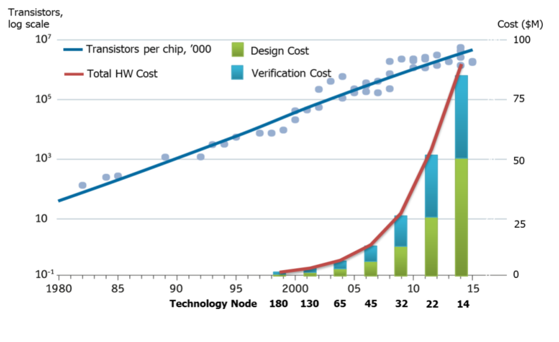

Introduction
===================================

SiliconCompiler ("SC") is an open source hardware compilation framework with native
support for open source as well as commercial design tools. The goal of the
SiliconCompiler project is to lower the barrier to ASIC design and integrated
circuit education.

Highlights
----------------
* Python based programming interface
* Scalable flowgraph based execution model
* Standardized plain text JSON configuration and provinence manifest
* Built in support for remote processing
* Python based ASIC floor-planning API

.. list-table::
   :widths: 20 15 15 20
   :header-rows: 1

   * - Feature
     - SiliconCompiler
     - Status Quo
     - Why it's important
   * - User API interface
     - Python
     - TCL
     - Python is 1000x more popular
   * - Open EDA API
     - Yes
     - No
     - Workforce development
   * - PDK agnostic APR setup
     - Yes
     - No
     - Startup time
   * - Library agnostic setup
     - Yes
     - Not usually
     - Startup time
   * - Common ASIC/FPGA design API
     - Yes
     - No
     - Startup time
   * - Remote processing
     - Yes
     - No
     - Startup time
   * - Common DV/Design sourcelist
     - Yes
     - No
     - Security, quality
   * - Provenance tracking
     - Automated
     - Manual
     - Security, quality
   * - Single file manifest/record
     - Yes
     - No
     - Security, quality
   * - Tapeout archiving
     - Automated
     - Manual
     - Security, quality

Historical perspective
------------------------

The term "Silicon Compiler" generally defined as a piece of software that reads a
high level specification and automatically translates it into a complete layout of
an integrated circuit (IC). The term was coined in 1979 at the height of a
VLSI revolution led by Carver Mead and Lynn Conway, who were on a mission to expand
the realm of the possible by enabling community of engineers without a background
in solid state device physics to design complex integrated circuits.

The initial idea behind early Silicon Compilers was one where chips would be
specified as a series of parameterized building blocks and the silicon compiler
would automatically stitch them together to create the final set of photmasks
containing all the layers needed to create transistors and interconnect. In today’s
terminology, we might call these types of compilers generators. The initial silicon
compilers had a compelling vision, but were not fully automated and proved too
limited for the rapidly evolving VLSI community. Instead, the methodology that won
was absed on standardized high level hardware description language (Verilog/VHDL)
is automatically translated/lowered to a physical layout using a series of
automated transformations (synthesis --> placement --> cts--> routing- -> dfm-->etc)
This “RTL to GDS” silicon compiler approach was rarely 100% automated, but it was
good enough for the industry for over 30 years. Stil, significant issues remain:

* Silicon compilation technology is too expensive for most
* Silicon compilation is not fully automated
* Silicon compilation is not PDK agnostic
* Silicon design abstractions have started leaking

Moore's law as we know it is ending and the only way we can continue to advance the
state of the art in performance, cost, and energy efficiency in the future is
through design of many more specialized circuits. Unfortunately, this post-Moore
era will never materialzie at the current chip design costs which range from
$50-500M at advanced manufacturing nodes.

Observing the positive impact that silicon has had on the world over the last 50
years it is a social imperative that we extend the current exponential trend for
as long possible. The time for a 2nd VLSI revolution has arrived...

Challenges
----------------

The challenge of modern ASIC/SoC design stems from the inherent complexity of
constructing a reliable machine consisting of billions of switches embedded within
a single tiny device. In chip design, anything less than perfection operation is
considered a failure. There is no recompile option.

The complexity challenge of modern silicon machines is pervasive with significant
effort going into system desigbn, applications, O/S, tools, drivers, architecture,
design, design verification, physical design, testing, and productization.
If we really want to make a difference and reduce the cost and time of chip design
by orders of magnitude (100x), the industry will need to address all inefficiencies
in the process not just the major ones. (see Amdahl's Law).

The specific challenge area addressed by the SiliconCompiler project is automated
hardware compilation (ie. the concept of taking a high level description and
lowering it to some final low level form). In modern chip design, this is actually
an incredibly complex endeavor due to the enormous search space associated with
implementation commands and numerical parameters to specify to achieve correct and
optimal implementation. Selection of each one of the parameters and recipes
requires access to state of the art EDA tools and expert knowledge of tools, foundry
PDKs and physical design methodologies. The number of physical design concerns has
been steadily increasing with every CMOS process node advancement, starting at
180nm. To qualify production level silicon solutions at 22nm and below requires
sophisticated implementation and verification flows with expertise needed in:

* static timing analysis
* design for testability
* RC delay effects
* clock tree optimization
* power integrity and power delivery
* signal integrity
* multi-threshold low power synthesis
* power gating
* multi-voltage domains
* Advanced ESD and antenna design rules
* congestion avoidance
* self heating
* on chip variability
* statistical yield analysis
* multic-corner multi-mode analysis
* stress and proximity effects
* complex patterning density rules
* design for manufacturability
* double and triple pattern lithography considerations
* current density limitations
* advanced packaging
* reliability and device fatique

To address the ever expanding set of physical design concerns, EDA companies
are continuously adding new tool features and automation capabilities to
commercial physical design tools. Despite these efforts, design
automation progress has not kept pace with the exponential rate of Moore’s Law
(2x more transistors per chip every 2 years), resulting in a productivity gap
that has made physical design of complex SoCs in SOTA process nodes impractical
for small design teams.

Large semiconductor companies with many design groups and numerous products
and prototypes in the pipeline minimize EDA, IP, and PDK project startup costs
through establishment of internal CAD teams that provide infrastructure and
enablement for all of the company’s product design teams. The key services
provided by internal CAD teams generally include:

* Setup and management of large on-premises and cloud based server farms
* EDA and IP procurement for the company
* EDA and IP license management for the company
* Installation of EDA tools, foundry PDKs, and foundational physical IP
* Version tracking and archiving of all versions of EDA, IP, PDKs
* Design/tapeout archiving
* Establishment of qualified reference physical design flows for the company
* Direct interfacing with EDA, IP, and foundry suppliers
* Reference flow support of internal design teams

The SiliconCompuler project aims to provide state of the art CAD infrasatructure
for folks who don't have accesss to large internal CAD teams.

Our approach
-------------

The SiliconCompiler is built around a central python configuration and tracking
dictionary (“schema”) that tracks all files and accesses and actions taken from RTL
to GDS. During design execution, the schema is dynamically accessed by translation
scripts at runtime to generate configuration files for each EDA tool accessed.
Metrics are collected at each design step and fed back into the centralized
dictionary maintained by the Python management program. JSON files are written to
disk after each step for verification purposes. Most importantly, a single
automatically generated unified JSON manifest can be linked with a GDS sent
to foundry to ensure provenance and traceability.

The configuration schema is accessed through a Python API that enables a safe
and secure interface to the configuration schema and manages the silicon
compilation

The SiliconCompiler project makes the following architecure decisions:

* Modern chip design is a high performance computing (HPC) problem. Compilation
  should make optimal use of the compouting platform whether we run on a laptop,
  powerful, workstation, or in a warehouse scale data center. A much as possible,
  the underlying computing platform should be abstracted away from the designer.
* Leverage a vaste open source Python ecosystem to reduce development cost and risk.
* Leverage the full power of the Python language to create data structures that
  mimic the natural PDK and IP patterns for setup that enables independent setup on
  a per IP and per process basis. Maximum efficiency is reached when each setup
  owner can work independently and the designer can simply point to the resources
  to be used (library, EDA tool, process).
* Create a set of known good targets that hard code appropriate defaults for
  all configuration parameters within the compiler for an easy out of the box
  experience, with the ability to override each parameter dynamically at run
  time.
* Leverage the looping and control features of the Python language to enable
  single file configuration (“manifest”) of a process node PDK and/or IP
  library.
* Use YAML/TCL/JSON configuration writers to interfaces with external tools.
* A single golden trackable configuration manifest that keeps a complete record
  and hashes of all files and tool versions and configurations used to produce
  the GDSII.
* Don’t fight the tools or the foundries. SC will conform to existing
  interfaces provided if available (TCL/YAML). When non-existent, as in the
  case of PDKs and IP libraries, SC native setup files will be created with
  translators to EDA reference methodologies
* Build generators not instances. The architecture schema is built to enable
  auto-generation of command line options and API access, enabling SC to
  scale gracefully from a single command line argument all the way up to the
  most complicated SoCs within a single platform without burdening the novice
  with steep ramp up costs or restricting advanced developers.
