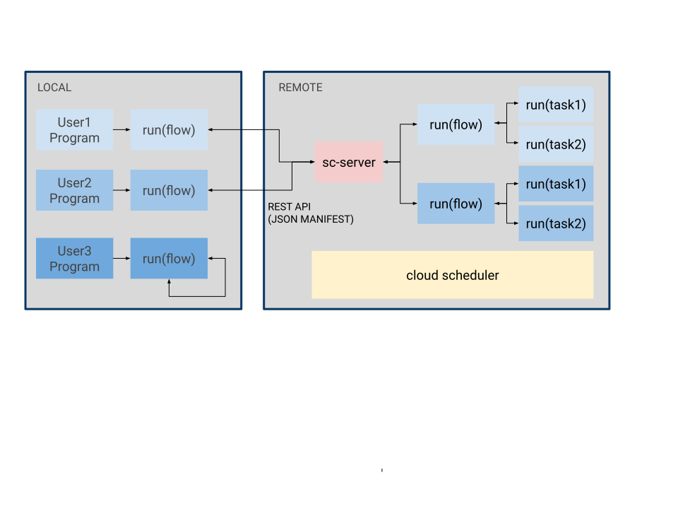

Introduction
===================================
SiliconCompiler is an open source build system that automates translation from source code to silicon.

Motivation
-----------

Silicon had an enormous positive impact on the world over the last 50 years and it is a social imperative that we surf the exponential Moore's Law as long as possible. Extreme hardware specialization is the only viable path for extending the current exponential electronics improvement trajectory indefinitely, but the path is currently blocked by the high engineering effort of chip design.

Hardware specialization for a long tail of future applications will require the creation of completely automated end-to-end compilers that are orders of magnitude faster than today's tools. The enormity of these challenges means single machine execution and monolithic single company efforts are unlikely to be sufficient. In this work, we take a distributed systems approach to compilers, with the goal of creating infrastructure that scales to thousands of developers and millions of servers.

Our Approach
-------------

The SiliconCompiler project is based on a standardized data :ref:`Schema <SiliconCompiler Schema>` that supports orthogonal combinations of design, tools, and Process Design Kits (PDKs). The schema design philosophy is to "make the complex possible while keeping the simple simple".

To simplify flow development, the project incorporates a simple object oriented :ref:`Python API<Core API>`. The API includes abstracted set/get access to the Schema, a flowgraph based parallel programming model, and a suite of utility functions for compilation setup and metric tracking.

The expansive data schema, standardized plug-in interfaces, and built-in dynamic module search functionality enables SiliconCompiler to scale effectively to a large number of tools and PDKs. The open source :ref:`Tool<Tools directory>` and :ref:`PDK<PDK directory>` sections in the reference manual serves as a good starting point for folks who want to add their own PDKs and tools.

To further reduce design access barriers, the project also supports a :ref:`client-server <Remote Processing>` execution model that leverages the cloud to: 1) reduce tool installation barriers, 2) reduce the barrier to massively parallel elastic compute, 3) address the NDA barrier for PDK and EDA tools.

Authors
-------------

SiliconCompiler project authors in chronological order: |authors|.
