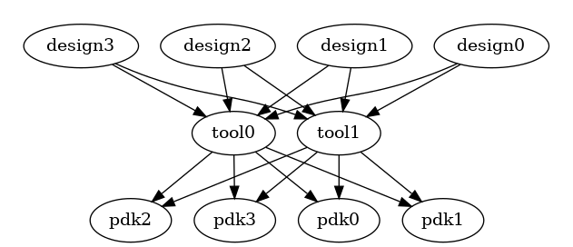
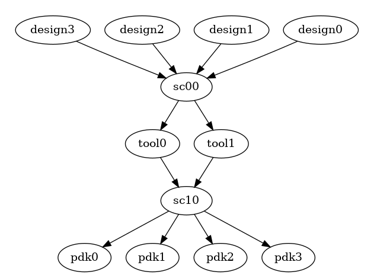
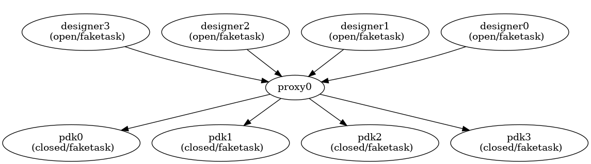

Introduction
===================================

SiliconCompiler ("SC") is an open source compiler infrastructure project that
aims to lower the barrier to custom silicon.

**TL;DR** – Here is the :ref:`Installation` and :ref:`Quickstart guide`

Motivation
-----------

Moore's Law is ending and the only option for continuing the current
exponential improvement path is hardware specialization. Unfortunately, using
today's technology, chip projects development cost can exceed $100M,
limiting hardware specialization to a small number of highly profitable
applications. Observing the positive impact that silicon has had
on the world over the last 50 years, we consider it a social imperative to
extend Moore's Law for as long possible. Enabling the level of hardware
specialization needed for the post-Moore era will require a fully automated
hardware compiler similar to the ones that we take for granted in software.

.. image:: ../_images/cost.png

Challenges
------------

A core challenge in creating a silicon compiler is the incredible numerical
complexity of optimizing billions of inter-connected devices for power, cost,
area, speed while ensuring that the produced circuit will operate reliably
under all possible temperature, voltage, and process conditions. Successful
compilation requires searching an (almost) unbounded parameter space and
selecting optimal values based on templated recipes ("reference flows") and
process constraints derived from foundries, EDA vendors, IP providers, and
design experts. A sizable portion of the EDA field over the last 50 years
have been focused on tackling these NP-hard problems.  The number
of physical design concerns has been steadily increasing with every process
node since the beginning of Moore's Law. Designing production grade silicon
solutions in state of the art process nodes (16nm and below) requires expert
knowledge in a broad set of highly specialized hardware design domains:

* physical floorplanning
* static timing analysis
* design for testability
* signal integrity
* power integrity
* clock tree techniques
* multi-threshold low power synthesis
* power gating
* multi-voltage domains
* advanced ESD design rules
* congestion optimization
* self heating
* high performance computing
* on chip variability
* statistical yield analysis
* multi-corner multi-mode analysis
* stress and proximity effects
* complex patterning density rules
* design for manufacturability
* double and triple pattern lithography
* advanced packaging
* reliability and device fatigue

Large semiconductor companies minimize EDA, IP, and PDK design project costs
through establishment of central CAD teams that maximize reuse of shared
infrastructure and design flows. Key services provided by internal CAD teams
include:

* Establishing massive computing resources needed for chip design.
* Procurement, licensing, and package management for EDA and IP.
* Design infrastructure (git, CI, backups, vpn, etc).
* Establishment of hardened per PDK reference flows ("recipes")

A second challenge associated with the numerical complexity of chip design
is excessive compile times. Software developers operate at the second or
minute time scales. Current chip design compilation cycles range from
hours to months depending on the fidelity of the result needed. To make
hardware compilation practical for co-design will require an order
of magnitude improvement in compilation latencies. Achieving significant
speed ups will require building infrastructure that enables built in
support for massively parallel compilation and the redesign of
serial algorithms for massive parallelism.
(see `Amdahl's law. <https://en.wikipedia.org/wiki/Amdahl%27s_law>`_)

A third challenge to creating a universal silicon compiler ("LLVM for
hardware") is rooted in the economic fundamentals of the semiconductor
ecosystem. A competitive semiconductor the hard reality of
`zero-sum economics <https://en.wikipedia.org/wiki/Zero-sum_game>`_
has prevented the established of robust data exchange standards and IRs.
Without a standardized IR, creating a a multi platform hardware compiler would
require writing translators from 1000's of designs to 10's of PDKs using
10's of individual tool executables, resulting in 1000's of separate
configurations and translators and high per design efforts.

The N-squared translation challenge is a well known problem involving
communication between N sources and N destinations, each speaking separate
languages. A brute force implementation for all to all communication would
require N^2 separate translators from all sources to all destinations. A more
efficient efficient solution relies on constructing an intermediate
representation "IR" that enables all sources to be translated to all
destinations using 2*N translators. The IR approach has served as a guiding
principle for a number of successful software projects, including
`LLVM <https://llvm.org/>`_ and `Pandoc <chttps://pandoc.org/>`_.

A related challenge to hardware compilation comes from the severe restrictions
placed on data sharing within the semiconductor industry. Every commercial
PDK, IP, and EDA tool is bound by NDAs and restrictive license/EULA agreements.
Software communities like the LLVM compiler community and the machine
learning communities have clearly demonstrated that a global collaborative
effort can solve problems that no single entity can (or should) solve alone.
It is exceedingly unlikely that the semiconductor industry will become as
open as the compiler/ML community so any technical solution will need to
accommodate severe restrictions on information sharing.

The final and biggest challenge to general purpose hardware compilers
comes from the complexity of no human in the loop automation in areas in areas
that are mathematically imprecise. The fields of robotics and autonomous drive
have shown us that removing humans out of the loop gets exponentially harder
with increasing quality requirements. Creating a "smart" chip generator can be
done easily today, creating a compiler that can completely replicate the
millions of man-hours spent on physical design of chips yearly may prove
impossible.

A working silicon compiler will need to successfully address all these
challenges to enable the extreme hardware specialization required to enable the
hyper-specialization required for the post-Moore era.

Related efforts
----------------

The first silicon compilers were invented in the 1970's during the height of
the by VLSI revolution led by Carver Mead and Lynn Convway. Their efforts
introduced formal design methods to a generation of new engineers and laid the
foundatiuon for today's semiconductor design methods. It was a time of great
excitement, with no limits on big ideas. One of the biggest ideas proposed,
was the idea of an automated "silicon compiler" that could turn a specification
into layout the same way we turn a program into an executable binary. These
early silicon compilers were developed around the vision that chips could be
automatically constructed using a set of parameterized building blocks.
Unfortunately, this generator approach was too brittle and too time consuming
for the rapidly evolving VLSI community.

The compiler approach that ended up succeeding in industry was based on mapping
a general purpose hardware design language (Verilog/VHDL) into a standard cell
based netlist abstraction, and then placing and routing that mapped netlist
using fully automated algorithms. These "RTL2GDS" type compilers have been
served us well as demonstrated by the thousands of silicon miracles taped out
every year. However, the inconvenient truth is that these RTL2GDS flows are
not really true
compilers because they require a significant level of manual work and
optimization for each design that runs throught the design. Comparing
to software, they would be the equivalent of having a C-compiler that
would require the user to write a portion of the program in assembly
for every architecture and to manually fix 1000's of errors in the
final binary executable on every compilation cycle.

Why can't we have "LLVM for hardware"? Using LLVM, we can cross-compile a
single source to a large number of architecture by simply modifying
the target string.

.. code-block:: bash

    $ clang --target=aarch64-linux-gnu hello.c -o hello

Each one of the architecture targets was created with manual work by a
software developer (and team of developers). The LLVM project has been
incredibly successful by creating an IR and an associated collection of
modular and reusable compiler that makes simplify the creation of new high
quality back end targets and new front end programming interfaces. Many of the
concepts and methods established by the LLVM project are directly transferrable
to the hardware comppilation domain, but ther are some key differences
between software compilers and hadware design which is grounded in physics.
To replicate the success of LLVM would require an exact IR specification
adopted by all producers and consumers within the compiler flow. While the
design database has an exact description as it goes through compilation
(source code, gate level netlist, spice netlists, and polygon based layouts),
there is no mathematical basis for the compilation recipe used for lowering
the program into polygons. An IR for hardware compilation will need to
rely on a mix of formal specifications, template compilation recipes, and
standardized tuning parameters.

In 2017, the US Defense Advanced Research Projects Agency (DARPA) established
the disruptive IDEA and POSH research programs aiming to reduce the
barrier to hardware specialziation. The IDEA program aimed to
"develop a fully automated no-human-in-the-loop circuit layout
generator that enables users with no electronic design expertise to
complete physical design of electronic hardware." The POSH program aimed
to "bootstrap an open source SoC design and verification eco-system to
enable cost effective design of ultra-complex SoCs." Significant
contributes made by DARPA and IDEA reserach teams included:

* `OpenROAD <https://github.com/The-OpenROAD-Project>`_: Automated RTL2GDS compilation
* `Align <https://github.com/ALIGN-analoglayout>`_: Automated place and route of analog circuits
* `FASoC <https://github.com/idea-fasoc>`_: Automated mixed signal design generation
* `ACT <https://github.com/asyncvlsi/act>`_: Asynchronous circuit compiler
* `OpenFPGA <https://github.com/lnis-uofu/OpenFPGA>`_: Automated FPGA generator
* `ILAng <https://github.com/PrincetonUniversity/ILAng>`_: Formal hardware modeling and verification platform

These academic projects represent incredible technical advancements,
but they are still in the prototype stage. Significant technical work
remains to improve: capacity, speed, feature completeness, stability,
standards compliance, and documentation.

A less well known recent example of silicon compilation is the
DARPA funded parallel DSP chip "Epiphany-V" from 2016. The chip
was created using a generator based approach reminiscient of the
early silicon compiler work from the 1980's. The Epiphany-V chip
included 4.5 billion transistors 4096 macros, and 1024 IO pins in
16nm. The fully automated RTL2GDS tapeout flow could compile RTL
into a manufacturable design database in less than 24hrs on a single
server. The efficiency metrics of the compiler are impressive but
they hide the fact that the design was highly regular and the
compilation flow was customized for the specific chip over the span
of 3 months by a 20 year silicon veteran. The Epiphany-V flow
demonstrated: 1.) the feasibility of state of the art automation
and 2.) the importance of layout/architeture co-design. Unfortunately,
the large up front work assocaited with creating the chi generator/flow
makes the approach impractical for creating a general purpose
compiler which must be capable of compiling any legal program.

Our Approach
-------------

The goal of SiliconCompiler project is not to solve any one compiler
task, but to provide core infrastructure that help accelerate
the path to a general purpose hardware compiler.

SiliconCompiler project makes two main technical contributions:

1. A unified database schema that enables arbitrary combinations of design, tools, and PDKs
2. A parallel programming model for distributed cloud scale hardware compilation

Implicit in our project goals are two assertions about the scope and nature of
automated hardwdare development: 1.) General purpose silicon compilation is
too complex a problem for one company to solve alone so effective collaboration
is a mandatory condition for progress. 2.) Massive distributed computing
resoures will be required to enable compilation times aligned with software
development time constants. Given these assertions, a promising approach to
scalable hardware compiler infrastruture is to adopt principles from the field
of distributed computing.  A distributed systems an be loosely defined as
having the following characteristics:

* System has a large node count (>>1).
* Participating nodes share a common goal.
* Nodes communicate with each other through standardized messaging.
* Nodes each have independent notion of time (no global clock).
* Failure of one more more nodes does not cause the system to crash.

We note that our definition of a "distributed system" can applies equally well
to computing and software development if we replace node with "machine" for
execution and "human" for software development.

The table below summarizes the properties of current state of the art
commercial design automation tools. It should be clear the current systems
are best defined as "centralized" and "monolithic".

.. list-table::
   :widths: 20 20 20
   :header-rows: 1

   * - System Property
     - Current Computing Approach
     - Current Development Approach
   * - Shared goal
     - Yes
     - Yes
   * - Large node count
     - No (some point tools distributed)
     - No (1 company = 1 node)
   * - Standardized Messages
     - No (non standard proprietary)
     - No (internal)
   * - Asynchronous clock
     - No
     - No (steady release schedules)
   * - Fault tolerance
     - No
     - No

The table below summarizes the concerns associated with distributed system
design and how we approached them in the SiliconCompiler project. The rest
of this section will review the details of each technique in more detail.

.. list-table::
   :widths: 15 15 20 20
   :header-rows: 1

   * - System Property
     - Challenge
     - Computing Approach
     - Development Approach
   * - Shared goal
     - Coordination
     - Standardized schema
     - Mission driven FOSS
   * - Large node count
     - Communication
     - Leverage cloud infrastructure
     - Hierarchical abstraction
   * - Message passing
     - Communication
     - Standardized schema (JSON)
     - Standards/languages
   * - Lack global clock
     - Synchronization
     - Data flow programming model
     - Hierarchical abstraction
   * - Fault tolerance
     - Complexity
     - Watchdog + task redundancy
     - Open source licensing

Our software inspired IR approach relies on a single plain text :ref:`Schema`
nested dictionary for tracking all design, tool, and PDK related information.
transforming the O(N^2) complexity translation problem to an O(N)
problem..

The SiliconCompiler programming model is based on a simple and open
Python programming model(:ref:`core API`) in which compilation parameters are
set up by the user and arbitrary static compilation passes are executed by
a SiliconCompiler runtime.

.. literalinclude:: examples/heartbeat.py

The SiliconCompiler :ref:`core API` interfaces with the :ref:`Schema`,
decoupling the user from tool configurations and PDKs, and paving
the way for derivative package development and knowledge sharing using
Python's powerful package manager (see `PyPI <https://pypi.org>`_). The
SiliconCompiler API and Schema were architected to enable distribution of
open and proprietary PDK setup files and EDA tool configuration files
as easily as Python and JavaScript packages are shared today through
PyPI and npm.

To address the long compilation times of physical design steps, an
abstracted asynchronous flowgraph programming model was developed that
enables transparent execution on local machines or in warehouse scale
data centers.

.. literalinclude:: examples/pattern_forkjoin.py

.. image:: _images/pattern_forkjoin.png

To solve the challenge of restrictive NDAs prevalent in the semiconductor
industry, SiliconCompiler has been designed from ground up for cloud and
client/server execution. The architecture allows proprietary PDKs
to be decoupled from the designer as much as possible using intermediate
proxies and information fire walling. By definition, a compilation cycle
must feed back some information to the programmer (at least 1
bit) to be useful, but through use of a intermediate proxy, the feedback
can be carefully controlled.

The development of the architecture and code base was guided by a number
of core principles listed below.

* Modern hardware compilation is a high performance computing (HPC) problem.
* Compilation should make optimal use of a diverse se of computing platforms. (latop, workstation, datacenter).
* Computing platform details should be abstracted from the user.
* Communication details should be abstracted from the user.
* File system details should be abstracted from the user.
* Vendor specific information/names should be abstracted from the user
* Adoption is maximized by prioritizing developer community size (Python).
* Adoption is maximized by serving all client platforms (Windows, macOS, Linux).
* Accept things we cannot change. TCL is not going away.
* Accept things we cannot change. The NDA problem is not going away..
* All non-critical databases should be plain-tet readable.
* Avoid creating custom file formats(use json, yaml, def, verilog, etc)
* Build generators not instances (applies to sw/hw/docs)
* Design for the lowest common denominator. Some brilliant EEs are terrible
  programmers and some brilliant programmers are bad engineers.
  Tools and frameworks should lower the bar for all. Create enough
  abstraction layers to serve the novice user and expert user effectively.

The following table summarizes key features of the SiliconCompiler project.

.. list-table::
   :widths: 20 10 25
   :header-rows: 1

   * - Feature
     - SiliconCompiler
     - Importance
   * - Programming Language
     - Python
     - Python 1000x more popular than TCL
   * - Open API
     - Yes
     - Network effect
   * - Open source
     - Yes
     - Serve the long tail
   * - Multi-platform support
     - Yes
     - Linux is only ~1% of client market
   * - Client/server model
     - Yes
     - Reducing adoption barrier to zero
   * - Fully automated
     - Yes* (work in progress)
     - It's not a compiler without it...
   * - PDK agnostic APR setup
     - Yes
     - Design time/cost
   * - Library agnostic setup
     - Yes
     - Design time/cost
   * - Common ASIC/FPGA design API
     - Yes
     - Widens design search space
   * - Provenance tracking
     - Automated
     - Secure silicon
   * - Single file manifest/record
     - Yes
     - Enable secure reuse
   * - Tapeout archiving
     - Automated
     - Work doesn't end at tapeout
