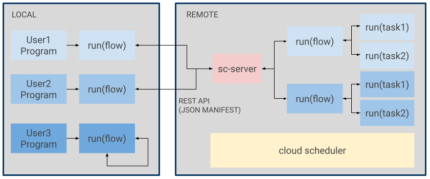

Introduction
===================================
SiliconCompiler is an open source compiler framework that aims to enable automated translation from source code to silicon.

Motivation
-----------

Silicon had an enormous positive impact on the world the last 50 years and it's a social imperative that we surf the exponential Moore's Law as long as possible. Extreme hardware specialization is the only viable path for extending the current exponential electronics improvement trajectory indefinitely, but this path is currently blocked by the high engineering effort of chip design.

Hardware specialization for the long tail of end user applications will require the creation of completely automated end-to-end compilers with many orders of magnitude improvements in run-time. The enormity of these challenges means single machine execution and monolithic single company efforts are unlikely to be sufficient. In this work, we take a distributed systems approach to compilers, with the goal of creating infrastructure that scales to thousands of developers and millions of servers.

Our Approach
-------------

The SiliconCompiler project was built bottom up, starting with a data model that could handle the complexity of chip design while being compatible with cloud scale distributed processing. The result was a unified database (:ref:`Schema`) that enables arbitrary combinations of design, tools, and PDKs.

To address the need for high productivity/high performance programming, we created a simple database API (:ref:`Core API`) and dataflow parallel programming model optimized for distributed task processing.

To remove the tool installation barrier and to faciliate access to warehouse cloud computing, the framework was architectured to nartively support (:ref:`Remote Processing`).

The diagram below illustrates some of the key concepts of local and remote processing.

