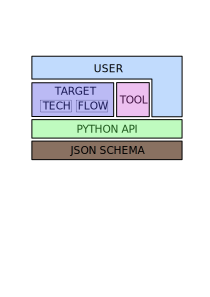

Introduction
===================================

SiliconCompiler ("SC") is a open source hardware compiler infrastructure project.
The goal of the SiliconCompiler project is to lower the barrier for hardware
specialization.

Architecture
----------------------

SiliconCompiler is based on a unified standard data schema that controls and tracks
all actions taken during hardware compilation. Schema parameters are accessed at
runtime to dynamically drive external tools (synthesis, place and route, etc)
through a Python API.  Metrics are collected at each compilation step and stored in
the in-memory SC dictionary controlled by the SC runtime program. At each step of
the compilation, JSON "manifest" files are written to disk for verification and data
exchange purposes. The final compilation manifest serves as a provinence and archive
record of the data (ie. gds, bitstream, etc)) created during the compilation
process.

**Design philosophy**:

* Modern hardware design is a high performance computing (HPC) problem. Compilation
  must make optimal use of the underlying computing platform whether we run on a
  laptop, powerful, workstation, or in a warehouse scale data center.
* Computing platform details should be abstracted from the designer/user.
* Hardware compilation is too complex and non-deterministic to control with a
  markup language like JSON/YAML. Compilation interfacing must be done through an
  API in a fully featured language.
* Given today's programming landscape, Python is the right language.
* Cherish diversity. Convincing the whole word to use Python is futile. Legacy tools
  with TCL interfaces will not (should not) be converted to Python. Instead,
  focus energy on effective handoff points between Python and TCL based tools.
* Don't try to change things you can't control (foundries, EDA companies, other FOSS
  projects). Game theory of semiuconductor economics is complex, non-deterministic,
  and not something that should be embedded in the architectre decisioin loop.
* Accept the fact that proprietary information and NDAs will always be part of the
  hardware industry. The architecture must handle this constraint effectively.
* Use standard-ish file formats for data exchange. (JSON, YAML, DEF, Verilog).
  Writing a new format is (almost) never the answer.
* Create enough abstraction layers to serve the novice user and expert user
  effectively. There are many examplse of framweorks that are either too naive
  or too complex to only serve a small subset of the community.
* Build generators, not instances. With a EE/Physics background it's easy to forget
  programmability in sofware is essentially "free". The generator concept should be
  leveraged across the whole platform (arch, config, docs, CLIs, help, testing).
* Design for the lowest common denominator. Some brilliant designers are terrible
  programmers. Don't build an architecture that require advanced programming
  knowledge.

**Features**:

* Python based programming interface
* Extensible dictionary based compilation schea
* Scalable flowgraph based compilation
* Built in support for remote processing
* Standardized plain text JSON compilation manifests

.. list-table::
   :widths: 20 15 15 20
   :header-rows: 1

   * - Feature
     - SiliconCompiler
     - Status Quo
     - Why it's important
   * - User API interface
     - Python
     - TCL
     - Python is 1000x more popular
   * - Open EDA API
     - Yes
     - No
     - Workforce development
   * - PDK agnostic APR setup
     - Yes
     - No
     - Startup time
   * - Library agnostic setup
     - Yes
     - Not usually
     - Startup time
   * - Common ASIC/FPGA design API
     - Yes
     - No
     - Startup time
   * - Remote processing
     - Yes
     - No
     - Startup time
   * - Common DV/Design sourcelist
     - Yes
     - No
     - Security, quality
   * - Provenance tracking
     - Automated
     - Manual
     - Security, quality
   * - Single file manifest/record
     - Yes
     - No
     - Security, quality
   * - Tapeout archiving
     - Automated
     - Manual
     - Security, quality

Historical perspective
------------------------

The term "Silicon Compiler" dates back to the firest VLSI revoluation in the late
1970's. The term was initially defined as a software sytem that that reads a high
level specification and translates it into a complete layout of an integrated
circuit (IC). The initial idea behind early Silicon Compilers was one where chips
would be specified as a series of parameterized building blocks and the silicon
compiler would automatically stitch them together to create the final set of
photmasks containing all the layers needed to create transistors and interconnect.

The initial silicon compilers had a compelling vision, but were not fully automated and proved too limited for the rapidly evolving VLSI community. Instead, the
methodology that won was based on standardized high level hardware description
language (Verilog/VHDL) and a standad library based abstraction where the desgn is
automatically translated/lowered to a physical layout using a series of automated
transformations (synthesis --> placement --> cts--> routing- -> dfm-->etc) and a
standard cell lib This “RTL to GDS” silicon compiler approach was rarely 100%
automated, but it was good enough for the industry for over 30 years. Still,
significant issues remain:

* Silicon compilation technology is too expensive ('not free as in beer')
* Silicon compilation is not fully automated
* Silicon compilation is not PDK agnostic
* Silicon design abstractions are now leakingn

Moore's law as we know it is ending and the only way we can continue to advance the
state of the art in performance, cost, and energy efficiency in the future is
through extreme circuit specialization. Unfortunately, this post-Moore
era vison will never materialzie at the current chip design costs which range from
$50-500M at advanced manufacturing nodes.

.. image:: ../_images/cost.png

Observing the positive impact that silicon and Moore's Law on the world over the
last 50 years it is a social imperative that we extend the current exponential
trend for as long possible. The time for a 2nd VLSI revolution has arrived!
