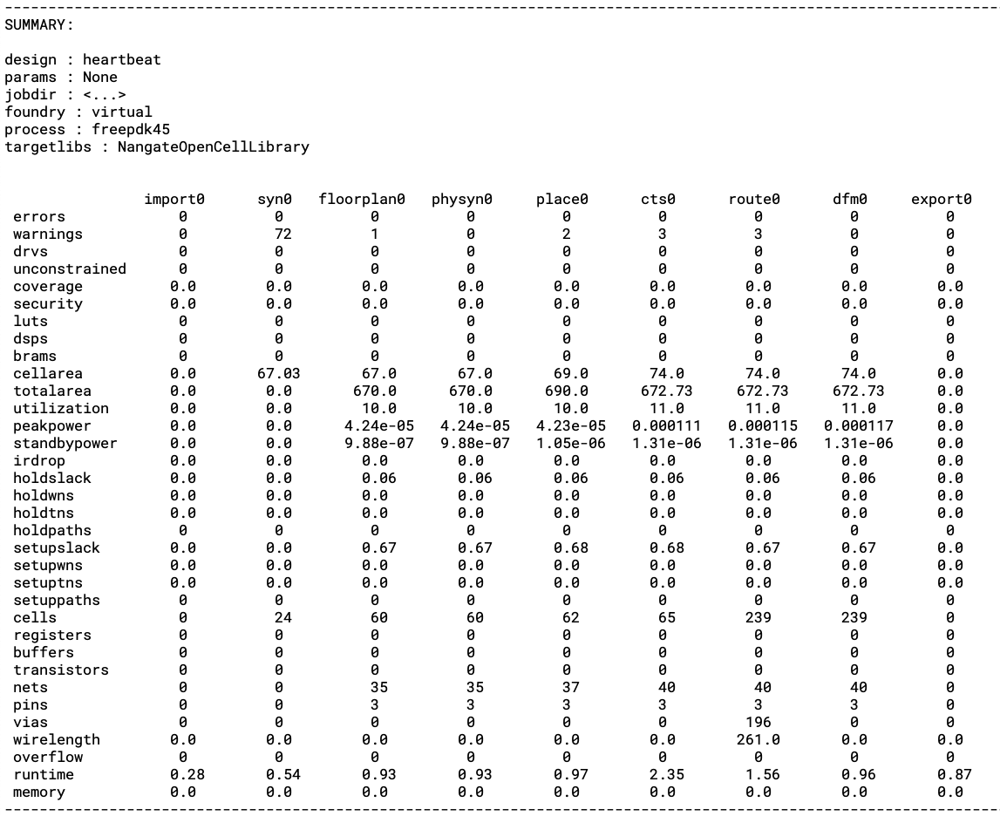
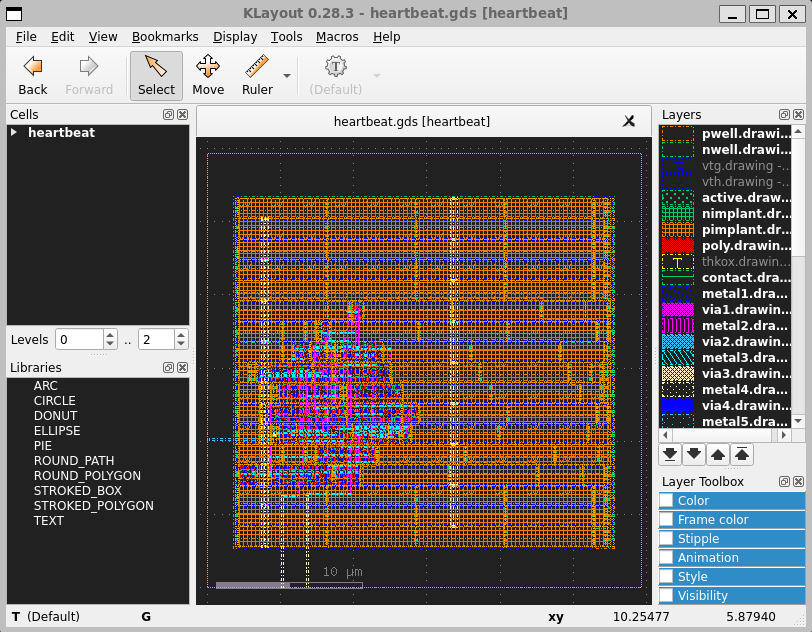

Quickstart guide
===================================

In this quickstart guide, we will illustrate core concepts of the project by
translating a simple Verilog based design into a GDSII IC layout database using
the freepdk45 virtual PDK.

Design
-------
As a case study we will use the simple "heartbeat" design shown below. The heartbeat
module is a free running counter that creates a single clock cycle pulse
("heartbeat") every time the counter rolls over. Copy paste the code into your
favorite text editor (vim, emacs, atom, notepad,etc) and save it to disk as
"heartbeat.v".

.. literalinclude:: examples/heartbeat/heartbeat.v
   :language: verilog

To constrain the design,  we need to also define a constraints file. Save the
following snippet as heartbeat.sdc. If you are not familiar with timing constraints,
don't worry about it for now.

.. literalinclude:: examples/heartbeat/heartbeat.sdc

Setup
-----------------

To address the complex process of modern hardware compilation, the SiliconCompiler
schema includes over 300 parameters. For this simple example, we only need a small
fraction of these parameters. The code snippet below illustrates the use of the
:ref:`Python API<Core API>` to set up and run a compilation. To run the example,
copy paste the code into your text editor and save it to disk as "heartbeat.py".

.. literalinclude:: examples/heartbeat/heartbeat.py

Much of the complexity of setting up a hardware compilation flow is abstracted away
from the user through the load_target() function which sets up a large number of PDK,
flow, and tool parameters based on a target setup module. To understand the
complete target configuration, see the :ref:`Flows Directory`, :ref:`PDK
Directory`, and :ref:`Target Directory` sections of the reference manual and read the source code for
`asicflow <https://github.com/siliconcompiler/siliconcompiler/blob/main/siliconcompiler/flows/asicflow.py>`_,
`freepdk45 <https://github.com/siliconcompiler/siliconcompiler/blob/main/siliconcompiler/pdks/freepdk45.py>`_, and
`freepdk45_demo <https://github.com/siliconcompiler/siliconcompiler/blob/main/siliconcompiler/targets/freepdk45_demo.py>`_.

.. note::

   The example assumes that surelog, yosys, openroad, and klayout are all correctly
   installed. Links to individual tool installation instructions and platform
   limitations can be found in the :ref:`Tools directory`.

   To simplify tool installation and job scheduling, SiliconCompiler supports a
   "-remote" option, which directs the compiler to send all steps to a remote
   server for processing. The "-remote" option relies on a credentials file
   located at ~/.sc/credentials on Linux or macOS, or
   at C:\\Users\\USERNAME\\.sc\\credentials on Windows.

   Remote processing option is enabled by setting the :ref:`remote` parameter to
   True. ::

     chip.set('remote', True)

Compilation
------------

To compile the example, simply execute the 'heartbeat.py' program from
your Python virtual environment.

.. code-block:: bash

   python heartbeat.py

Alternatively, the simple hearbeat example can be run calling the
SiliconCompiler 'sc' program directly from the command line.

.. literalinclude:: examples/heartbeat/run.sh
   :language: bash

If the compilation was successful, you should see a flood of tool specific
information printed to the screen followed by a summary resembling the summary
shown below. Set the :ref:`quiet` parameter to True of you want to redirect this
information to a log file. By default, all SiliconCompiler outputs are placed in
the build/<design> directory.

View layout
------------

If you have Klayout installed, you can view the output from the 'asicflow' by
calling chip.show() from your Python program or by calling the 'sc-show' program
from the command line as shown below:

.. code-block:: bash

   (venv) sc-show -design heartbeat

