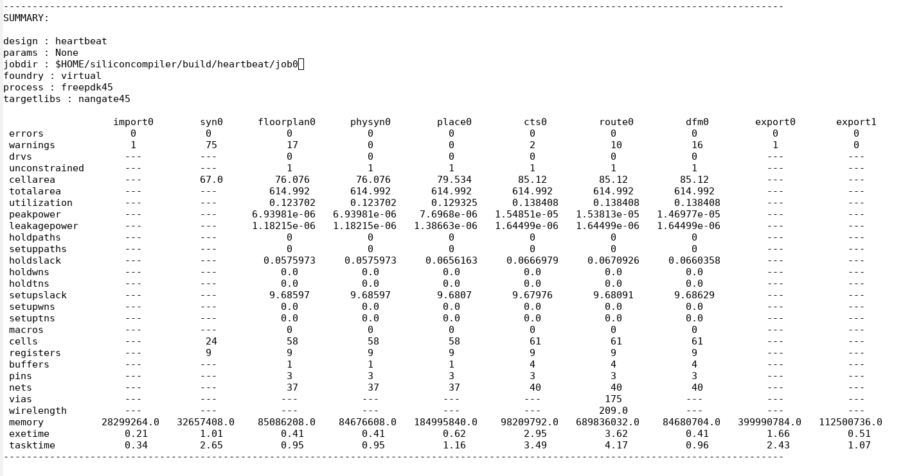

.. _quickstart_guide:

Quickstart guide
================

If you've completed the :ref:`Installation <installation>` section and were able to run the :ref:`ASIC Demo <asic_demo>`, you will have completed a simple remote run through an ASIC design flow!

In the following sections, you will find more details about `the design <start_the_design>`_, `the flow <start_the_flow>`_ and `the results <start_the_results>`_ of the run.

.. _start_the_design:

Design Details
--------------

The simple design that was used in the :ref:`demo target <asic_demo>` is a single clock cycle pulse (“heartbeat”) generated by a counter.
You can see the design here: `heartbeat.v <https://github.com/siliconcompiler/siliconcompiler/blob/main/examples/heartbeat/heartbeat.v>`_.

.. _start_the_flow:

Run Setup
---------

SiliconCompiler includes a Python API to simplify the hardware compilation flow process.
The following code snippet below shows how the :ref:`demo design <asic_demo>` was loaded in and run through the Python API.

.. code-block:: python
    :caption: heartbeat.py (remote run)

    #!/usr/bin/env python3

    from siliconcompiler import ASICProject, Design  # import python package
    from siliconcompiler.targets import skywater130_demo

    if __name__ == "__main__":
        design = Design("heartbeat")                           # create design object
        design.set_topmodule("heartbeat", fileset="rtl")       # set top module
        design.add_file("heartbeat.v", fileset="rtl")          # add input sources
        design.add_file("heartbeat.sdc", fileset="sdc")        # add input sources
        project = ASICProject(design)                          # create project
        project.add_fileset(["rtl", "sdc"])                    # enable filesets
        skywater130_demo(project)                              # load a pre-defined target
        project.set('option','remote', True)                   # enable remote execution
        project.run()                                          # run compilation
        project.summary()                                      # print summary
        project.show()                                         # show layout

The following sub-sections will describe each line in more detail.

Project and Design Creation
^^^^^^^^^^^^^^^^^^^^^^^^^^^

The hardware build flow centers around two main objects: the :class:`.Design`, which holds design-specific information, and the :class:`.ASICProject`, which manages project settings and execution.

.. code-block:: python

    from siliconcompiler import ASICProject, Design

    design = Design("heartbeat")
    project = ASICProject(design)

Defining the Design
^^^^^^^^^^^^^^^^^^^

Once the objects are created, we specify the design's top module and add its source files. In this case, `heartbeat.v` is the Verilog RTL, and `heartbeat.sdc` is the Synopsys Design Constraints file, which defines the clock.

.. code-block:: python

    design.set_topmodule("heartbeat", fileset="rtl")
    design.add_file("heartbeat.v", fileset="rtl")
    design.add_file("heartbeat.sdc", fileset="sdc")
    project.add_fileset(["rtl", "sdc"])

Loading a Target
^^^^^^^^^^^^^^^^

Next, we load a **target**, which bundles a Process Design Kit (PDK), standard cell libraries, and a pre-configured compilation flow.

.. code-block:: python

    from siliconcompiler.targets import skywater130_demo

    skywater130_demo(project)

Configuring the Run
^^^^^^^^^^^^^^^^^^^

The :meth:`.Project.set()` method is used to configure various settings. Here, we set the :keypath:`option,remote` parameter to `True` to execute the compilation job in the cloud.
If you were to remove this line, the job would run on your local machine.

.. code-block:: python

    project.set('option', 'remote', True)

Executing the Flow
^^^^^^^^^^^^^^^^^^

Finally, we execute the flow.
The :meth:`.Project.run()` method starts the compilation, :meth:`.Project.summary()` prints a table of results, and :meth:`.Project.show()` opens the final layout in a viewer.

.. code-block:: python

    project.run()
    project.summary()
    project.show()

Run Flow
--------

Running this python script directly produces the same results as the :ref:`ASIC Demo <asic_demo>` target.

.. code-block:: bash

    python3 heartbeat.py

Remote Run Controls
-------------------

When your job starts on a remote server, it will log a job ID which you can use to query your job if you close the terminal window or otherwise interrupt the run before it completes:

.. code-block::

    | INFO    | job0  | remote     | 0  | Your job's reference ID is: 0123456789abcdeffedcba9876543210

You can use this job ID to interact with a running job using the :ref:`sc-remote <app-sc-remote>` CLI app:

.. code-block:: bash

    # Check on a job's progress.
    sc-remote -jobid 0123456789abcdeffedcba9876543210

    # Cancel a running job.
    sc-remote -jobid 0123456789abcdeffedcba9876543210 -cancel

    # Ask the server to delete a job from its active records.
    sc-remote -jobid 0123456789abcdeffedcba9876543210 -delete

    # Reconnect to an active job.
    sc-remote -jobid 0123456789abcdeffedcba9876543210 -reconnect -cfg [build/design/jobname/import/0/outputs/design.pkg.json]

The :ref:`sc-remote <app-sc-remote>` app also accepts a `-credentials` input parameter which works the same way as the :keypath:`option,credentials` parameter.

.. _start_the_results:

Run Results
-----------

Your run will first show the the SiliconCompiler banner/info, followed by design INFO messages.

As the run goes through each step of the flow, a message will be printed to the screen every 30 seconds.

Then, at the end of the run, a summary table will be printed similar to the one show below.
This table is generated by calling the :meth:`.Project.summary()` function call in your python script :ref:`above <start_the_flow>`.

All design outputs are located in ``build/<design>/<jobname>``.
When running remote, you will not get all the tool-specific output that you would with a local run, but you will be able to find a screenshot of the demo design ``heartbeat.png``:

.. image:: ../_images/selftest_screenshot.png

Other Ways to Run
-----------------

The :ref:`ASIC Demo <asic_demo>` was run in public beta server in the cloud.
SiliconCompiler also supports running on :ref:`private <private-server>` servers or also local runs on your own machine.

See :ref:`docker <docker>` to see details on how to use the SiliconCompiler docker image to run on tools on your local machine without needing to maintain the tools.

See :ref:`remote processing <remote_processing>` to see details on how to run on a private server, and see :ref:`external tools <external_tools>` to see the additional tool installation requirements for running on your machine locally.

Local Run Results
^^^^^^^^^^^^^^^^^
By default, only the summary of each step is printed, in order to not clutter up the screen with tool-specific output.
If you wish to see the output from each tool, you can find the log files associated with each tool in: ``build/<design>/<jobname>/<step>/<index>/<step>.log``

If you wish to see all the tool-specific information printed onto the screen, you can turn the :keypath:`option,quiet` option off.

View Design
^^^^^^^^^^^
For viewing IC layout files (DEF, GDSII) we recommend installing the open source multi-platform :ref:`Klayout viewer <tool-klayout>`  (available for Windows, Linux, and macOS).
Installation instructions for Klayout can be found in the :ref:`tools directory <tool-klayout>`.

If you have Klayout installed, you can browse your completed design by calling :ref:`sc-show <app-sc-show>` directly from the command line as shown below:

.. code-block:: bash

   (venv) sc-show -design heartbeat

.. image:: _images/heartbeat.png

If you want to have this window pop up automatically at the end of your script, you can add :meth:`.Project.show()` to the end of your :ref:`python script <start_the_flow>`.

.. code-block:: python

        project.show()      # pops open a window with the layout

What Next?
-----------

Now that you've quickly run a simple example, you can proceed to a larger example like :ref:`building your own soc <picorv32_example>`, or you can dive deeper into the SiliconCompiler build flow you ran from this quickstart (`asic_demo <https://github.com/siliconcompiler/siliconcompiler/blob/main/siliconcompiler/targets/asic_demo.py>`_) by looking through how the flow is constructed with the :ref:`Design and Compilation Data <data_model>` and :ref:`Compilation Process <execution_model>` in the Fundamentals section.
