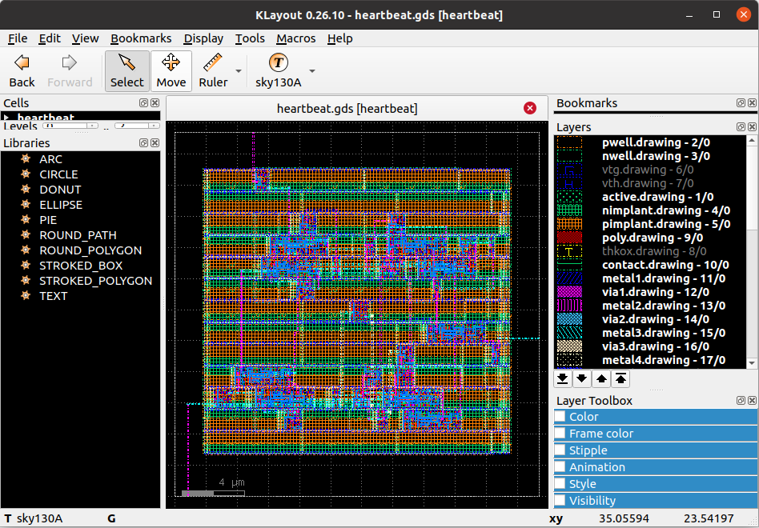

Quickstart quide
===================================

The SiliconCompiler project is designed to support automated translation from a
broad set of high level languages into manufacturable and deployable hardware. In
this quickstart guide, we will illustrate core concepts of the project by
translating a simple Verilog based design into a as GDSII IC layout database using
the freepdk45 virtual PDK. For a list of other open source PDKs supported by
the project, seee the :ref:`PDK directory`

Design
-------
As a case study we will use the simple "heartbeat" design shown below.
The heartbeat module is a free running counter that creates a single clock cycle
pulse ("heartbeat") every time the counter rolls over. Copy paste the code into your
favorite text editor (vim, emacs, atom, notepad,etc) and save it to disk as
"heartbeat.v".

.. literalinclude:: examples/heartbeat.v
   :language: verilog

Setup
-----------------

The SiliconCompiler uses a standrdized :ref:`Schema` to control and track
all tasks performed during compilation. To address the complex process of
modern hardware compilation, the SiliconCompiler schema includes over 250
dynamic parameters. For the simple exaxmple in this quickstart guide,
we only need to set a small fraction of these schema parameters.

Setting up a compilation involves configuring parameters in the schema using
the :ref:`Core API`. The code snippet below illustrates the minimum viable
program needed to set up and run a compilation for the 'heartbeat' example.
Copy paste the code into your text editor and save it to disk as
"heartbeat.py".

.. literalinclude:: examples/heartbeat.py

Much of the complexity of setting up a hardware compilation flow is
abstracted away from the user through the target() function which
sets up a large number of PDK, flow, and tool parameters based on
a "tuple" of strings separated by undescore ('_'). To understand
the complete target configuration, see the :ref:`flows` and :ref:`PDK` reference
documentation and/or read the source code for
`asicflow <https://github.com/siliconcompiler/siliconcompiler/blob/main/siliconcompiler/flows/asicflow.py>`_
and
`freepdk45 <https://github.com/siliconcompiler/siliconcompiler/blob/main/siliconcompiler/pdks/freepdk45.py>`_

.. note::

The example assumes that surelog, yosys, openroad, klayout all correctly
installed.  Links to individual tool installation instructions and platform
limitations can be found in the :ref:`tools<Tools directory>`.

.. note::

   To avoid the time and complexity of tool installation, you can sign
   up for a free beta testing account at:
   `beta.siliconcompiler.com <https://beta.siliconcompiler.com>`_.
   Follow the beta directions for placing a credentials file in your
   user directory and then enable remote processing in the example
   by uncommenting the remote setting line.::

     chip.set('remote', True)

Compilation
------------

To compile the example, simply excute the 'heartbeat.py' program from
your Python virtual environment.

.. code-block:: bash

   (venv) python heartbeat.py

If the compilation was successful, you should see a flood of tool specific
information printed to the screen followed by a summary resembling the
summary shown below.

.. literalinclude:: examples/heartbeat.log
   :language: console

View layout
------------

If you installed the Klayout program during installation, you can now
view the layout of the heartbeat by uncommenting the show_file line
in the heartbeat.py example.::

  chip.show_file()

Alternatively, you can run the SiliconCompiler app 'sc-show'
at the command line to display the layout. The 'sc-show' app is a
wrapper around layout viewers that helps ensure that all the
technology/layer settings are set up correctly.

.. code-block:: bash

   (venv) sc-show -design heartbeat

