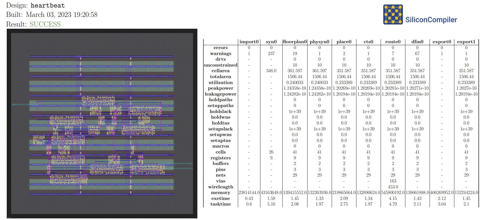

Running SiliconCompiler
------------------------------

You can either `run remotely`_ in the cloud, or `run locally`_ on your machine.

.. _run remotely:

Cloud Access (Public)
^^^^^^^^^^^^^^^^^^^^^

By default, SiliconCompiler will send remote jobs to our public beta servers, after printing a brief reminder that the job is being uploaded to a public server. You can run a quick self-test to verify that SiliconCompiler was installed successfully::

    sc -target asic_demo -remote

The job should only take a few minutes to run if the servers aren't too busy, and once it completes, you should receive a PDF file containing a screenshot and metrics for the build results. The self-test design is a simple 8-bit counter, so your results should look something like this:

You do not need to configure anything to use the :keypath:`option, remote` flag with these public servers, but you can use the ``sc-configure`` command to specify where SiliconCompiler should send remote jobs. For more information, see the :ref:`Configuring a Different Remote Server` section.

.. _run locally:

Run Locally
^^^^^^^^^^^

If you wish to run locally, you will need to install some external tool dependencies to start. Take a look at :ref:`External Tools` for a list of tools which you may want to have.

.. note::

   The minimum set of tools required for an ASIC flow are: Surelog, Yosys, OpenRoad and KLayout.

Once you have these tools installed, try compiling a simple design:

.. code-block:: bash

    (venv) cd $SCPATH/../examples/heartbeat
    (venv) sc heartbeat.v heartbeat.sdc

See the :ref:`Quickstart guide <quickstart guide>` section to get more details on what you're running.

View Design
^^^^^^^^^^^

To view IC layout files (DEF, GDSII) we recommend installing the open source multi-platform 'klayout' viewer (available for Windows, Linux, and macOS). Installation instructions for klayout can be found in the :ref:`tools directory <klayout>`.

To test the klayout installation, run the :ref:`sc-show` to display the 'heartbeat' layout:

.. code-block:: bash

   (venv) sc-show -design heartbeat
