==================
Dashboard Tutorial
==================

At this point, you should have built a project on your computer.

To start, run the command:

.. code-block:: bash

    sc-dashboard -cfg <path to manifest>

You can specify the port by adding a port flag:

.. code-block:: bash

    sc-dashboard -cfg <path to manifest> -port <port number>

And/or you can include extra projects by adding a ``-graph_cfg`` flag:

.. code-block:: bash

    sc-dashboard -cfg <path to manifest> -graph_cfg <manifest name> <path to manifest> -graph_cfg <manifest name> <path to manifest>

Header
======

In the header, you can select any of the projects that are part of the history of the project loaded in and any of the other projects loaded in through the ``-graph_cfg`` flag (see arrow below).

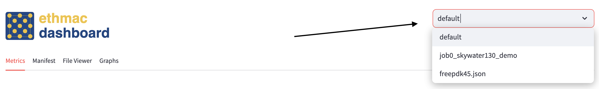

Metrics Tab
===========

You will load into the metrics tab similar to the one below upon running :ref:`sc-dashboard <app-sc-dashboard>`.

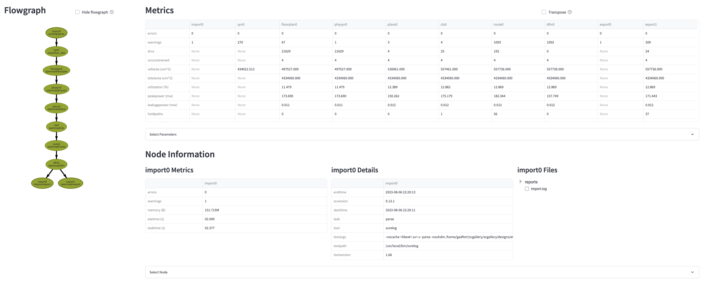

Metrics Section
---------------

The metrics section displays an overview of each value for each metric tracked for each node.
Click "Transpose" to switch the axes (arrow A in image below).

You may use the "Select Parameter" expander to specify certain nodes and/or metrics (arrow C and D in image below).
Click "Apply" to make those changes (arrow B in image below).

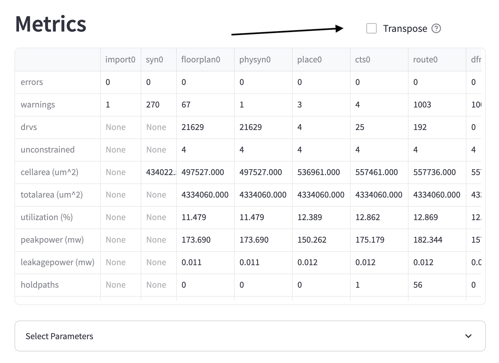

Node Information Section
------------------------

Below is the node information section.
It consists of three subsections - node metrics, node details, and node files.

You can select a node using the "Select Node" expander as seen with arrow's A and B below.
Click "Apply" to make the change.

.. image::  ../../_images/dashboard_images/dashboard_metrics_node_information.png

Alternatively, you can double click on the flowgraph node.
Nodes that are selected will bolden.

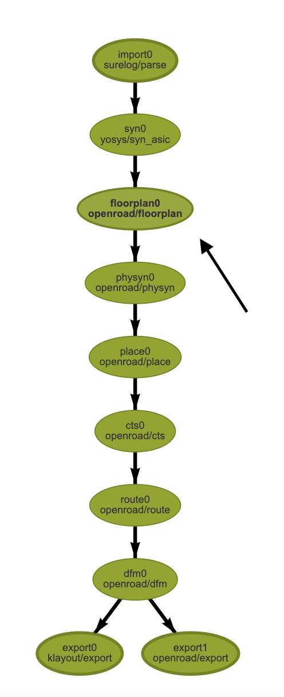

Node Metrics Subsection
+++++++++++++++++++++++

The node metrics subsection consists of all of not ``None`` values recorded for each of the metrics recorded for the selected node.

Node Details Subsection
+++++++++++++++++++++++

The node details subsection consists of all of the characteristics about this node that are not reflected in the metrics section.

Node Files Subsection
+++++++++++++++++++++

The node files subsection consists of all of the files for a given node that are in the build directory.

Selecting a node will display a list of the metrics that the file informs below the file tree.

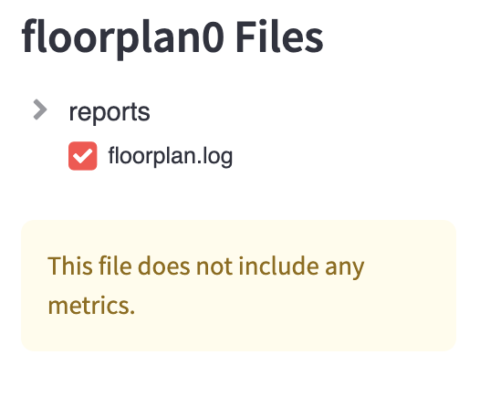

File Viewer Tab
===============

The selected node you clicked in the `Node Files Subsection`_ will appear here.
You may download the file by clicking the download button as shown below.

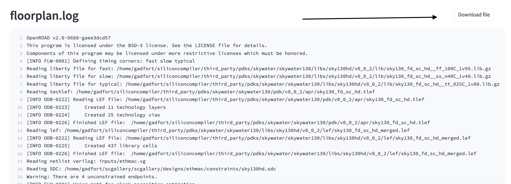

If no file is selected, the error message below will be displayed telling you to select a file first.

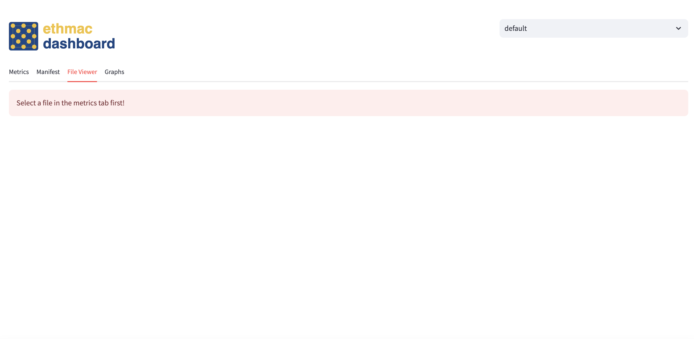

Manifest Tab
============

The next tab you can select is the manifest tab.
This displays the manifest after it has been filtered through to make it more readable.

To view the manifest, click the arrow on the dictionary (arrow A). The search bars will return partial matches for either
the keys (arrow B in image below) or the values (arrow C in image below).
You may download the JSON as you view it at any point (arrow D in image below).
You can view the raw manifest by clicking the checkbox to the right of the search bar (arrow E in image below).

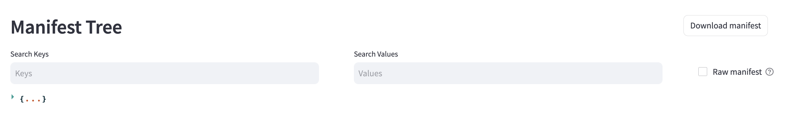

Display Preview Tab
===================

This displays the preview image of the project if there is one in the directory (example given below). If not, this tab will not be included.

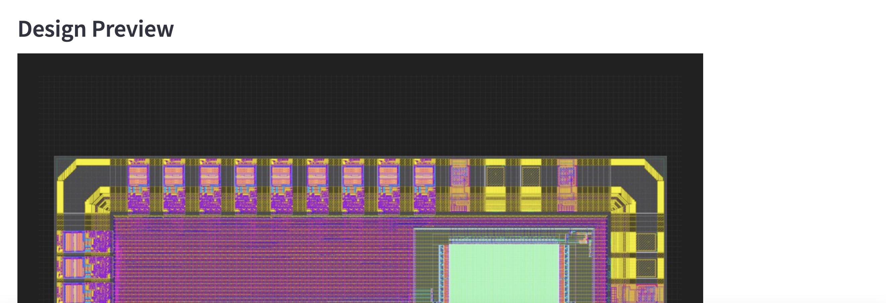

Graphs Tab
==========

This tab is meant to make comparisons between nodes for a given metric across many projects.

At the top of the panel, select which runs/jobs to include for all the graphs (arrow A in image below). T

Move the slider to add more graphs or remove old ones (arrow B in image below).

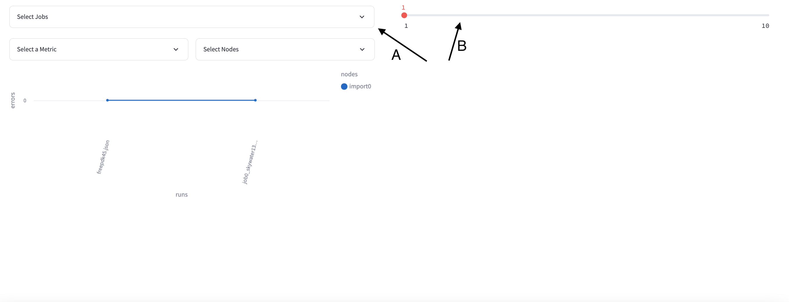

For each graph, you must select one metric (show in image below).

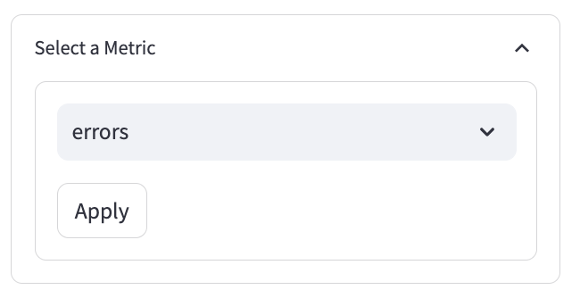

You may select any amount of nodes (show in image below).

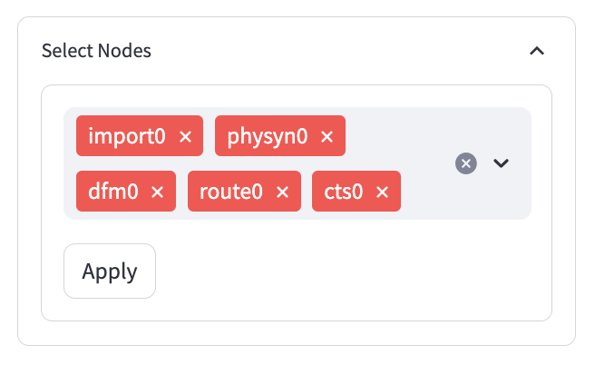

Sometimes nodes may not have values for a metric, in which case they will not be included in the graph.
In the image below, import0 is not in the legend.

.. image::  ../../_images/dashboard_images/dashboard_graphs_nodes_selected_vs_nodes_displayed.png

Sometimes nodes that are in the legend are not visible on the graph.
What has happened is that they have the exact same values as some other node.
Consider deselecting other nodes in this case.
In the image below, cts0 is barely visible on the graph.

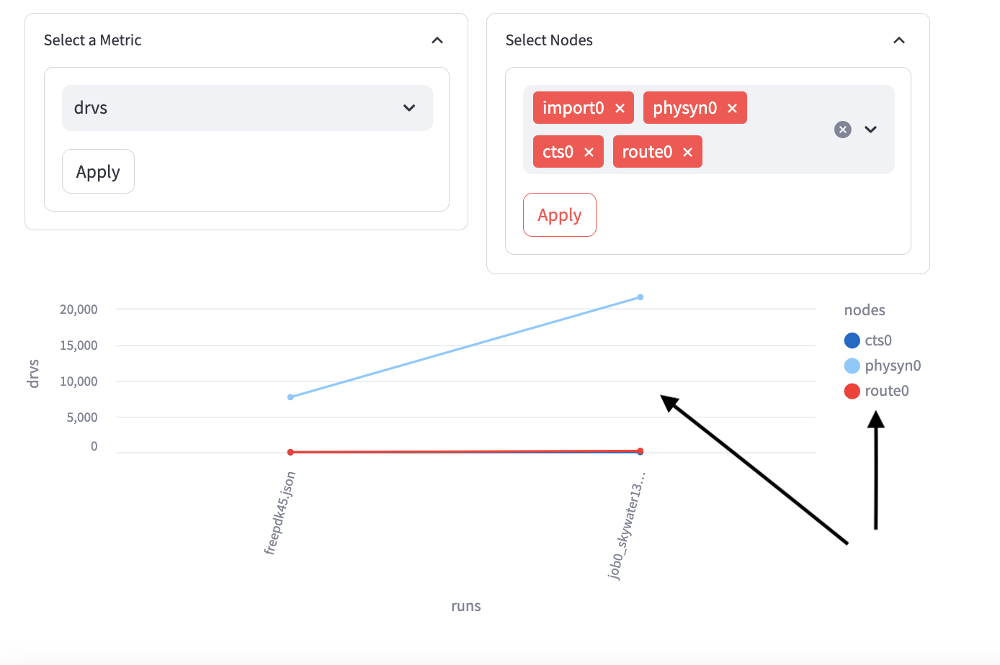
