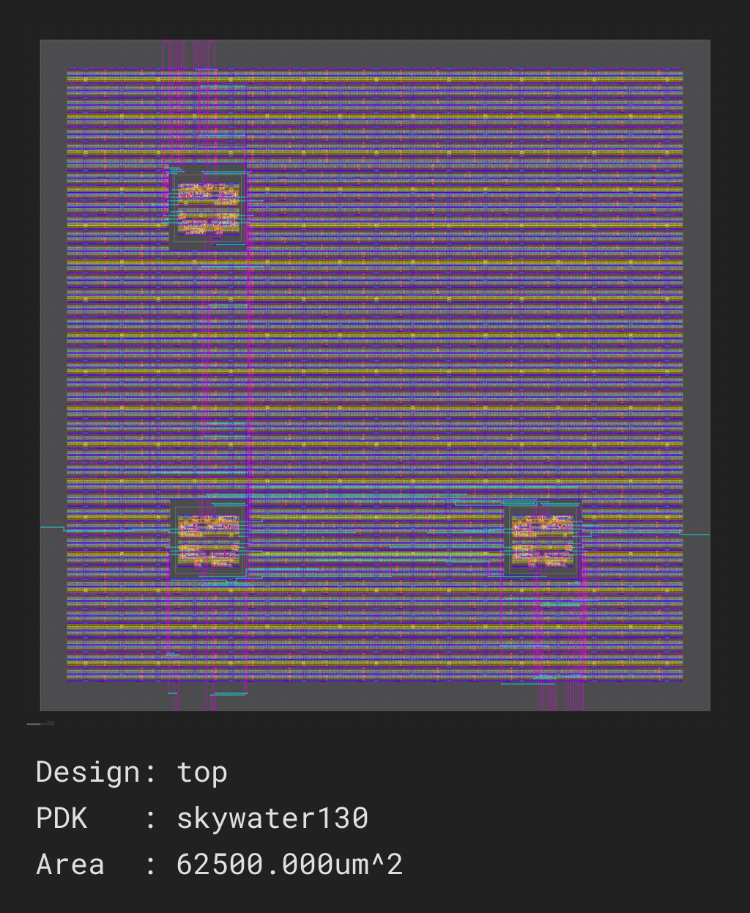

.. _hardened_modules:

Instantiating a hardened module in a design
===========================================

Hardened modules allow predictable timing, efficient placement, and scalable hierarchical ASIC design.

This tutorial demonstrates how to use Silicon Compiler to harden a Verilog module as a reusable macro, and then instantiate it multiple times in another module by:

1. Setup design
2. Synthesizing, placing, and routing **mod_and** using Silicon Compiler
3. Packaging the resulting layout and timing models from **mod_and** as a hard macro
4. Running the ASIC flow on module **top**

All these steps are contained in the `python script <https://github.com/siliconcompiler/siliconcompiler/blob/main/examples/macro_reuse/make.py>`_.

To run this script from its containing folder:

.. code-block:: bash

    smake build_top

or to use docker:

.. code-block:: bash

    docker run --rm -v "$(pwd):/sc_work" \
        ghcr.io/siliconcompiler/sc_runner:latest \
        python3 make.py

The image output will appear in: ``./build/top/job0/write.gds/0/outputs/top.png``

Environment Setup
-----------------

Import the modules to be used:

.. literalinclude:: examples/macro_reuse/make.py
    :language: python
    :lines: 19-20

Files used
----------

Child Module (and.v)
^^^^^^^^^^^^^^^^^^^^

.. literalinclude:: examples/macro_reuse/and.v
    :caption: and.v
    :language: verilog

Parent Module (top.v)
^^^^^^^^^^^^^^^^^^^^^

.. literalinclude:: examples/macro_reuse/top.v
    :caption: top.v
    :language: verilog

Step 1: Setup design
--------------------

The following code will instantiate the module: **mod_and** and **top**:

Child Module (and.v)
^^^^^^^^^^^^^^^^^^^^

.. literalinclude:: examples/macro_reuse/make.py
    :language: python
    :caption: Design setup for mod_and
    :lines: 23-33

Parent Module (top.v)
^^^^^^^^^^^^^^^^^^^^^

.. literalinclude:: examples/macro_reuse/make.py
    :language: python
    :caption: Design setup for top
    :lines: 36-48

Dependency graph from **top**:

    Dependency graph from ``Top().write_depgraph``

Step 2: Synthesize, Place & Route module **mod_and**
----------------------------------------------------

The following code will build module **mod_and** with the default :ref:`ASIC <schema-siliconcompiler-flows-asicflow-asicflow>` flow.
This generates the physical layout required for the macro.

.. literalinclude:: examples/macro_reuse/make.py
    :language: python
    :lines: 51-68

.. figure:: _images/hardened/and.png
    :align: center
    :scale: 50%

Step 3: Packaging the resulting layout and timing models from **mod_and** as a hard macro
-----------------------------------------------------------------------------------------

Once the flow is complete, we must package the results into a StdCellLibrary.
This object tells the tools where to find the physical views (LEF/GDS) and timing views (LIB) required by the parent design.
We gather the results from the previous build step and register them into the library object

.. literalinclude:: examples/macro_reuse/make.py
    :language: python
    :lines: 70-93

Step 4: Running the ASIC flow on module **top**
-----------------------------------------------

Finally, we configure the flow for the top module.
Critical steps here include:

1. **Blackboxing (Alias)**: We use add_alias to prevent the tool from synthesizing the RTL of And. We want to use the pre-hardened version, not re-synthesize it.
2. **Library Injection**: We use add_asiclib to provide the LEF and LIB files we packaged in Step 3.

.. literalinclude:: examples/macro_reuse/make.py
    :language: python
    :lines: 96-123

.. note::
    Setting the core and die area explicitly is crucial for macro placement.
    If the area is too small, the floorplan may fail to insert the macros.

.. literalinclude:: examples/macro_reuse/make.py
    :language: python
    :lines: 119

Conclusion
----------

This tutorial demonstrates how to perform a basic modular hierarchical :ref:`ASIC <schema-siliconcompiler-flows-asicflow-asicflow>` design flow in Silicon Compiler by:

- Hardening a leaf module **mod_and**
- Exporting the layout and timing views from **mod_and** as a custom library ``module_and``
- Instantiating ``module_and`` in the parent module **top**

This approach enables scalable chip design with reusable hardened blocks.
