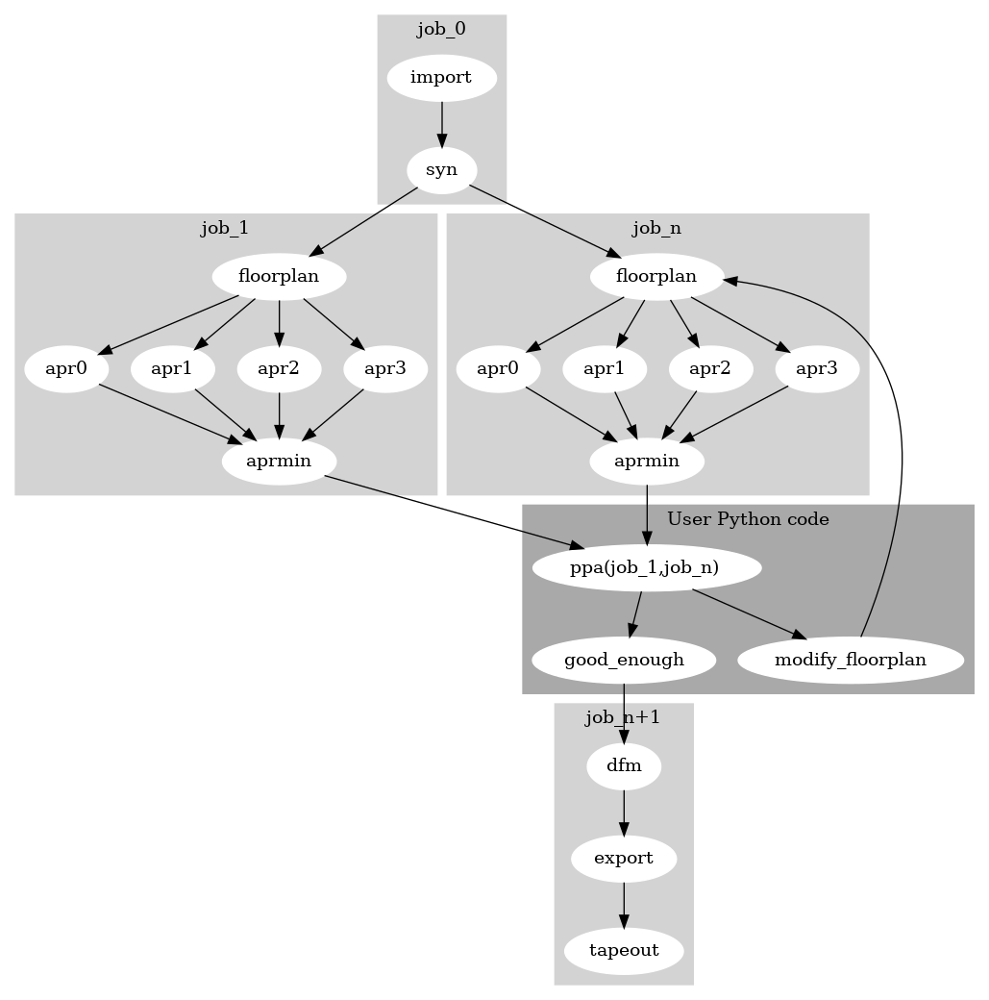

:orphan:

.. TODO (docs audit, later phase): expand this into a real step-by-step guide and
   un-orphan it. The three patterns to cover, each with a working example already
   in the repo:
     1. Chaining flows -- examples/gcd/gcd_skywater.py runs asicflow as job
        "rtl2gds", then feeds find_result() outputs into a new fileset and runs
        SignoffFlow as job "signoff".
     2. Sweeping a parameter -- examples/oh_experiments/adder_sweep.py runs one
        job per data width and reads cellarea back via project.history(jobname).
        examples/oh_experiments/check_area.py is the fresh-project-per-run variant.
     3. Hierarchical builds -- examples/macro_reuse/make.py hardens a child in one
        job and consumes it in the parent's job (see the hardened tutorial).
   Pull code via literalinclude from those examples rather than pasting it, and
   replace the non-code line `project.set('some parameter..')` below.
   Mechanism worth stating: history is keyed by jobname and recorded in a finally
   block (so failed jobs are still queryable), and reusing a jobname logs
   "Overwriting job <name>" and replaces the earlier record.

###############################
Multi-Job Flows and Automation
###############################

As an extension of :ref:`compilation process <execution_model>`, which describes setting up only one job, you can link together different jobs and Python manipulation code for your own purposes.

At the end of each :meth:`.Project.run()` call, the current in-memory job schema entries are copied into a job history dictionary for reference later.
The user can access these to create more complex, non-linear flows that take into account run history and gradients.
The code snippet below shows a minimal sequence leveraging the multi-job feature.::

  project.run()
  project.option.set_jobname('newname')
  project.set('some parameter..')
  project.run()

Complex iterative compilation flows can be created with Python programs that:

1. Calls :meth:`.Project.run()` multiple times using a different jobname, and
2. Leverages Python logic to query per job metrics to control the compilation flow decision, for automation

